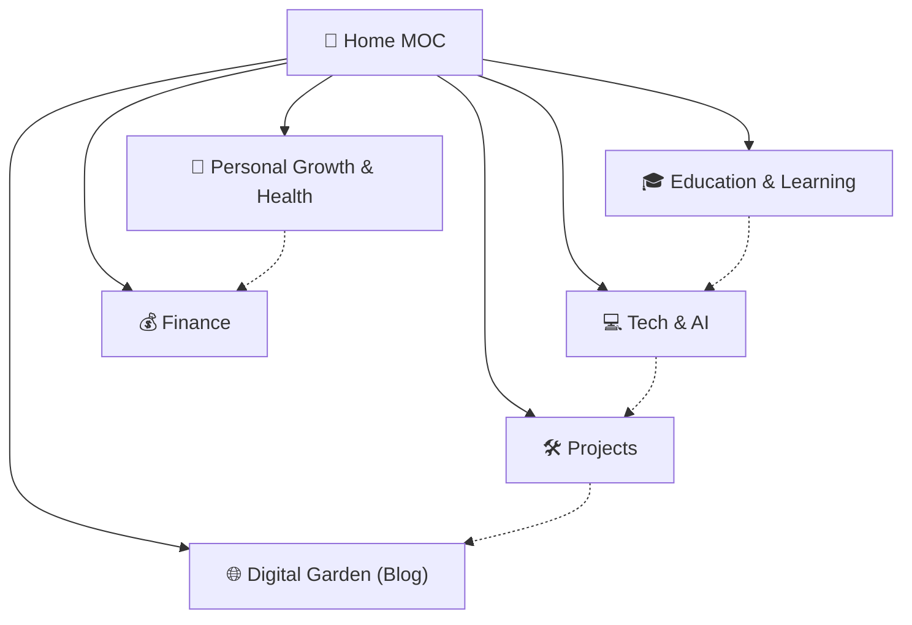

# 🧠 Second Brain — Home MOC

Benvenuto nel centro di controllo e navigazione del Second Brain & Digital Garden.
Tutta la conoscenza è strutturata nelle **5 Macro-Aree** tematiche, collegate agli studi di pubblicazione e al sistema di visione.

---

## 🗺️ Le 5 Macro-Aree Fondamentali

- 💻 **[[Tech & AI MOC|Tech & AI]]** — Sviluppo software, architetture LLM, agenti AI, prompt engineering
- 🎓 **[[Education & Learning MOC|Education & Learning]]** — Ingegneria Informatica, corsi universitari, didattica e archivio studi
- 🌿 **[[Personal Growth & Health MOC|Personal Growth & Health]]** — Mindset, stoicismo, psicologia, allenamento, salute e fitness
- 💰 **[[Finance MOC|Finance]]** — Finanza personale, mercati monetari, strategie crypto, investimenti
- 🛠️ **[[Projects MOC|Projects]]** — Efforts attivi, progetti applicativi, architettura AI Second Brain

---

## 🌐 Studio di Pubblicazione & Visione

- 🌐 **[[Blog MOC|Blog & Digital Garden]]** — Saggi, articoli tecnici e guide divulgative pronte per il web.
- 🎯 **[[Telos]]** — Visione strategica di vita, principi cardine e obiettivi a lungo termine.

---

## 🧭 Mappa delle Interconnessioni Concettuali

---

## 🔗 Collegamenti Rapidi

- [[Review Dashboard]] — Dashboard di ingestione e revisione note in entrata
- [[AI Second Brain System]] — Documentazione e logica del sistema
