[[Home MOC|Home]] / [[Education & Learning]] / [[Come Tornare a Leggere Libri|Perche Non Riusciamo Piu a Leggere Libri e Come Tornare a Farlo]]

# Perché Non Riusciamo Più a Leggere Libri e Come Tornare a Farlo

- **Video URL**: https://youtu.be/UUkdab6HatQ
- **Canale**: [[Geopop]]

---

## Sintesi Rapida

Negli ultimi anni, la nostra capacità di concentrarci su testi complessi ha subito un drastico declino a causa del continuo bombardamento di stimoli digitali che riprogrammano le nostre abitudini di attenzione. Questo saggio analizza come la sovrastimolazione tecnologica influenzi neurologicamente il nostro <mark style="background:rgba(181, 113, 255, 0.36)"><b>cervello</b></mark>, riducendo l'abitudine alla lettura e incrementando l'analfabetismo funzionale. Attraverso l'uso mirato della neuroplasticità e di specifiche strategie basate su evidenze scientifiche, è tuttavia possibile invertire questo trend e riscoprire i benefici cognitivi ed empatici della lettura su carta.

---

## Capitolo 1: La Frammentazione dell'Attenzione nell'Era Digitale

```mermaid
graph TD
    subgraph Ciclo dell'Attenzione Frammentata
        A[Notifica / Social Network] -->|Attivazione Dopamina| B[Gratificazione Istantanea]
        B -->|Adattamento Cerebrale| C[Attenzione a Breve Termine]
        C -->|Scansione Veloce| D[Modalità Scrolling]
        D -->|Overstimulation| A
    end
    subgraph Ciclo della Lettura Profonda
        E[Lettura su Carta] -->|Sforzo di Concentrazione| F[Neuroplasticità Inversa]
        F -->|Immersione Cognitiva| G[Teoria della Mente]
        G -->|Comprensione e Empatia| H[Lettura Profonda e Analisi]
        H -->|Allenamento Attenzione| E
    end
    style A fill:#ffcccc,stroke:#ff6666,stroke-width:2px
    style E fill:#ccffcc,stroke:#66cc66,stroke-width:2px
```

Aprire un libro e accorgersi, dopo una decina di minuti, di aver letto e riletto le stesse righe senza averne assimilato il significato è un'esperienza comune a molti. Spesso acquistiamo libri con le migliori intenzioni, per poi lasciarli sul comodino per settimane con il segnalibro immobile allo stesso capitolo. Questo declino non riflette una mancanza di volontà intraprendente, ma è la conseguenza diretta di una riprogrammazione neurologica. Il nostro <mark style="background:rgba(181, 113, 255, 0.36)"><b>cervello</b></mark> sta semplicemente facendo ciò per cui è stato costantemente addestrato negli ultimi anni: elaborare flussi di informazioni rapidi e frammentati.

Ogni interazione con un <mark style="background:rgba(181, 113, 255, 0.36)"><b>social network</b></mark> offre al sistema nervoso una scarica immediata di <mark style="background:rgba(181, 113, 255, 0.36)"><b>dopamina</b></mark> sotto forma di notifiche, approvazioni visive o brevi contenuti multimediali sorprendenti. Questo <mark style="background:rgba(181, 113, 255, 0.36)"><b>ambiente</b></mark> premia la velocità e la transizione rapida, addestrando la mente a una soglia di <mark style="background:rgba(181, 113, 255, 0.36)"><b>attenzione</b></mark> estremamente ridotta. Quando a una mente abituata a cambiare stimolo ogni venti secondi viene chiesto di concentrarsi su una pagina statica per un'ora, lo sforzo richiesto non è solo metaforico, ma neurologico e fisico. La capacità intrinseca del sistema nervoso di adattarsi all'ambiente — nota come <mark style="background:rgba(255, 193, 69, 0.32)"><b>neuroplasticità</b></mark> — opera però in entrambe le direzioni. Come il cervello ha disimparato a concentrarsi su testi lunghi, così può essere rieducato a farlo.

---

## Capitolo 2: L'Evoluzione Storica e la Crisi del Tempo

Per millenni, la lettura è stata un'attività riservata a pochissimi. Prima dell'introduzione della stampa a caratteri mobili nel 1440, la produzione manuale di un singolo volume richiedeva mesi di lavoro da parte di un copista, portando il costo di un libro a equivalere a circa quattro mesi di stipendio di un lavoratore medio. In Europa, solo il 30% della popolazione, in massima parte uomini delle classi elevate, sapeva leggere. L'avvento della stampa ha avviato una democratizzazione culturale senza precedenti, con una curva di <mark style="background:rgba(181, 113, 255, 0.36)"><b>alfabetizzazione</b></mark> cresciuta costantemente per cinque secoli: se nel 1820 solo il 12% degli adulti mondiali sapeva leggere, nel 2000 la percentuale ha raggiunto l'82%. Questa transizione ha rimodellato la democrazia, la scienza, il diritto e la medicina, fornendo ai cittadini gli strumenti critici necessari per comprendere e difendere i propri diritti.

Tuttavia, a metà degli anni 2000, questa traiettoria positiva ha subito una battuta d'arresto nei paesi industrializzati. Il problema non risiede nell'alfabetizzazione di base, che continua a progredire, ma nel declino dell'abitudine e del piacere di leggere nel tempo libero. Questa inversione coincide con l'avvento sul mercato di massa dello <mark style="background:rgba(181, 113, 255, 0.36)"><b>smartphone</b></mark> e con la trasformazione dell'attenzione umana nella risorsa economica più contesa del pianeta. Le ore libere della giornata sono state progressivamente saturate da piattaforme digitali progettate per massimizzare il coinvolgimento immediato, riducendo lo spazio dedicato alla riflessione e alla lettura prolungata.

---

## Capitolo 3: Il Contesto Italiano e la Piaga dell'Analfabetismo Funzionale

In Italia, questo scenario globale assume contorni particolarmente preoccupanti. I dati <mark style="background:rgba(181, 113, 255, 0.36)"><b>Eurostat</b></mark> evidenziano che solo il **35%** dei cittadini tra i 16 e i 65 anni ha letto almeno un libro nell'ultimo anno. Si tratta di un valore nettamente inferiore alla media europea del **52%** e distante dal **72%** registrato in Danimarca, che posiziona l'Italia al terzultimo posto in Europa, davanti solo a Cipro e Romania. Oltre a ciò, il tempo medio settimanale dedicato alla lettura dagli italiani è diminuito di quasi un'ora in soli due anni, scendendo sotto la soglia delle tre ore. A questo si aggiunge un profondo divario geografico e infrastrutturale: nel Mezzogiorno si registra il **30% in meno** di librerie rispetto alla media nazionale, e meno del **20%** dei libri complessivamente venduti nel Paese è acquistato al Sud e nelle isole, configurando una reale disparità di accesso fisico alla cultura.

La conseguenza più allarmante di questa tendenza è l'aumento dell'analfabetismo funzionale. I dati pubblicati dall'<mark style="background:rgba(181, 113, 255, 0.36)"><b>OCSE</b></mark> rivelano che il **35%** degli adulti italiani tra i 16 e i 65 anni non è in grado di comprendere testi che vadano oltre messaggi brevissimi contenenti informazioni esplicite e lineari. Documenti quotidiani come contratti di lavoro, informative bancarie o articoli di giornale di media complessità risultano inaccessibili per più di un terzo della popolazione adulta. Questo dato, che si attestava al 28% nel 2012, è peggiorato di sette punti percentuali in un decennio. L'<mark style="background:rgba(255, 193, 69, 0.32)"><b>analfabetismo funzionale</b></mark> rappresenta una grave minaccia per la tenuta democratica: la perdita della capacità di comprendere testi complessi espone le persone alla manipolazione politica e limita l'esercizio consapevole dei propri diritti civili.

---

## Capitolo 4: Simulazione Neurologica ed Empatia

La ricerca scientifica dimostra che la lettura esercita un impatto profondo e misurabile sulla struttura del <mark style="background:rgba(181, 113, 255, 0.36)"><b>cervello</b></mark>. Dal punto di vista neurologico, la lettura di testi narrativi funziona come una vera e propria simulazione della vita reale. Gli studi basati sulla risonanza magnetica funzionale mostrano che quando leggiamo di un personaggio che sperimenta una specifica emozione o sensazione fisica, le medesime aree cerebrali che si attiverebbero se stessimo vivendo quell'esperienza in prima persona si illuminano nel lettore.

Una meta-analisi che ha coinvolto oltre 11.000 partecipanti ha confermato che la fruizione regolare di narrativa produce un miglioramento significativo della <mark style="background:rgba(255, 193, 69, 0.32)"><b>teoria della mente</b></mark>, ovvero la capacità cognitiva di comprendere gli stati mentali, le emozioni e le intenzioni altrui. Non sono semplicemente le persone dotate di maggiore <mark style="background:rgba(181, 113, 255, 0.36)"><b>empatia</b></mark> a scegliere di leggere, ma è l'atto stesso della lettura a sviluppare e potenziare l'attitudine empatica. Smettere di leggere comporta la progressiva atrofia di questa competenza sociale complessa, riducendo la nostra attitudine a comprendere prospettive diverse dalla nostra.

---

## Capitolo 5: Supporto Fisico e Modalità di Lettura: Carta vs Schermo

Leggere su un supporto cartaceo e leggere su uno schermo digitale non produce i medesimi effetti cognitivi. Chi legge un testo stampato su carta mostra livelli di <mark style="background:rgba(181, 113, 255, 0.36)"><b>comprensione</b></mark> e memorizzazione sistematicamente superiori rispetto a chi affronta lo stesso testo in formato digitale. Questa discrepanza diventa ancora più evidente all'aumentare della lunghezza e complessità del testo e risulta particolarmente marcata nei lettori meno esperti.

La causa principale non è legata alla leggibilità visiva dello schermo, bensì alle aspettative cognitive che il lettore associa allo strumento tecnologico. L'uso quotidiano dei dispositivi digitali predispone la mente a quella che viene definita <mark style="background:rgba(255, 193, 69, 0.32)"><b>modalità scrolling</b></mark>. Davanti a uno schermo, il cervello opera una scansione rapida della pagina alla ricerca di parole chiave, anticipando interruzioni e saltando passaggi per massimizzare la velocità di consumo. Quando applichiamo involontariamente questa modalità a un testo lungo e articolato, la nostra capacità di analisi profonda ne risente pesantemente. Al contrario, l'uso di dispositivi di lettura dedicati (come gli e-reader a inchiostro elettronico privi di applicazioni e notifiche) riduce significativamente questo deficit, poiché limita le fonti di distrazione pur non eguagliando completamente l'esperienza fisica della carta.

---

## Capitolo 6: Strategie Scientifiche per Riattivare l'Abitudine alla Lettura

Riconquistare la capacità di concentrazione profonda richiede metodo e costanza. Trattandosi di un'abilità allenabile, il percorso di riadattamento cerebrale può essere facilitato da alcune strategie pratiche basate sulla ricerca scientifica:

* **Modifica dell'ambiente fisico**: Il primo passo consiste nel posizionare lo <mark style="background:rgba(181, 113, 255, 0.36)"><b>smartphone</b></mark> in un'altra stanza. La semplice presenza visiva di un telefono cellulare nello stesso <mark style="background:rgba(181, 113, 255, 0.36)"><b>ambiente</b></mark>, anche se spento o silenziato, riduce la capacità cognitiva e la memoria di lavoro disponibili. Ottimizzare il contesto fisico circostante è più efficace del semplice affidamento sulla forza di volontà.
* **Selezione guidata dall'interesse personale**: Per ricostruire l'abitudine alla lettura, è fondamentale scegliere testi che suscitino un reale e spontaneo interesse, abbandonando l'idea di dover leggere per dovere accademico o morale opere complesse o distanti dai propri gusti. Generi considerati di intrattenimento, come i gialli o le biografie, producono i medesimi benefici cognitivi del saggio o del classico della letteratura se consentono un'immersione profonda.
* **Pianificazione di sessioni costanti**: Definire un orario fisso dedicato alla lettura, anche di soli quindici minuti al giorno, genera un impatto cumulativo rilevante. Leggere trenta pagine al giorno si traduce in circa dodici libri letti all'anno, una quantità significativamente superiore alla media nazionale.
* **Rispetto dei ritmi individuali**: La velocità non deve essere un obiettivo. La lettura lenta è la modalità corretta per assimilare concetti e stimolare la riflessione personale. Inoltre, se un testo non risulta coinvolgente dopo le prime venti pagine, è opportuno abbandonarlo senza sensi di colpa, cercando un'opera più adatta alle proprie esigenze del momento.

Coltivare la <mark style="background:rgba(255, 193, 69, 0.32)"><b>lettura profonda</b></mark> in una società dominata dalla frammentazione dell'attenzione è un atto di resistenza intellettuale e un esercizio fondamentale per preservare l'integrità e la plasticità delle nostre funzioni cognitive.

---
## Concetti Chiave

- **[[Neuroplasticità]]**: La straordinaria capacità del nostro <mark style="background:rgba(181, 113, 255, 0.36)"><b>cervello</b></mark> di riorganizzare le proprie connessioni sinaptiche in risposta agli stimoli ambientali. Se allenata alla frammentazione digitale, la mente perde l'abitudine alla concentrazione prolungata, ma il processo è fortunatamente reversibile attraverso un esercizio mirato e costante.
- **[[Analfabetismo Funzionale]]**: La condizione per cui un individuo, pur possedendo le competenze di base della scrittura e della lettura, non è in grado di comprendere, analizzare e utilizzare le informazioni contenute in testi di media complessità della vita quotidiana, con gravi conseguenze sull'indipendenza decisionale e sui diritti democratici.
- **[[Teoria della Mente]]**: La facoltà cognitiva che ci permette di attribuire stati mentali, credenze, desideri ed emozioni a se stessi e agli altri. La lettura di narrativa stimola le medesime aree cerebrali dell'esperienza vissuta, potenziando in modo robusto la nostra capacità di <mark style="background:rgba(181, 113, 255, 0.36)"><b>empatia</b></mark> e di socializzazione.
- **[[Modalità Scrolling]]**: L'atteggiamento cognitivo caratterizzato da una lettura superficiale e frammentata del testo, focalizzata sulla ricerca rapida di parole chiave e influenzata dalle abitudini di consumo su schermo e dispositivi mobili.

---
## Collegamenti

- **Macro Area**: [[Tech & AI]]
- **Note Correlate**: [[Contrastare la Brevita]], [[Guida al Dopamine Detox]], [[Learning to Learn ITA]]
