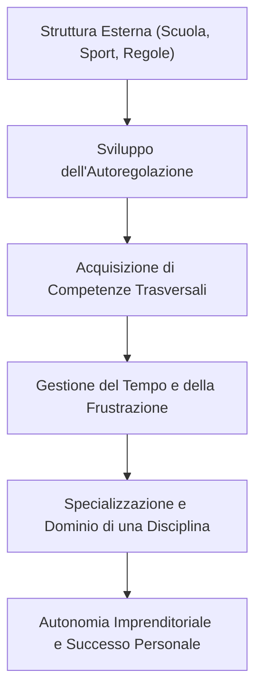

i[[Home MOC|Home]] / [[Personal Growth & Health MOC|Mentality]] / [[School MOC|School]] / [[Bravo a Scuola vs Bravo nella Vita]]

# Bravo a Scuola vs Bravo nella Vita: La Verità che i Guru non Dicono

- **Video URL**: https://youtu.be/QLQtu9ryhNM
- **Canale**: [[Andrea Muzii]]
- **Data Ingestione**: 2026-07-19

---

## Sintesi Rapida

La narrazione diffusa dai guru della crescita personale e del business digitale tende a svalutare il rendimento scolastico, assimilando l'eccellenza negli studi a una cieca obbedienza. In realtà, questo mito ignora sia i principi fondamentali della <mark style="background:rgba(255, 193, 69, 0.32)"><b>psicologia dell'età evolutiva</b></mark> sia i dati statistici reali. L'ambiente scolastico e i contesti strutturati non plasmano individui passivi, ma forniscono la <mark style="background:rgba(255, 193, 69, 0.32)"><b>struttura esterna</b></mark> necessaria per sviluppare <mark style="background:rgba(255, 193, 69, 0.32)"><b>competenze trasversali</b></mark> indispensabili nella vita adulta e nell'imprenditoria.

---

## Il Mito dell'Obbedienza e la Fallacia dei Guru

Nel panorama del personal development e dell'imprenditoria digitale guidata da <mark style="background:rgba(181, 113, 255, 0.36)"><b>one-uprenditori</b></mark>, si è insediato un luogo comune particolarmente insidioso: chi ottiene ottimi risultati a scuola sarebbe soltanto un individuo addestrato ad obbedire, a non mettere in discussione le <mark style="background:rgba(181, 113, 255, 0.36)"><b>regole</b></mark> e ad eseguire ordini impartiti dall'alto. Questa visione dipinge il successo accademico come un sintomo di conformismo anziché di valore.

Tuttavia, un'analisi critica evidenzia come questo ragionamento poggi su basi concettualmente fallaci. La critica al sistema educativo viene spesso confusa con la svalutazione dell'apprendimento stesso. Muovere obiezioni alle carenze strutturali o didattiche dell'istituzione scolastica non implica affatto che l'adeguamento a un contesto strutturato sia un limite; al contrario, costituisce il **primo fondamentale gradino di sviluppo** di qualunque percorso professionale e personale.

>[!warning] Il Paradosso della Narrazione Simplificata
>Sostenere che andare bene a scuola equivalga a essere "una pecora" è una scorciatoia argomentativa. Ignora che il rispetto di una struttura non elimina il pensiero critico, ma crea il perimetro metodologico entro cui il pensiero critico e l'autonomia possono svilupparsi in modo efficace.

---

## La Psicologia dell'Età Evolutiva: Perché la Struttura è Indispensabile

Il primo errore cardine dei detrattori del percorso scolastico consiste nel disconoscere come funziona la <mark style="background:rgba(255, 193, 69, 0.32)"><b>psicologia dell'età evolutiva</b></mark>. Durante l'infanzia e l'adolescenza, l'individuo non possiede ancora il livello di maturazione neurologica e cognitiva necessario per autoregolarsi completamente o per comprendere in autonomia ciò che è prioritario per il proprio benessere a lungo termine.

Per questa ragione, la presenza di una <mark style="background:rgba(255, 193, 69, 0.32)"><b>struttura esterna</b></mark> definita — fatta di orari, consegne, valutazioni e regole di condotta — non è un atto castrante, bensì una **necessità di sviluppo fondamentale**.

I momenti di <mark style="background:rgba(181, 113, 255, 0.36)"><b>libertà e creatività</b></mark> non traggono valore dall'assenza totale di vincoli, ma proprio dalla loro contrapposizione a un quadro di riferimento solido. Senza un perimetro strutturato, l'esplorazione libera rischia di degenerare in disorganizzazione, impedendo al bambino e al ragazzo di interiorizzare il senso del limite e della disciplina.

---

## Le Competenze Trasversali della Disciplina Scolastica

Al di là dei singoli contenuti nozionistici — che la scuola potrebbe senz'altro trasmettere con metodi più efficaci e aggiornati — il valore profondo dell'esperienza scolastica risiede nell'allenamento quotidiano alle abilità trasversali (*soft skills*).

Attraverso la quotidianità delle lezioni e della verifica, si assimilano fattori determinanti per l'intero arco della vita:

- **Organizzazione e gestione del tempo**: Imparare a pianificare lo studio, gestire le scadenze e distribuire il carico di lavoro in vista di un obiettivo.
- <mark style="background:rgba(255, 193, 69, 0.32)"><b>Gestione della frustrazione</b></mark>: Affrontare un insuccesso, un voto negativo o una spiegazione complessa senza abbandonare il compito.
- **Accettazione e rielaborazione del feedback**: Trasformare la valutazione critica in uno strumento di correzione strategica del proprio metodo.

Tali competenze non sono affatto esclusive del contesto scolastico e possono essere edificate anche attraverso altre attività altamente strutturate — come gli <mark style="background:rgba(181, 113, 255, 0.36)"><b>sport agonisti</b></mark> (il pugilato, la disciplina atletica), la musica o il collezionismo competitivo (giochi di carte strategici, le gare di memoria o lo speedcubing). 

>[!important] La Struttura precede la Scalabilità
>Prima di poter espandere il proprio raggio d'azione o fondare un'azienda, è necessario diventare eccellenti in un ambito specifico altamente delimitato. La capacità di muoversi entro uno schema <mark style="background:rgba(181, 113, 255, 0.36)"><b>disciplinato e rigido</b></mark> è il pre-requisito indispensabile per costruire qualsiasi successo scalabile.

Inoltre, sul piano macroscopico, la <mark style="background:rgba(181, 113, 255, 0.36)"><b>correlazione statistica</b></mark> parla chiaro: ampie analisi sulla popolazione confermano un legame diretto e positivo tra il livello di istruzione conseguito e il reddito medio, la stabilità lavorativa e il benessere generale. Persino esaminando i profili delle figure di maggior successo economico a livello globale, la grande maggioranza possiede percorsi accademici avanzati e specializzazioni rigorose in ambito scientifico o ingegneristico. Le eccezioni del self-made man totalmente privo di istruzione rappresentano anomalie statistiche, non la norma.

---

## Il Paradosso dei Guru e il Ruolo Fiduciario dell'Insegnante

Se si analizza la narrazione dei guru che incoraggiano il disprezzo per la scuola, emerge un evidente <mark style="background:rgba(181, 113, 255, 0.36)"><b>paradosso della narrazione</b></mark>. Essi promuovono l'idea che la scuola ingabbi l'individuo in un sistema di regole, ma contestualmente propongono corsi o percorsi privati che richiedono l'adesione cieca e rigorosa a un nuovo set di regole rigide e procedure standardizzate definite da loro stessi.

In questo scenario, la vera variabile determinante all'interno della scuola è il <mark style="background:rgba(181, 113, 255, 0.36)"><b>singolo insegnante</b></mark>. Il docente non è soltanto un mero trasmettitore di nozioni, ma l'anello di congiunzione tra la materia e lo studente. 

Un insegnante illuminato trasmette una vera e propria <mark style="background:rgba(255, 193, 69, 0.32)"><b>forma mentis</b></mark>:

> [!quote] Il Valore dell'Insegnamento
> L'efficacia della didattica non si misura dalla memorizzazione passiva, ma dalla capacità del docente di insegnare a pensare, di trasferire rigore metodologico e di motivare lo studente a superare i propri limiti.

Reclamare una scuola migliore, più moderna ed equilibrata, non significa affatto demonizzare chi rispetta le regole o chi ottiene il massimo dai propri studi. Significa comprendere che la struttura non è una prigione, ma la rampa di lancio verso un'autonomia matura e consapevole.

---

## Concetti Chiave

- **[[Psicologia dell'Età Evolutiva]]**: Ramo della psicologia che studia lo sviluppo psichico dell'individuo, evidenziando il bisogno primario di cornici operative esterne durante l'accrescimento.
- **[[Soft Skills]]**: Insieme di abilità trasversali — tra cui la gestione del tempo, la resilienza e l'adattabilità — apprese attraverso l'interazione con sistemi regolamentati.
- **[[Disciplina Strutturata]]**: La pratica sistematica di esercitarsi all'interno di regole chiare, pre-requisito sia nello sport sia nelle professioni ad alto valore aggiunto.
- **[[Gestione della Frustrazione]]**: La capacità emotiva e cognitiva di tollerare ostacoli e insuccessi senza perdere la motivazione all'apprendimento.

---

## Collegamenti

- **Macro Area**: [[Personal Growth & Health MOC]] | [[School MOC]]
- **Note Correlate**: [[Learning to Learn ITA]] | [[Metodo di Studio - PACRAR]] | [[Telos]]
