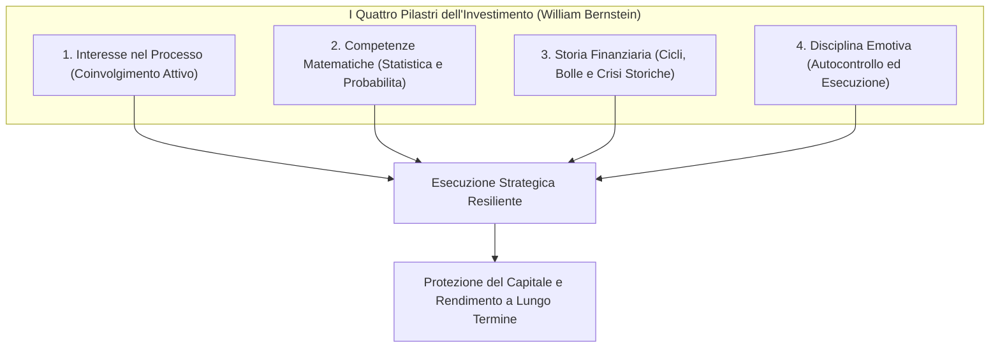
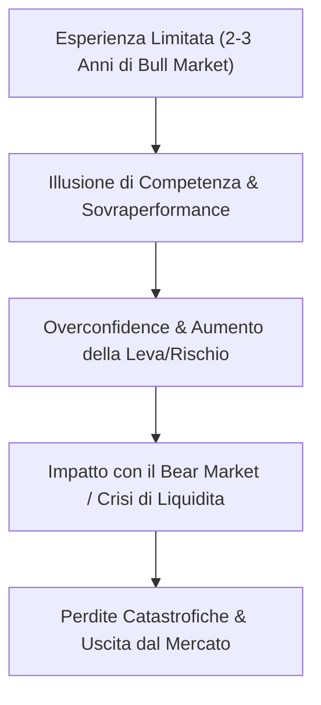

[[Home MOC|Home]] / [[Finanza MOC|Finance]] / [[La Bugia del Questa Volta e Diverso - Vivere un Crollo e un'Altra Storia]]

# La Bugia del "Questa Volta è Diverso": Vivere un Crollo Finanziario

- **Video URL**: https://youtu.be/vi0BYzyWnFg
- **Canale**: [[Mr. RIP]]

---

## Sintesi Rapida

L'illusione più ricorrente e distruttiva nella storia dei mercati finanziari è racchiusa nella convinzione che *"questa volta sia diverso"*. Sebbene le tecnologie, gli strumenti e gli scenari macroeconomici si trasformino costantemente, la natura umana e le dinamiche psicologiche di fondo restano invariate. Raggiungere una reale maturità come investitori non richiede soltanto formule matematiche, ma poggia sui <mark style="background:rgba(255, 193, 69, 0.32)"><b>quattro pilastri dell'investimento</b></mark> teorizzati da <mark style="background:rgba(181, 113, 255, 0.36)"><b>William Bernstein</b></mark>: l'interesse genuino nel processo gestionale, la comprensione probabilistica, la conoscenza approfondita della storia finanziaria e la ferrea disciplina emotiva.

Esiste tuttavia una profonda frattura tra la teoria quantitativa e l'esperienza vissuta sul campo: <mark style="background:rgba(255, 193, 69, 0.32)"><b>un crollo di mercato non può essere simulato tramite un backtest</b></mark>. I modelli retrospettivi mostrano i minimi storici come ovvie e razionali opportunità di acquisto, cancellando completamente il terrore viscerale, il senso di rovina e la paralisi decisionale provati da chi attraversa una crisi in tempo reale. Comprendere la storia dei mercati serve a costruire **umiltà epistemica**, a riconoscere l'inevitabilità dei cicli economici e a difendere il capitale dai pericoli dell'eccesso di sicurezza (*overconfidence*).

---

## I Quattro Pilastri dell'Investimento Consapevole

Nella letteratura finanziaria contemporanea, in particolare nelle opere cardine _The Four Pillars of Investing_ e _The Investor's Manifesto_ di <mark style="background:rgba(181, 113, 255, 0.36)"><b>William Bernstein</b></mark>, il successo negli investimenti a lungo termine non viene fatto dipendere dalla selezione di specifici asset class miracolosi o dall'abilità di prevedere il mercato nel breve periodo (*market timing*). Al contrario, esso richiede la convergenza di quattro competenze strutturali:

### 1. Interesse Attivo nel Processo Gestionale
L'amministrazione del patrimonio personale richiede un **coinvolgimento metodico e continuativo**. Così come accade per l'artigianato, la falegnameria o l'arte medica, se l'attività di pianificazione e gestione finanziaria viene vissuta come un compito gravoso o sgradevole (paragonabile a una dolorosa operazione odontoiatrica), i risultati finali saranno inevitabilmente scadenti. Chi non prova piacere nell'approfondire la materia tenderà a delegare passivamente le proprie scelte o ad abbandonare la strategia nei momenti critici.

### 2. Basi Matematiche e Pensiero Probabilistico
Non è necessario essere matematici d'avanguardia, ma un investitore deve possedere una padronanza intuitiva e quantitativa superiore all'aritmetica di base:
- Comprensione rigorosa delle **percentuali e delle asimmetrie matematiche**: una perdita del $50\%$ richiede un rendimento del $+100\%$ per essere recuperata; un calo dell'$80\%$ necessita di un guadagno del $+400\%$.
- Meccanica esponenziale dell'<mark style="background:rgba(181, 113, 255, 0.36)"><b>interesse composto</b></mark> e valore temporale del denaro.
- Nozioni di statistica applicata, inclusi i concetti di **distribuzione normale**, deviazione standard, regressione verso la media e legge dei grandi numeri.

### 3. Solida Conoscenza della Storia Finanziaria
Senza memoria storica, ogni oscillazione di prezzo appare inedita, straordinaria o apocalittica. Dalla <mark style="background:rgba(181, 113, 255, 0.36)"><b>South Sea Bubble</b></mark> del 1720 alla <mark style="background:rgba(181, 113, 255, 0.36)"><b>Grande Depressione del 1929</b></mark>, dalla crisi inflazionistica degli anni '70 allo scoppio della bolla Dot-Com del 2000 fino alla grande crisi finanziaria del 2008, i mercati ripropongono costantemente gli stessi schemi di euforia speculativa e panico collettivo.

### 4. Disciplina Emotiva ed Esecuzione Strategica
Questo è il pilastro spartiacque. Un investitore può possedere una mente brillante, un'eccellente comprensione matematica e una cultura storica impeccabile, ma se è privo di <mark style="background:rgba(255, 193, 69, 0.32)"><b>disciplina emotiva</b></mark>, soccomberà inevitabilmente alla paura o all'avidità nel momento dell'esecuzione. La capacità di attenersi rigidamente al proprio piano prestabilito durante le fasi di stress estremo costituisce il fattore determinante tra profitto e rovina.

>[!important] La Gerarchia dei Pilastri
>La conoscenza tecnica e teorica è una condizione necessaria ma non sufficiente: senza disciplina psicologica ed emotiva, le prime tre abilità rischiano di risultare del tutto inutili quando i mercati entrano in territorio di panico.

---

## La Maturità dell'Investitore e l'Illusione dell'Esperienza Breve

Uno degli errori più diffusi tra i partecipanti ai mercati finanziari è confondere un periodo favorevole di mercato (*Bull Market*) con la propria abilità analitica. Chi opera da due o tre anni e sperimenta guadagni costanti tende a sviluppare una pericolosa distorsione da **eccesso di fiducia** (*overconfidence bias*), ritenendo che battere il mercato sia un'attività semplice o che le metriche tradizionali siano ormai superate.

Come sottolineato dal divulgatore e gestore <mark style="background:rgba(181, 113, 255, 0.36)"><b>Ben Carlson</b></mark>, non esistono scorciatoie temporali per acquisire la saggezza dei mercati:
- È indispensabile aver vissuto e navigato attraverso **almeno un intero ciclo economico**, comprensivo sia di un'espansione prolungata sia di una fase di contrazione brutale (*Drawdown* profondo).
- Chi non ha ancora attraversato un mercato ribassista prolungato non ha mai testato la propria reale **tolleranza al rischio** sul capitale effettivo, al di là delle simulazioni su carta.

---

## Le Quattro Lezioni della Storia dei Mercati secondo Ben Carlson

Per colmare parzialmente il divario tra la giovinezza operativa e l'esperienza sul campo, lo studio approfondito della storia finanziaria offre una bussola indispensabile. Ben Carlson individua quattro lezioni fondamentali estratte dallo studio sistematico dei mercati del passato:

### 1. Prospettiva sugli Estremi e la Frase più Pericolosa
I movimenti di mercato sembrano sempre privi di precedenti storici a chi li vive nel presente. Sebbene gli attori, le innovazioni tecnologiche e i contesti normativi cambino, il pendolo psicologico oscilla costantemente tra due poli opposti: <mark style="background:rgba(181, 113, 255, 0.36)"><b>avidità (greed)</b></mark> ed <mark style="background:rgba(181, 113, 255, 0.36)"><b>euforia</b></mark> da un lato, <mark style="background:rgba(181, 113, 255, 0.36)"><b>panico</b></mark> e avversione al rischio dall'altro.

La celebre massima del trader storico <mark style="background:rgba(181, 113, 255, 0.36)"><b>Jesse Livermore</b></mark> mantiene intatta la sua attualità:
>[!quote] Jesse Livermore
>_«Non c'è niente di nuovo a Wall Street. Non ci può essere, perché la speculazione è vecchia come le colline. Quello che succede nel mercato azionario oggi è già successo in passato e succederà ancora.»_

I mercati possono salire molto più in alto o scendere molto più in basso di quanto chiunque ritenga razionale, ma **nessuna anomalia dura per sempre**. La convinzione che *"questa volta sia diverso"* è il segnale classico che precede l'esaurimento di una fase euforica.

### 2. L'Inevitabilità dei Cicli di Mercato
Come teorizzato da <mark style="background:rgba(181, 113, 255, 0.36)"><b>Howard Marks</b></mark>, nel mondo degli investimenti nulla è più certo e prevedibile dell'esistenza dei cicli. Fondamentali, psicologia collettiva, valutazioni e rendimenti oscillano continuamente. 

La vera difficoltà risiede nel fatto che **i cicli non hanno una scadenza fissa o un calendario predeterminato**:
- Alcuni mercati rialzisti possono durare decenni sostenuti da innovazioni strutturali;
- Alcuni crolli avvengono in modo fulmineo, mentre altri si trascinano lentamente per anni attraverso un logoramento psicologico costante.

### 3. Costruzione dell'Umiltà Epistemica contro l'Overconfidence
Lo studio della storia dimostra quanto sia strutturalmente complessa l'arte della previsione. Il panorama finanziario è costellato dai fallimenti di economisti insigniti di premi Nobel, brillanti analisti quantitativi e gestori di hedge fund che sono stati accecati dalla certezza assoluta dei propri modelli. Imparare dal passato demolisce l'illusione del controllo e insegna a pianificare per una **gamma diversificata di scenari possibili** anziché scommettere su un unico esito.

### 4. Il Limite dei Dati Storici e la Natura Non Predittiva dei Modelli
La storia fornisce un'eccellente linea di base (*baseline*) statistica e consente di stimare distribuzioni di probabilità sensate, ma non è una sfera di cristallo. Un modello quantitativo non può prevedere eventi esogeni complessi, innovazioni dirompenti o mutamenti geopolitici imprevedibili.

---

## L'Asimmetria Emotiva: Perché un Crollo Non si Può "Backtestare"

Il limite più profondo dell'analisi puramente quantitativa risiede nella totale asimmetria tra dati asettici e realtà psicologica. I grafici storici e i **backtest computazionali sono privi di emozioni** (*unemotional*), mentre gli esseri umani sono guidati da istinti biologici di conservazione.

>[!quote] Fred Schwed (_Where Are the Customers' Yachts?_)
>_«Come ogni esperienza ricca di emozioni della vita, l'autentico sapore del perdere una somma vitale di denaro non può essere trasmesso dalla letteratura.»_

Quando si osserva retrospettivamente il grafico di una crisi storica (come il crollo del 1929, lo scoppio della bolla del 2000 o la crisi dei mutui subprime del 2008), ogni minimo di mercato appare come una straordinaria e ovvia opportunità di acquisto. Tuttavia, questa visione retrospettiva è viziata dal fatto che **a posteriori si conosce già la fine della storia e il punto esatto di ripartenza**.

| Dimensione | Analisi Retrospettiva (Backtest) | Esperienza Reale in Tempo Reale |
| :--- | :--- | :--- |
| **Percezione del Drawdown** | Fluttuazione statistica temporanea con recupero certo | Minaccia esistenziale al proprio capitale e al tenore di vita |
| **Stato Emotivo** | Calma, distacco logico e razionalità computazionale | Terrore viscerale, insonnia, ansia e pressione sociale/familiare |
| **Punto di Minimo** | Punto ottimale per acquistare a sconto (*Buy the Dip*) | Fase di massimo pessimismo in cui si teme il collasso del sistema |
| **Orizzonte Temporale** | Compresso in pochi centimetri di grafico | Mesi o anni di erosione continua del patrimonio giorno dopo giorno |
| **Fattori Esterni** | Ignorati (il modello valuta solo prezzi e indici) | Rischio simultaneo di perdita del lavoro, recessione ed emergenze |

### Il Caso Studio del 2008: Dalla Teoria al Panico di Bogleheads
Un esempio emblematico dell'impatto psicologico reale è rappresentato dalle testimonianze preservate sui forum di investitori passivi storici (come la celebre community <mark style="background:rgba(181, 113, 255, 0.36)"><b>Bogleheads</b></mark>). Nell'ottobre del 2008, durante il culmine del panico bancario globale, decine di investitori disciplinati — fedeli alla filosofia dell'indicizzazione passiva e del lungo termine — iniziarono a capitolare emotivamente, pubblicando messaggi di disperazione (*thread "Panic Survival"*) e vendendo ai minimi storici pur di fermare l'angoscia psicologica.

Vivere un crollo reale significa gestire la paura concreta che le aziende in cui si investe non si riprenderanno mai più, o che il sistema finanziario globale sia giunto a un punto di non ritorno.

---

## Dinamiche Speculative Moderne e Distorsione dei Fondamentali

Nelle fasi avanzate di un ciclo di mercato rialzista, si osserva frequentemente un progressivo scollamento tra il prezzo degli asset e i loro fondamentali economici sottostanti (ricavi, utili, flussi di cassa operativi e rendimento reale del capitale investito):

- **Valutazioni Estreme e Multipli Irrazionali**: quando azioni o asset digitali scambiano a multipli prezzo/utili (P/E) abnormi o privi di flussi di cassa, l'investimento cessa di essere tale e si trasforma in pura **speculazione basata sulla teoria del più sciocco** (*Greater Fool Theory*).
- **Il Keynesian Beauty Contest**: come descritto da John Maynard Keynes, il mercato smette di valutare il valore intrinseco di un bene e si focalizza unicamente sull'anticipare ciò che la maggioranza dei partecipanti comprerà a breve termine per pura inerzia o moda speculativa.
- **La Trappola del Gambling Finanziario**: quando la crescita dei prezzi prescinde dalla produttività reale e si alimenta esclusivamente di narrativa e leva finanziaria, la volatilità subisce un'accelerazione esponenziale, aumentando la gravità della correzione successiva.

---

## Principi Operativi per l'Investitore a Lungo Termine

Per navigare con successo sia le fasi di euforia irrazionale sia i periodi di crollo sistemico, l'investitore strategico deve interiorizzare una serie di principi non negoziabili:

- [k] **Costruire un'Allocazione del Rischio Realistica**: non sovrastimare la propria propensione al rischio durante i mercati rialzisti. Il portafoglio deve essere dimensionato per permettere di dormire sonni tranquilli anche in presenza di una perdita temporanea del $30-50\%$.
- [!] **Evitare la Leva Finanziaria Eccessiva**: la leva amplifica i rendimenti nominali ma azzera la capacità di resistere ai drawdown prolungati, costringendo a liquidazioni forzate nei momenti peggiori.
- [w] **Mantenere Liquidità di Riserva e Fondo Emergenze**: disporre di liquidità garantita evita di dover vendere asset azionari in perdita per far fronte a necessità personali impreviste.
- [R] **Praticare il Ribilanciamento Periodico**: vendere quote di asset che hanno corso eccessivamente per acquistare asset temporaneamente depressi consente di monetizzare l'euforia e sfruttare la ciclicità senza tentare di prevedere i massimi e i minimi.
- [S] **Pianificare per l'Incertezza Epistemica**: accettare che il futuro non è prevedibile e che la sopravvivenza a lungo termine sul mercato premia la resilienza psicologica rispetto all'ottimizzazione esasperata.

---

## Collegamenti

- [[Finance|Finance — Map of Content]]
- [[Guida Investimenti 2025]]
- [[Come le Banche Creano Magicamente il Denaro]]
- [[Una Nuova Visione Economica - il Piano Strategico Dietro i Dazi Americani]]
- [[Home|Home]]
