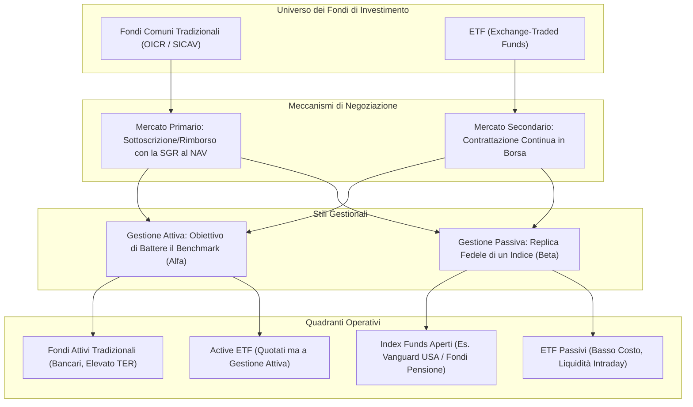
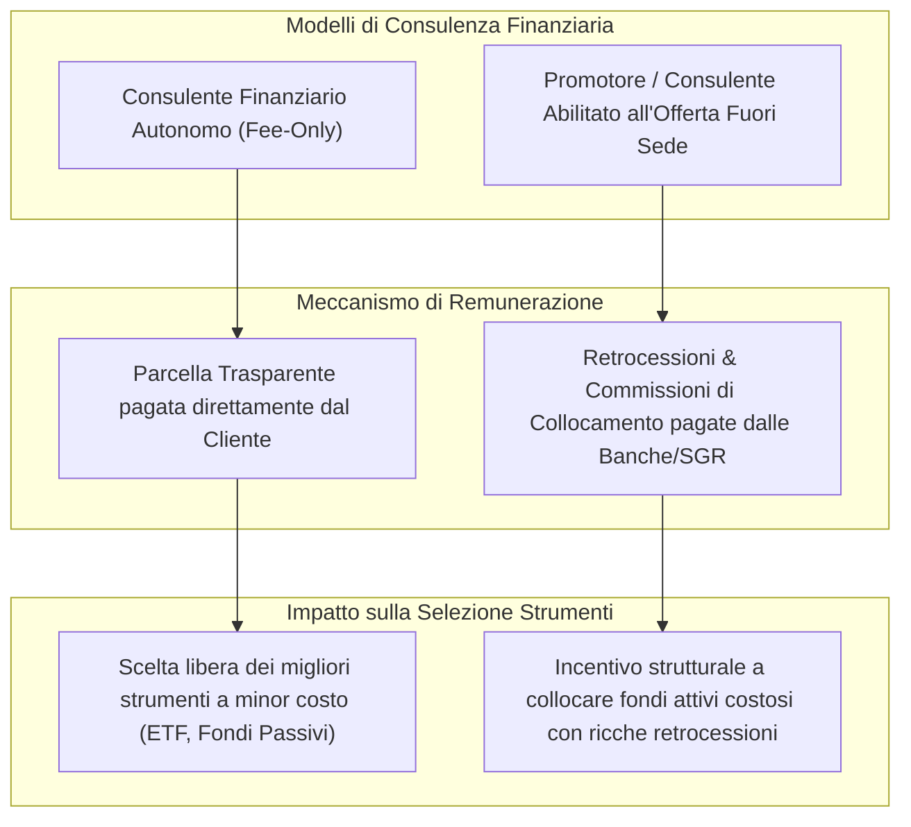

[[Home MOC|Home]] / [[Finanza MOC|Finance]] / [[Le Vere Differenze Tra Fondi e Etf]]

# Le Vere Differenze Tra Fondi e Etf

- **Video URL**: https://youtu.be/nEDQ31eYj9k
- **Canale**: [[Mr. RIP]]

---

## Sintesi Esecutiva

Nel linguaggio comune e nella consulenza finanziaria commerciale, i termini <mark style="background:rgba(255, 193, 69, 0.32)"><b>fondo comune di investimento</b></mark> ed <mark style="background:rgba(255, 193, 69, 0.32)"><b>ETF (Exchange-Traded Fund)</b></mark> vengono spesso contrapposti in modo improprio, generando confusione concettuale. In realtà, **tutti gli ETF sono fondi**, ma non tutti i fondi sono ETF: la relazione è quella di un insieme con un suo sottoinsieme specializzato.

La vera linea di demarcazione tra gli strumenti si articola su due dimensioni ortogonali:
1. **La struttura di negoziazione e liquidazione:** I fondi aperti tradizionali si sottoscrivono e rimborsano sul <mark style="background:rgba(181, 113, 255, 0.36)"><b>mercato primario</b></mark> direttamente con l'emittente al <mark style="background:rgba(181, 113, 255, 0.36)"><b>NAV (Net Asset Value)</b></mark> di fine giornata, mentre gli ETF sono quotati e scambiati sul <mark style="background:rgba(181, 113, 255, 0.36)"><b>mercato secondario</b></mark> (la borsa valori) in tempo reale tra investitori.
2. **Lo stile gestionale:** La distinzione tra <mark style="background:rgba(255, 193, 69, 0.32)"><b>gestione attiva</b></mark> (tentativo di battere un indice di mercato) e <mark style="background:rgba(255, 193, 69, 0.32)"><b>gestione passiva</b></mark> (replica fedele di un indice/benchmark) è del tutto indipendente dal veicolo utilizzato. Esistono infatti sia fondi aperti passivi (come i diffusi *index mutual funds*), sia ETF a gestione attiva.

Comprendere questa architettura permette all'investitore di valutare criticamente il ruolo del <mark style="background:rgba(181, 113, 255, 0.36)"><b>benchmark</b></mark>, l'incidenza del <mark style="background:rgba(181, 113, 255, 0.36)"><b>tracking error</b></mark> e la natura della relazione con il proprio consulente (autonomo a parcella vs promotore bancario in conflitto d'interesse).

---

## Tassonomia degli Strumenti: Fondi Comuni vs ETF

Per fare chiarezza è fondamentale stabilire la gerarchia definitoria: un **fondo comune di investimento** è un patrimonio autonomo raccolto tra una pluralità di risparmiatori e gestito in monte da una società specializzata (SGR o SICAV).

### 1. Fondi Comuni Tradizionali (Aperti)
- **Modalità di acquisto/vendita:** L'investitore interagisce unicamente con l'emittente sul mercato primario.
- **Prezzo di esecuzione:** Le operazioni avvengono al valore patrimoniale netto delle quote (<mark style="background:rgba(181, 113, 255, 0.36)"><b>NAV</b></mark>), calcolato una sola volta al giorno dopo la chiusura delle borse.
- **Meccanismo di rimborso:** Quando l'investitore disinveste, la società di gestione liquida parte dei titoli sottostanti per restituire il controvalore monetario.

### 2. ETF (Exchange-Traded Funds)
- **Modalità di acquisto/vendita:** Le quote sono frazionate e quotate su mercati regolamentati (come Borsa Italiana, Xetra o Euronext). L'investitore acquista e vende sul mercato secondario scambiando quote con altri investitori o con i market maker.
- **Prezzo di esecuzione:** Il prezzo varia continuamente durante la giornata di contrattazione in base alla domanda e all'offerta, rimanendo ancorato al valore del sottostante grazie all'arbitraggio degli *Authorized Participants* (meccanismo di *creation/redemption in-kind*).
- **Trasparenza e flessibilità:** L'investitore conosce istantaneamente il prezzo di esecuzione ed è libero di inserire ordini limite, stop-loss o acquisti frazionati.

---

## La Matrice Veicolo vs Stile Gestionale

Uno dei più grandi malintesi finanziari consiste nell'associare automaticamente il termine **"fondo"** alla gestione attiva e il termine **"ETF"** alla gestione passiva. La forma giuridica del contenitore (veicolo) e la strategia di investimento (stile) sono due aspetti completamente separati.

| Categoria | Fondo Tradizionale Aperto | ETF (Exchange-Traded Fund) |
|---|---|---|
| **Gestione Passiva (Indicizzata)** | **Index Mutual Fund** (es. Vanguard Index Funds nei piani pensione 401k USA). Replicano indici con costi bassi ma senza quotazione intraday. | **ETF Passivo Standard** (es. ETF su MSCI World o S&P 500). Strumento principe per gli investitori retail moderni: bassi costi e replica trasparente. |
| **Gestione Attiva** | **Fondo Comune Attivo Tradizionale** (la maggioranza dei prodotti collocati dalle reti bancarie italiane). Commissioni elevate (TER 1,5%-3%), costi di ingresso/uscita e frequente sotto-performance. | **Active ETF** (ETF a gestione attiva). Fondi quotati in borsa in cui un gestore seleziona attivamente i titoli cercando di sovraperformare il mercato. |

### Il Mercato Globale dei Fondi Passivi
Negli Stati Uniti, la quota di mercato dei **fondi comuni passivi non quotati** (come quelli offerti storicamente da Vanguard o Fidelity) supera persino quella degli ETF passivi all'interno dei fondi pensione e dei conti previdenziali aziendali (401k). Ciò dimostra che l'efficienza della gestione passiva prescinde dalla necessità della quotazione in borsa.

---

## Il Benchmark e le Dinamiche di Tracking

Il <mark style="background:rgba(255, 193, 69, 0.32)"><b>benchmark</b></mark> è il parametro oggettivo di riferimento utilizzato per confrontare il rendimento e il profilo di rischio di una strategia di investimento.

### 1. Il Benchmark nella Gestione Passiva
Nei prodotti indicizzati, il benchmark rappresenta l'indice esatto che lo strumento ha l'obiettivo statutario di replicare.

- **Rendimento Teorico Netto:** In assenza di attriti, il rendimento del fondo corrisponde a:
 $$\text{Rendimento Fondo} = \text{Rendimento Benchmark} - \text{TER (Costi di Gestione)}$$
- **Tracking Difference & Tracking Error:**
 - *Tracking Difference:* Lo scostamento assoluto tra il rendimento del fondo e quello dell'indice in un dato intervallo temporale.
 - *Tracking Error:* La volatilità statistica di questo scostamento nel tempo.
- **Fattori di Disallineamento (Bias Negativo):**
 - **Frequenza di ribilanciamento:** Gli indici ufficiali applicano formule di ribilanciamento a date prefissate (con prezzi di chiusura), mentre il fondo esegue operazioni di acquisto e vendita sui mercati reali durante la giornata.
 - **Rotazione dei titoli in entrata/uscita:** Quando una società decade da un indice large-cap, il fondo potrebbe possederla ancora in fase calante prima di perfezionare la vendita, creando un lieve bias strutturale verso scostamenti negativi.
 - **Costi di transazione e ritenute sui dividendi:** Differenze tra la fiscalità teorica dell'indice (*Gross Total Return* vs *Net Total Return*) e quella effettivamente applicata al fondo.

### 2. Il Benchmark nella Gestione Attiva e la Scelta "Risk-Appropriate"
Nei fondi a gestione attiva, il gestore ha l'obiettivo dichiarato di generare <mark style="background:rgba(181, 113, 255, 0.36)"><b>alfa</b></mark>, ossia battere il benchmark a parità di rischio, oppure ottenere lo stesso rendimento con una volatilità e un *maximum drawdown* inferiori.

> [!warning] Il Pericolo del Benchmark Inappropriato (*Benchmark Mismatch*)
> Spesso le società di gestione adottano benchmark di comodo per mascherare scarse performance. Ad esempio, un fondo che investe in azioni ad alta volatilità non può adottare come parametro di confronto un indice obbligazionario a breve termine o la liquidità monetaria. La scelta del benchmark deve essere rigorosamente **Risk-Appropriate**, rispettando la medesima classe di attivo, area geografica e profilo di rischio.

---

## Consulenza Finanziaria: Indipendenza vs Retribuzione da Collocamento

Quando si analizza la presenza di molteplici fondi all'interno di un portafoglio, la prima variabile da verificare è il modello di remunerazione del professionista che li ha raccomandati.

- **Consulente Finanziario Autonomo (Indipendente / Fee-Only):**
 - Remunerato **esclusivamente a parcella** dal cliente.
 - Non percepisce provvigioni o retrocessioni da banche o case di investimento.
 - Può consigliare liberamente ETF o fondi a bassissimo costo in base all'effettivo interesse del cliente.
- **Promotore Bancario / Agente di Rete:**
 - Lavora su mandato della banca o della rete distributiva.
 - Il suo compenso dipende in larga parte dalle **retrocessioni commissionali** (*kickback*) generate dai fondi attivi collocati.
 - Difficilmente proporrà ETF a basso costo in quanto privi di provvigioni distributive per la banca.

---

## Concetti Chiave & Takeaway

- **Relazione di Insieme:** L'ETF è semplicemente un fondo comune con la caratteristica tecnica di essere negoziato in borsa in tempo reale come un'azione.
- **Indipendenza tra Veicolo e Stile:** La forma del fondo (aperto o ETF) non determina se la gestione sia attiva o passiva; esistono fondi aperti indicizzati ed ETF attivi.
- **Costi e Trasparenza:** Gli ETF passivi offrono generalmente costi di gestione (TER) sensibilmente inferiori (0,05%-0,30%) rispetto ai fondi attivi bancari tradizionali (1,50%-3,00%), oltre a totale trasparenza delle posizioni giornaliere.
- **Tracking Difference:** La performance reale di un fondo indicizzato rispetto al benchmark risente dei costi interni, dei tempi di ribilanciamento e delle ritenute fiscali.
- **Controllo del Conflitto d'Interesse:** Un portafoglio infarcito di fondi attivi costosi è spesso il risultato di una rete distributiva remunerata a retrocessioni, non di una strategia ottimizzata per l'investitore.

---

## Applicazioni & Note Operative

- **Revisione del Portafoglio:** Esaminare i documenti informativi chiave (KID) di ogni fondo in possesso per identificare le spese correnti totali (TER), i costi di ingresso/uscita e le commissioni di incentivo (*performance fee*).
- **Verifica del Benchmark:** Controllare che l'indice dichiarato dal fondo rispecchi fedelmente la reale esposizione al rischio del capitale investito.
- **Ottimizzazione Esecutiva:** Per la costruzione di un portafoglio di lungo termine, privilegiare ETF passivi UCITS ad accumulazione, minimizzando i costi di attrito ed eliminando gli intermediari non allineati.

---

## Collegamenti

- [[Finance]]
- [[Guida Investimenti 2025]]
- [[Come le Banche Creano Magicamente il Denaro]]
- [[La Bugia del Questa Volta e Diverso - Vivere un Crollo e un'Altra Storia|La Bugia del Questa Volta e Diverso]]
- [[Strategia per Guadagnare con le Criptovalute - un Approccio Duraturo]]
