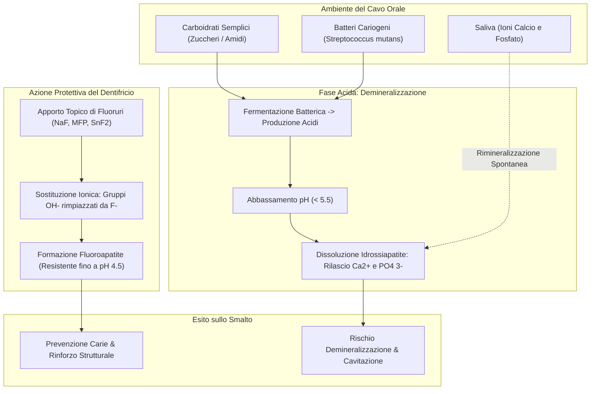

[[Home MOC|Home]] / [[Personal Growth & Health]] / [[A Cosa Serve Davvero il Dentifricio Come il Fluoro Protegge i Denti|Raw Note 2026 - 08 - 25 23 - 30]]

# A Cosa Serve Davvero il Dentifricio: Come il Fluoro Protegge lo Smalto dei Denti

- **Video URL**: https://youtu.be/LEN55dyOKw8
- **Canale**: [[Geopop]]

---

## Sintesi Esecutiva

Il dentifricio non è un semplice detergente aromatico per l'alito, ma un **vettore chimico essenziale** per la conservazione e la protezione dello smalto dentale. Lo strato esterno dei nostri denti è composto per circa il 97% da <mark style="background:rgba(255, 193, 69, 0.32)"><font color="#cc8800"><b>idrossiapatite</b></font></mark>, un minerale cristallino ad altissima durezza che, una volta danneggiato, **non possiede capacità di rigenerazione cellulare autonoma**.

Nel cavo orale coesistono continuamente due reazioni chimiche antagoniste:
1. La <mark style="background:rgba(255, 193, 69, 0.32)"><font color="#cc8800"><b>demineralizzazione</b></font></mark>, innescata dagli acidi metabolici prodotti dai batteri (in particolare <mark style="background:rgba(181, 113, 255, 0.36)"><font color="#9a54c1"><b>Streptococcus mutans</b></font></mark>) durante la fermentazione degli zuccheri, che porta allo scioglimento del reticolo minerale sotto un pH critico di 5.5;
2. La <mark style="background:rgba(181, 113, 255, 0.36)"><font color="#9a54c1"><b>rimineralizzazione</b></font></mark>, mediata naturalmente dalla saliva ricca di ioni calcio e fosfato.

L'inserimento del **fluoro** (sotto forma di sali di <mark style="background:rgba(255, 193, 69, 0.32)"><font color="#cc8800"><b>fluoruro</b></font></mark>) nel dentifricio induce una reazione di sostituzione topica: gli ioni fluoruro rimpiazzano i gruppi ossidrile dell'idrossiapatite, generando <mark style="background:rgba(255, 193, 69, 0.32)"><font color="#cc8800"><b>fluoroapatite</b></font></mark>. Questa nuova struttura cristallina è nettamente più resistente agli attacchi acidi, abbassando la soglia critica di dissoluzione a un pH di 4.5 e creando un vero e proprio **scudo chimico protettivo**.



---

## Struttura e Fisiologia dello Smalto Dentale

Lo **smalto dentale** rappresenta il tessuto biologico più duro e mineralizzato dell'organismo umano, progettato per sopportare forze masticatorie continue e proteggere la dentina e la polpa sottostante.

### Composizione Chimica
La composizione dello smalto è quasi interamente inorganica:
- **97% Matrice Minerale:** Costituita da cristalli esagonali compatti di <mark style="background:rgba(255, 193, 69, 0.32)"><font color="#cc8800"><b>idrossiapatite</b></font></mark>, la cui formula stechiometrica è:
 $$\text{Ca}_{10}(\text{PO}_4)_6(\text{OH})_2$$
 La struttura racchiude 10 atomi di calcio, 6 gruppi fosfato e 2 gruppi idrossido $(\text{OH}^-)$ disposti lungo l'asse centrale del reticolo cristallino.
- **3% Componente Organica & Acqua:** Una matrice residuale di acqua legata e proteine strutturali (come amelogenine ed enameloblastine) che conferisce un minimo grado di elasticità evitando la frattura fragile del cristallo.

### Il Paradosso dell'Assenza di Rigenerazione
A differenza dell'osso o di altri tessuti epiteliali (come approfondito in ambiti di fisiologia e cura dei tessuti in [[Skincare]]), **lo smalto dentale maturo non può rigenerarsi per via cellulare**:
- Durante l'odontogenesi, le cellule specializzate deputate alla sintesi dello smalto sono gli <mark style="background:rgba(181, 113, 255, 0.36)"><font color="#9a54c1"><b>ameloblasti</b></font></mark>.
- Nel momento in cui la corona del dente erompe attraverso la gengiva nella cavità orale, gli ameloblasti vanno incontro ad apoptosi e atrofia definitiva.
- Di conseguenza, qualsiasi perdita irreversibile di smalto per corrosione acida, usura meccanica o cavitazione cariosa deve essere prevenuta o riparata esclusivamente per via chimico-fisica o odontoiatrica.

---

## La Dinamica Biochimica: Demineralizzazione vs Rimineralizzazione

La salute dello smalto dipende da un **equilibrio dinamico continuo** all'interfaccia tra superficie dentale, biofilm batterico e fluido salivare.

```
 Demineralizzazione (pH < 5.5)
Idrossiapatite + 2H+ ===========================> 10 Ca2+ + 6 PO4(3-) + 2 H2O
 <===========================
 Rimineralizzazione (Saliva / pH > 5.5)
```

### 1. Il Meccanismo della Demineralizzazione
La bocca ospita centinaia di specie microbiche appartenenti al microbiota orale. Tra queste, lo <mark style="background:rgba(181, 113, 255, 0.36)"><font color="#9a54c1"><b>Streptococcus mutans</b></font></mark> possiede un'elevata capacità cariogena:
1. **Fermentazione degli Zuccheri:** In presenza di carboidrati semplici (saccarosio, glucosio, fruttosio o carboidrati raffinati come pane e pasta), i batteri attivano la glicolisi anaerobia producendo acidi organici (prevalentemente acido lattico).
2. **Crollo del pH Locale:** Gli acidi rilasciati nella placca fanno precipitare il pH locale al di sotto del valore critico di **$pH \approx 5.5$**.
3. **Attacco al Reticolo di Idrossiapatite:** A pH acido, gli ioni idrogeno $(\text{H}^+)$ reagiscono con i gruppi idrossido $(\text{OH}^-)$ dell'idrossiapatite formando molecole d'acqua:
 $$\text{Ca}_{10}(\text{PO}_4)_6(\text{OH})_2 + 2\text{H}^+ \longrightarrow 10\text{Ca}^{2+} + 6\text{PO}_4^{3-} + 2\text{H}_2\text{O}$$
4. **Perdita Minerale:** Il reticolo si dissolve progressivamente, rilasciando ioni calcio e fosfato liberi nella saliva e creando micro-porosità che evolvono in **lesioni cariose** stabili.

### 2. Il Ruolo Tampone della Saliva e la Rimineralizzazione
In condizioni fisiologiche normali, la saliva costituisce la prima linea di difesa dell'organismo:
- **Azione Tampone:** Contiene ioni bicarbonato e fosfato che neutralizzano l'eccesso di acidità riportando il pH verso la neutralità ($pH \approx 6.8 - 7.2$).
- **Apporto Minerale:** La saliva è sovrasatura di ioni $\text{Ca}^{2+}$ e $\text{PO}_4^{3-}$, che tendono a riprecipitare spontaneamente sulle zone demineralizzate, ricostituendo parzialmente i prismi di idrossiapatite.
- **Protezione Antimicrobica:** Enzimi come lisozima, lattoferrina e immunoglobuline A (IgA) limitano la proliferazione incontrollata dei batteri.

>[!important] La Bilancia della Carie
>Se la frequenza di assunzione di zuccheri e alimenti acidi (bibite gassate, agrumi, caffè, pomodoro) è troppo ravvicinata o l'igiene orale è inadeguata, la demineralizzazione supera costantemente la rimineralizzazione salivare, portando a perdita strutturale irreversibile.

---

## Il Ruolo del Fluoro: Dalla Idrossiapatite alla Fluoroapatite

L'elemento fondamentale introdotto dal dentifricio per alterare questa dinamica a favore della protezione è il **fluoro**.

>[!warning] Distinzione Chimica: Fluoro vs Fluoruri
>Il fluoro elementare $(\text{F}_2)$ è un gas alogeno altamente tossico e reattivo. Nei presidi odontoiatrici e nei dentifrici si impiegano esclusivamente i suoi sali inorganici ionici, denominati <mark style="background:rgba(255, 193, 69, 0.32)"><font color="#cc8800"><b>fluoruri</b></font></mark> $(\text{F}^-)$.

### I Composti Fluorurati Più Utilizzati
I principi attivi fluorurati standard nell'industria odontoiatrica includono:
- **Fluoruro di Sodio ($\text{NaF}$):** Rilascia istantaneamente ioni $\text{F}^-$ liberi a contatto con l'acqua e la saliva.
- **Monofluorofosfato di Sodio ($\text{Na}_2\text{FPO}_3$ o MFP):** Richiede l'idrolisi enzimatica delle fosfatasi salivari per liberare il fluoruro attivo.
- **Fluoruro Stannoso ($\text{SnF}_2$):** Fornisce sia lo ione fluoruro per la mineralizzazione sia lo ione stagno $(\text{Sn}^{2+})$, dotato di marcate proprietà antibatteriche e desensibilizzanti.

### La Reazione di Sostituzione Topica
Quando il dentifricio fluorurato viene applicato sulla superficie del dente durante lo spazzolamento, avviene una reazione di **scambio ionico topico in due fasi**:

1. **Fase Intermedia (Apatite Fluorinata):** Lo ione fluoruro sostituisce il primo gruppo idrossido del reticolo cristallino:
 $$\text{Ca}_{10}(\text{PO}_4)_6(\text{OH})_2 + \text{F}^- \longrightarrow \text{Ca}_{10}(\text{PO}_4)_6(\text{OH})\text{F} + \text{OH}^-$$
2. **Fase Finale (<mark style="background:rgba(255, 193, 69, 0.32)"><font color="#cc8800"><b>Fluoroapatite</b></font></mark>):** Un secondo ione fluoruro rimpiazza il secondo ossidrile:
 $$\text{Ca}_{10}(\text{PO}_4)_6(\text{OH})\text{F} + \text{F}^- \longrightarrow \text{Ca}_{10}(\text{PO}_4)_6\text{F}_2 + \text{OH}^-$$

### Perché la Fluoroapatite è uno "Scudo"?
La sostituzione del gruppo ossidrile con lo ione fluoruro (di raggio ionico minore ed elevatissima elettronegatività) rende il reticolo cristallino molto più compatto, ordinato e termodinamicamente stabile:
- **Abbassamento del pH Critico:** Mentre l'idrossiapatite si scioglie a $pH < 5.5$, la fluoroapatite resiste fino a **$pH \approx 4.5$**.
- **Resistenza agli Acidi Batterici:** La maggior parte degli attacchi acidi post-prandiali porta il cavo orale a un pH compreso tra 5.0 e 5.4: in questa finestra la normale idrossiapatite si scioglie, mentre **la fluoroapatite rimane integra**.
- **Effetto Serbatoio Dinamico:** La fluoroapatite superficiale subisce nel tempo un'usura meccanica e chimica graduale; la quotidiana riapplicazione del dentifricio ricarica questo scudo minerale superficiale.

---

## Anatomia e Formulazione del Dentifricio

Il dentifricio è un'emulsione chimica complessa formulata per combinare igiene meccanica, protezione chimica e stabilità della pasta.

| Categoria Ingrediente | Esempi Chimici | Funzione Principale | Meccanismo Operativo |
|---|---|---|---|
| **Agente Fluorurante (Attivo)** | Fluoruro di sodio ($\text{NaF}$), MFP, $\text{SnF}_2$ | Remineralizzazione & Scudo Acido | Conversione dell'idrossiapatite in fluoroapatite ad alta stabilità. |
| **Umettanti & Dolcificanti** | <mark style="background:rgba(181, 113, 255, 0.36)"><font color="#9a54c1"><b>Sorbitolo</b></font></mark>, Glicerolo, Xilitolo | Idratazione & Palatabilità non cariogena | Mantengono la pasta idratata nel tubetto; conferiscono sapore dolce senza nutrire i batteri (non fermentabili). |
| **Tensioattivi (Detergenti)** | <mark style="background:rgba(181, 113, 255, 0.36)"><font color="#9a54c1"><b>Sodio lauril solfato (SLS)</b></font></mark> | Schiumogeno & Emulsionante | Abbassa la tensione superficiale, rimuove residui lipidici e disperde il biofilm batterico. |
| **Abrasivi Delicati** | Silice idrata, Carbonato di calcio | Pulizia Meccanica Controllata | Rimuovono la pellicola acquisita e la placca senza graffiare lo smalto (indice RDA controllato). |
| **Conservanti & Stabilizzanti** | Benzoato di sodio, Gomma di xantano | Conservazione Microbiologica & Viscosità | Impediscono la proliferazione fungina e mantengono uniforme la consistenza della pasta. |
| **Aromi & Rinfrescanti** | Mentolo, Eucaliptolo | Esperienza Sensoriale | Donano freschezza prolungata all'alito. |

### La Scelta dei Polioli (Sorbitolo e Xilitolo)
L'aggiunta di zuccheri tradizionali (come il saccarosio) all'interno di un dentifricio sarebbe controproducente, in quanto alimenterebbe direttamente la fermentazione batterica. Per questo motivo l'industria impiega i **polioli** (alcoli dello zucchero come sorbitolo e xilitolo): molecole dolcificanti che i batteri della placca non riescono a metabolizzare in acido lattico.

---

## La Triade della Prevenzione: Meccanica, Chimica e Detersione

Nessun ingrediente chimico può sostituire l'azione fisica, così come lo spazzolamento a secco non garantisce la protezione minerale. L'igiene orale efficace si basa sulla sinergia simultanea di **tre pilastri**:

- [i] **Azione Meccanica (Lo Spazzolino):** È il motore primario. Le setole dello spazzolino disgregano fisicamente la matrice viscosa della placca batterica e rimuovono i residui di cibo più voluminosi dagli spazi interdentali e dai solchi occlusali. L'applicazione passiva del dentifricio senza frizione meccanica è clinicamente inefficace.
- [k] **Azione Chimica di Trasformazione (Il Fluoro):** Rilascia gli ioni fluoruro per mineralizzare lo smalto e costruire la barriera di fluoroapatite resistente all'acido.
- [w] **Azione Chimica di Detersione (I Tensioattivi):** Il sodio lauril solfato emulsiona i residui grassi e facilita il distacco e l'espulsione del biofilm disciolto tramite il risciacquo.

```
 ┌───────────────────────────────┐
 │ Igiene Orale Efficace │
 └───────────────┬───────────────┘
 │
 ┌──────────────────────────┼──────────────────────────┐
 ▼ ▼ ▼
┌──────────────────┐ ┌──────────────────┐ ┌──────────────────┐
│ Azione Meccanica │ │ Azione Chimica │ │ Detersione │
│ (Spazzolino) │ │ (Fluoro) │ │ (Tensioattivi) │
├──────────────────┤ ├──────────────────┤ ├──────────────────┤
│ Disgregazione │ │ Sintesi di │ │ Emulsione lipidi │
│ fisica placca & │ │ fluoroapatite e │ │ e riduzione │
│ detriti di cibo │ │ scudo anti-acido │ │ carica batterica │
└──────────────────┘ └──────────────────┘ └──────────────────┘
```

---

## Sicurezza, Dosaggio e Prevenzione della Fluorosi

### Ingestione Negli Adulti: La Regola della Dose
L'ingestione accidentale di una modica quantità di dentifricio durante lo spazzolamento quotidiano negli adulti non comporta alcun rischio tossicologico. In tossicologia vige il principio paracelsiano per cui _"è la dose che fa il veleno"_: la concentrazione di fluoruro nei dentifrici commerciali per adulti (generalmente compresa tra **1000 e 1450 ppm**) è studiata per garantire la massima efficacia topica in totale sicurezza sistemica.

### La Vulnerabilità Pediatrica: La Fluorosi Dentale
Una particolare cautela è richiesta per i bambini di età inferiore agli **8 anni**:
- **Amelogenesi in Corso:** A questa età, i denti permanenti si stanno ancora formando all'interno delle ossa mascellari e mandibolari.
- **Rischio di Deglutizione Cronica:** Se un bambino deglutisce regolarmente quantità elevate di dentifricio fluorurato, l'eccesso sistemico di fluoro può interferire con gli ameloblasti, causando la <mark style="background:rgba(181, 113, 255, 0.36)"><font color="#9a54c1"><b>fluorosi dentale</b></font></mark>.
- **Manifestazioni Cliniche:** Nelle forme lievi si evidenzia con sottili striature o macchie bianche gessose sullo smalto; nelle forme più gravi può causare discromie marroni e porosità strutturali.

### Linee Guida di Utilizzo Sicuro
- **Sotto i 2-3 anni:** Quantità microscopica grande quanto un _chicco di riso_ (smear size), preferibilmente con dentifrici a basso tenore di fluoro (500-1000 ppm) sotto diretta supervisione genitoriale.
- **Dai 3 ai 6 anni:** Quantità della grandezza di un _pisello_ (pea-sized), educando il bambino a sputare accuratamente l'eccesso senza deglutire.
- **Oltre i 6 anni e Adulti:** Spazzolamento costante almeno 2-3 volte al giorno dopo i pasti principali per un tempo minimo di 2 minuti.

---

## Collegamenti

- [[Home|Home]]
- [[Personal Growth & Health|Personal Growth & Health]]
- [[Youtube|Youtube Creators MOC]]
- [[Skincare|Routine di Cura Fisiologica e Salute dei Tessuti]]
