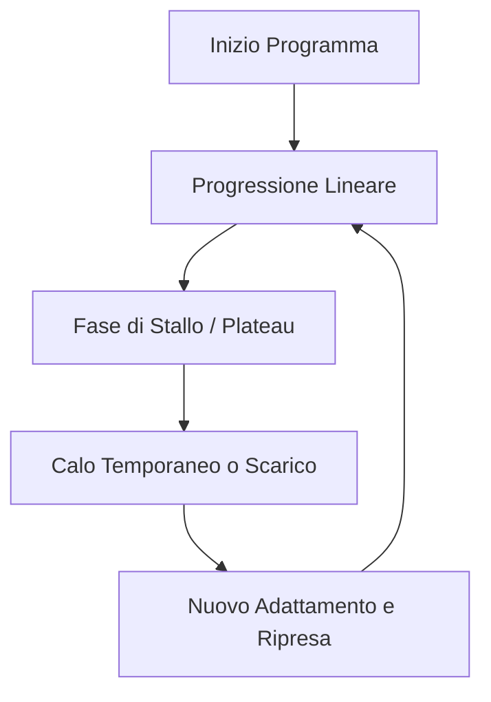

[[Home MOC|Home]] / [[Personal Growth & Health]] / [[Come Impostare una Corretta Progressione dei Carichi]]

# Come Impostare una Corretta Progressione dei Carichi

La [[Progressione dei Carichi]] (sovraccarico progressivo) è il pilastro fondamentale di qualsiasi programmazione di allenamento finalizzata all'[[Ipertrofia]] e all'aumento della forza. Senza un incremento sistematico dello stimolo nel tempo, il corpo non ha motivo di adattarsi e crescere.

---

## Che Cos'è la Progressione?
Progredire non significa unicamente aumentare il peso sul bilanciere. Esistono diverse modalità principali per impostare una progressione:

1. **Aumento delle ripetizioni (a parità di carico)**:
   * *Esempio*: Passare da `60 kg x 10 rep` nella prima settimana a `60 kg x 11 rep` nella settimana successiva.
2. **Aumento del carico (a parità di ripetizioni)**:
   * *Esempio*: Passare da `60 kg x 10 rep` a `65 kg x 10 rep`.
3. **Miglioramento della qualità esecutiva (a parità di carico e rep)**:
   * *Esempio*: Eseguire un curl per bicipiti con `10 kg` senza compensare con la schiena (cheating) rispetto alle settimane precedenti.

> [!WARNING]
> Aumentare il carico diminuendo drasticamente le ripetizioni (es. passare da `60 kg x 10` a `70 kg x 8`) **non** costituisce una progressione sul tempo, bensì una semplice serie piramidale. La vera progressione si valuta confrontando le performance a parità di parametri chiave.

---

## Schema di Progressione su 6 Settimane (Reps-First)
Per massimizzare i guadagni senza stallare rapidamente, una strategia efficace consiste nel **progredire prima con le ripetizioni e poi con il carico**. Aumentare costantemente il carico di settimana in settimana (anche solo di 1-2 kg) è insostenibile nel lungo periodo.

### Esempio Pratico: Distensioni con Manubri su Panca Orizzontale
* **Target di partenza**: Trovare un carico che consenta di eseguire 6 ripetizioni pulite (es. `60 kg`).
* **Sviluppo dello schema**:
  * **Settimana 1**: `60 kg x 6 rep`
  * **Settimana 3**: `60 kg x 8 rep` (progressione sulle rep)
  * **Settimana 5**: `60 kg x 10 rep` (progressione sulle rep)
* **Reset & Incremento**: Una volta raggiunte le 10 ripetizioni (allontanandosi dal range iniziale), si aumenta il carico (es. a `65 kg`) e si torna a eseguire 6 ripetizioni, ricominciando il ciclo.

---

## Alternanza degli Esercizi (Strategia Anti-Stallo)
Ripetere ossessivamente lo stesso identico esercizio ogni settimana riduce il margine di progressione e può portare rapidamente a uno stallo. Una tecnica avanzata consiste nell'**alternare due schede diverse** a settimane alterne, utilizzando varianti simili per lo stesso piano di lavoro.

### Esempio di Programmazione Alternata (Petto)

| Settimana | Esercizio A (Settimane 1, 3, 5) | Esercizio B (Settimane 2, 4, 6) |
| :--- | :--- | :--- |
| **Primo Esercizio** (Spinta Orizzontale) | [[Distensioni manubri su panca orizzontale]] | [[Chest press]] |
| **Secondo Esercizio** (Spinta Inclinata) | [[Distensioni manubri a 30°]] | [[Incline chest press]] / [[Panca alta bilanciere]] |
| **Terzo Esercizio** (Isolamento) | [[Croci con manubri a 30°]] | [[Croci ai cavi a 30°]] |

### Progressione con Esercizi Alternati:
* **Settimana 1** (Manubri): `60 kg x 6`
* **Settimana 2** (Chest Press): `100 kg x 8`
* **Settimana 3** (Manubri): `60 kg x 8` (Progressione su A)
* **Settimana 4** (Chest Press): `100 kg x 10` (Progressione su B)
* **Settimana 5** (Manubri): `60 kg x 10` (Progressione su A)
* **Settimana 6** (Chest Press): `100 kg x 12` o incremento del carico (Progressione su B)

---

## La Progressione Non È Lineare
Il percorso di miglioramento non è una retta costantemente orientata verso l'alto. È normale riscontrare:
* **Fasi di stallo**: che possono durare anche 2-3 settimane.
* **Calo temporaneo delle performance**: dovuto a stanchezza accumulata o stress.
* **Differenze tra gruppi muscolari**: I muscoli piccoli (come il petto, condizionato da stabilizzatori deboli come spalle e tricipiti) progrediscono molto più lentamente di gambe o dorso. In questi casi è fondamentale l'uso di **micro-carichi** (es. dischi da `1.25 kg` o `2.5 kg`).

---

## Gestione del Cedimento Muscolare (RPE / RIR)
Quante [[Serie a Cedimento]] inserire nella scheda? La risposta dipende dal livello di esperienza dell'atleta:

* **Principianti**: Hanno bisogno di un **volume allenante maggiore** e di più serie a cedimento. Questo perché spesso non hanno ancora la coordinazione neuromuscolare per raggiungere il "vero" cedimento e reclutare tutte le fibre muscolari con una singola serie.
* **Avanzati**: Richiedono **meno serie a cedimento** (es. lo stile *Heavy Duty* di Dorian Yates focalizzato su un'unica serie portata all'estremo), poiché riescono a esprimere un'intensità e un reclutamento neuromuscolare devastanti in una sola serie.

### Linee Guida Pratiche:
1. **Minimo indispensabile**: Inserire almeno **1-2 serie a cedimento** per esercizio.
2. **Autoregolazione**: Se dopo 8-10 settimane si nota uno stallo persistente, probabilmente si sta accumulando troppo stress sistemico. In tal caso, ridurre le serie a cedimento per favorire il recupero.
3. **Strategia di Volume Crescente**:
   * *Settimana 1*: 1 serie a cedimento.
   * *Settimana 3*: Aggiungere una seconda serie se il recupero lo consente.
   * *Settimana 5*: Valutare una terza serie, ascoltando i segnali di [[Overreaching]] del corpo per capire quando inserire una [[Settimana di Scarico]].
