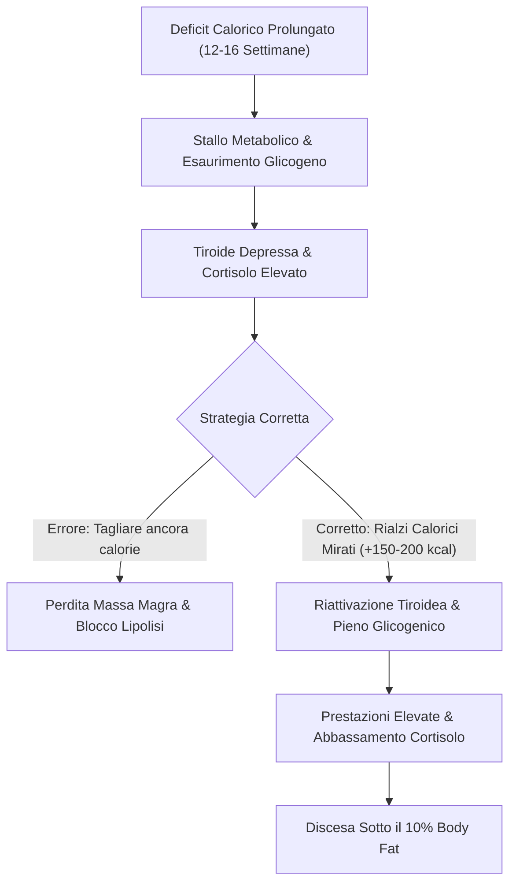

[[Home MOC|Home]] / [[Personal Growth & Health]] / [[Come Scendere Sotto il 10% di Massa Grassa]]

# Come Scendere Sotto il 10% di Massa Grassa

Raggiungere e consolidare una percentuale di grasso corporeo inferiore al **10% di massa grassa (Body Fat)** rappresenta una delle sfide fisiologiche più complesse nel percorso di ricomposizione corporea natural. Quando un atleta si trova già in un deficit calorico prolungato (12-16 settimane), il continuo taglio calorico e l'aumento indiscriminato dell'attività aerobica smettono di produrre risultati a causa di <mark style="background:rgba(255, 193, 69, 0.32)"><b>adattamenti metabolici ed endocrini compensatori</b></mark>.

---

## 1. Il Paradosso dello Stallo Metabolico

Nelle fasi avanzate del dimagrimento, il corpo umano mette in atto potenti meccanismi di difesa per preservare le riserve energetiche:

1. **Rallentamento Tiroideo:** La riduzione cronica dei carboidrati deprime la conversione periferica degli ormoni tiroidei (T4 in T3 attivo), abbassando il <mark style="background:rgba(181, 113, 255, 0.36)"><b>metabolismo basale</b></mark>.
2. **Elevazione Cronica del Cortisolo:** Un deficit aggressivo combinato con volumi eccessivi di cardio induce ritenzione idrica extra-cellulare e inibisce la lipolisi profonda.
3. **Deplezione del Glicogeno Muscolare:** Allenarsi a riserve vuote riduce drasticamente l'output di forza in sala pesi, contraendo la spesa calorica effettiva della sessione (fino a meno della metà rispetto a un allenamento con glicogeno saturo).

> [!IMPORTANT] Nota Bene
> Aggiungere ulteriore cardio o tagliare calorie quando si è già al limite non crea nuovo dimagrimento, ma aggrava l'infiammazione sistemica e porta al catabolismo muscolare.

---

## 2. La Strategia del Rialzo Calorico Ciclico (Refeed Controllato)

Per sbloccare il metabolismo senza accumulare tessuto adiposo, la strategia d'elezione per gli atleti natural consiste nell'apportare <mark style="background:rgba(255, 193, 69, 0.32)"><b>micro-incrementi calorici strategici</b></mark> concentrati nei giorni di allenamento:

* **Incremento Iniziale:** +150 / +200 kcal provenienti esclusivamente da carboidrati complessi (es. +30-50g di riso o fiocchi d'avena).
* **Frequenza:** 3 o 4 giorni a settimana, rigorosamente in concomitanza con le sessioni con i pesi.
* **Giorni di Riposo:** Mantenere le calorie di base invariate per conservare il bilancio settimanale in moderato deficit.

### Benefici Fisiologici Immediati:
* **Segnale Leptinico & Tiroideo:** Il transitorio picco glicemico/insulinico stimola la tiroide a riprendere la termogenesi.
* **Riduzione del Cortisolo:** I carboidrati post-workout abbattono l'ormone dello stress, drenando i liquidi sottocutanei.
* **Densità & Performance:** La reidratazione intracellulare del muscolo aumenta la pienezza e consente di sollevare carichi maggiori, incrementando il consumo energetico intra ed extra-allenamento.

---

## 3. La Partita a Scacchi con il Metabolismo

Il processo di definizione estrema richiede precisione millimetrica:

| Fattore | Approccio Scorretto | Approccio Strategico |
| :--- | :--- | :--- |
| **Calorie** | Taglio lineare drastico continuo | Micro-rialzi a onde su carboidrati |
| **Cardio** | 6-7 ore settimanali estenuanti | 20-45 min modulati in base al deficit |
| **Weekend** | Abbuffate / Sgarri incontrollati | Rispettare rigorosamente i macronutrienti |
| **Scarico** | Allenamento continuo senza pause | Settimana di deload per ripristinare il SNC |

---

## Collegamenti & Note Correlate

- [[Home|Home]]
- [[Come Impostare una Corretta Progressione dei Carichi]]
- [[Guida al Dopamine Detox]]
