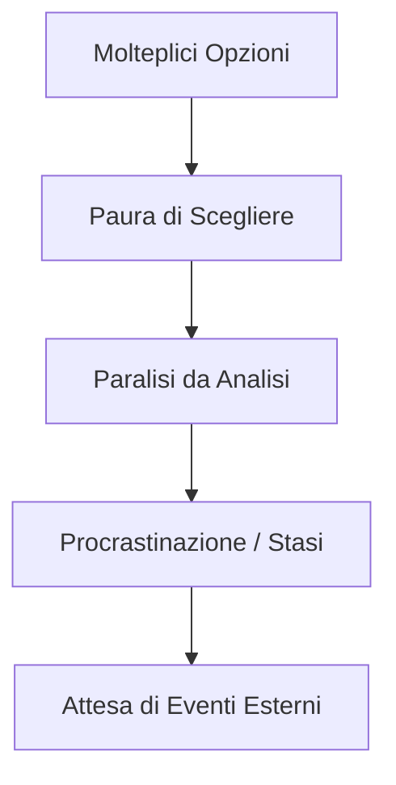
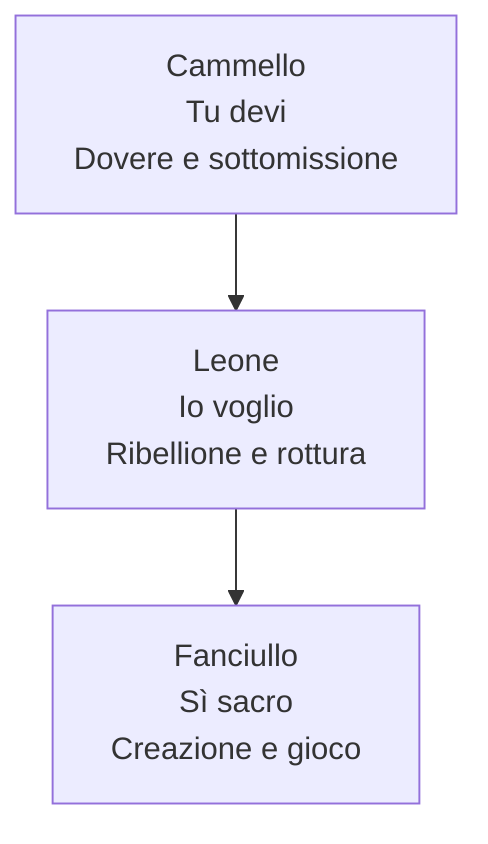

[[Home MOC|Home]] / [[Personal Growth & Health]] / [[5 Libri per Svegliarti|Ti Senti Bloccato Nella Vita 5 Libri per Svegliarti]]

# Ti Senti Bloccato nella Vita? 5 Libri per Svegliarti

- **Video URL**: https://youtu.be/FCzZZTBrSpA
- **Canale**: [[Rick DuFer]]

---

## Sintesi Rapida

Spesso la sensazione di essere bloccati nella vita non deriva dalla mancanza di alternative, bensì da un eccesso di possibilità che genera la <mark style="background:rgba(255, 193, 69, 0.32)"><b>paralisi da analisi</b></mark>. Attraverso una selezione di cinque opere fondamentali, tra saggi filosofici e romanzi, viene proposto un percorso di sblocco esistenziale volto a scardinare il perfezionismo, l'overthinking e la paura della scelta. L'obiettivo non è ricevere risposte pronte, ma dotarsi degli strumenti critici per assumersi la responsabilità delle proprie azioni e riprendere a muoversi.

---
## Capitolo 1: Il Paradosso del Tempo e la Paralisi da Analisi

Molti giovani, in particolare nella fascia d'età under 30, vivono una persistente sensazione di stasi, un peso invisibile che si manifesta come incapacità di prendere decisioni cruciali riguardanti lo studio, le relazioni o la carriera. Questa paralisi non è causata dall'assenza di opzioni, ma dall'opposto: il proliferare di strade possibili genera la paura ossessiva di commettere l'errore definitivo. È la patologia dell'overthinking, che spinge ad attendere un'illuminazione esterna che non arriverà mai.

Per scardinare questa serratura mentale, il primo strumento indispensabile è il celebre saggio _La brevità della vita_ (noto in latino come _De brevitate vitae_) del filosofo stoico <mark style="background:rgba(181, 113, 255, 0.36)"><b>Seneca</b></mark>. L'opera affronta direttamente l'illusione di non avere abbastanza tempo a disposizione, ribaltando la prospettiva comune.

>[!quote] Seneca, _La brevità della vita_
>Non è vero che abbiamo poco tempo. La verità è che ne perdiamo molto. Ciascuno fa correre precipitosamente la propria vita. non pensa che al domani e si annoia dell'oggi. Solo colui che dedica a sei tutto il proprio tempo e dispone di ogni suo giorno come se fosse l'intera vita, non desidera quello che verrà né lo teme. Non devi dunque pensare che uno che abbia i capelli bianchi e le rughe sia vissuto a lungo. Non è vissuto a lungo, ma ha solo trascinato a lungo l'esistenza.

Il messaggio è un duro monito contro la tendenza a considerare l'esistenza attuale come una prova generale in vista di un futuro indefinito. Il <mark style="background:rgba(255, 193, 69, 0.32)"><b>tempo</b></mark> è l'unica risorsa non rinnovabile e trattarlo con noncuranza nell'attesa della scelta perfetta costituisce l'unico vero fallimento. L'antidoto all'apatia consiste nel comprendere che l'errore non risiede nello sbagliare direzione, ma nel rimanere fermi all'incrocio.

---
## Capitolo 2: La Disciplina della Diversità e la Libertà Esistenziale

Rifiutare i modelli standardizzati imposti dalla società è un'aspirazione legittima, ma per non trasformarsi in un vuoto ribellismo sterile richiede una rigorosa alternativa. Questa tematica è splendidamente espressa nel romanzo _Il barone rampante_ di <mark style="background:rgba(181, 113, 255, 0.36)"><b>Italo Calvino</b></mark>. Il protagonista, il giovane nobile <mark style="background:rgba(181, 113, 255, 0.36)"><b>Cosimo Piovasco di Rondò</b></mark>, a soli dodici anni decide di salire sugli alberi e di non scendere mai più.

>[!quote] Italo Calvino, _Il barone rampante_
>Cosimo salì fino alla forcella ad un grosso ramo dove poteva stare comodo e si sedette lì a gambe penzoloni, a braccia incrociate con le mani sotto le ascelle, la testa insaccata nelle spalle, il tricorno calcato sulla fronte. Nostro padre si sporse dall'avanzale. "Quando sarai stanco di star lì? Cambierai idea", gli gridò. "Non cambierò mai idea" fece mio fratello dal ramo. "Ti farò vedere io appena scendi e io non scenderò più". E mantenne la parola.

Questa scelta estrema non rappresenta un isolamento dal mondo, bensì la costruzione di un punto di vista differente da cui partecipare attivamente alla società: Cosimo studia, fa politica, commercia, ama e redige costituzioni. L'insegnamento fondamentale è che per essere autenticamente liberi non basta il dissenso; occorre una <mark style="background:rgba(255, 193, 69, 0.32)"><b>diversità disciplinata</b></mark> che imponga regole precise al proprio modo alternativo di vivere.

A questa necessità di autodeterminazione si affianca il pensiero di <mark style="background:rgba(181, 113, 255, 0.36)"><b>Jean-Paul Sartre</b></mark> esposto in _L'esistenzialismo è un umanismo_. Il filosofo francese chiarisce che l'uomo non possiede un'essenza precostituita o un destino prefissato, ma si definisce esclusivamente attraverso le sue azioni.

>[!quote] Jean-Paul Sartre, _L'esistenzialismo è un umanismo_
>L'esistenza precede l'essenza. Significa che l'uomo esiste innanzitutto, si trova, sorge nel mondo e che si definisce dopo. L'uomo non è definibile in quanto all'inizio non è niente, sarà solo in seguito e sarà quale si sarà fatto. L'uomo non è altro che ciò che si fa.

La libertà descritta da Sartre non è una concessione leggera, ma una condanna alla responsabilità indivduale. L'angoscia provata di fronte alle decisioni non è un malessere patologico, ma la vertigine dell'assoluta <mark style="background:rgba(255, 193, 69, 0.32)"><b>libertà</b></mark> di scelta. Rifiutarsi di scegliere, o nascondersi dietro alle aspettative esterne o al passato per giustificare la propria immobilità, equivale ad agire in "malafede".

---
## Capitolo 3: La Trappola del Cinismo e la Metamorfosi Creativa

Un blocco frequente per le menti più analitiche è l'uso del cinismo come scudo protettivo. Giudicare tutto banale o irrilevante permette di evitare il confronto con la realtà, preservando un'illusione di superiorità intellettuale che in verità nasconde il terrore del fallimento. Questo vicolo cieco è descritto da <mark style="background:rgba(181, 113, 255, 0.36)"><b>Fëdor Dostoevskij</b></mark> in _Memorie dal sottosuolo_. Il protagonista è un uomo iper-consapevole che viviseziona ogni emozione fino a paralizzarla del tutto, finendo per odiare gli uomini d'azione e se stesso.

>[!quote] Fëdor Dostoevskij, _Memorie dal sottosuolo_
>Signori, mi tormentano dei problemi, risolvetemeli. Voi, per esempio, un uomo lo volete disavvezzare dalle vecchie abitudini e volete correggere la sua volontà conformemente alle esigenze della scienza e del buon senso. Ma come fate a sapere che l'uomo non solo si può, ma si deve anche trasformarlo così? Da che cosa concludete che al volere umano così indispensabilmente occorra correggersi? Perché questa per intanto non è ancora che una vostra supposizione? Mettiamo che sia una legge della logica, ma forse non è per niente una legge dell'umanità.

L'iper-razionalizzazione non deve diventare un pretesto per non agire. L'intelligenza disgiunta dall'azione concreta si tramuta in veleno. L'unico modo per sconfiggere il cinismo è accettare la vulnerabilità del fare e persino dello sbagliare.

Per superare la pesantezza di questa condizione di stallo morale e superare il senso opprimente del dovere, <mark style="background:rgba(181, 113, 255, 0.36)"><b>Friedrich Nietzsche</b></mark> in _Così parlò Zarathustra_ propone la teoria delle tre metamorfosi dello spirito: lo sviluppo interiore che conduce dall'obbedienza alla creazione.

1. **Il <mark style="background:rgba(181, 113, 255, 0.36)"><b>Cammello</b></mark>**: Rappresenta lo stadio del dovere ("Tu devi"). Lo spirito si carica passivamente dei pesi imposti dalla tradizione, dalla famiglia e dalla società.
2. **Il <mark style="background:rgba(181, 113, 255, 0.36)"><b>Leone</b></mark>**: Rappresenta la ribellione ("Io voglio"). Lo spirito si scaglia contro i vecchi valori, distruggendo le imposizioni esterne ma rimanendo incapace di generare qualcosa di nuovo.
3. **Il <mark style="background:rgba(181, 113, 255, 0.36)"><b>Fanciullo</b></mark>**: È lo stadio della rinascita e del gioco ("Sì"). Rappresenta la pura innocenza e la leggerezza di chi crea nuovi valori da zero, senza risentimento.

>[!quote] Friedrich Nietzsche, _Così parlò Zarathustra_
>Ma ditemi, fratelli, che cosa sa fare il fanciullo che neppure il leone era in grado di fare? Perché il leone rapace deve anche diventare un fanciullo. Innocenza è il fanciullo e oblio, un nuovo inizio, un gioco, una ruota ruotante da sola, un primo moto, un sacro dire di sì. Sì per il giogo della creazione, fratelli, occorre un sacro dire di sì. Ora lo Spirito vuole la sua volontà. Il perduto per il mondo conquista per sé il suo mondo.

Il superamento del blocco richiede lo sforzo di transitare dallo scontro reattivo tipico del leone alla giocosa creatività del fanciullo, riscoprendo la vita come un'opera da plasmare attivamente.

---
## Capitolo 4: Dalla Teoria alla Pratica: Esercizi di Autosblocco

I concetti filosofici e letterari rimangono speculazioni sterili se non vengono tradotti in azioni concrete. Per trarre utilità reale da queste letture, è possibile strutturare un percorso pratico basato su cinque auto-riflessioni:

### 1. Monitoraggio del Tempo Passivo (Seneca)
Per contrastare la sensazione che il tempo stia sfuggendo, è necessario redigere un bilancio onesto e dettagliato delle proprie giornate. Identificare le ore spese in modo inconsapevole e passivo rappresenta il primo passo per riappropriarsi del proprio tempo e smettere di procrastinare.

### 2. Definizione del Proprio Modello Alternativo (Calvino)
Chi rifiuta i percorsi preconfezionati deve sforzarsi di descrivere e strutturare le proprie regole. Bisogna chiedersi: "Quale modello alternativo desidero costruire? Ho la disciplina necessaria per sostenerlo?". La libertà non è assenza di limiti, ma capacità di darsi regole proprie e rispettarle.

### 3. Assunzione di Responsabilità (Sartre)
Individuare i momenti in cui si delega la propria libertà di scelta ad altri per paura delle conseguenze. Riconoscere che "non scegliere è comunque una scelta" aiuta a disinnescare la malafede e ad assumersi la piena paternità del proprio cammino.

### 4. Disinnesco del Cinismo (Dostoevskij)
Analizzare se l'atteggiamento ipercritico o cinico verso il mondo sia in realtà un meccanismo di difesa per evitare di mettersi in gioco. Uscire dal sottosuolo significa accettare il rischio di commettere errori pur di agire concretamente.

### 5. Verifica della Metamorfosi dello Spirito (Nietzsche)
Valutare in quale fase dello sviluppo ci si trova:
- Si agisce ancora sotto il giogo dei doveri imposti da terzi? (Stadio del **Cammello**)
- Si è bloccati in una rabbiosa ma inconcludente protesta contro il sistema? (Stadio del **Leone**)
- Si è pronti ad abbracciare la vita con la leggerezza propositiva del gioco e della creazione? (Stadio del **Fanciullo**)

Per evitare che la ricerca dello sblocco diventi un'ennesima forma di procrastinazione, l'indicazione finale è semplice: non accumulare letture in modo compulsivo, ma scegliere il libro che ha suscitato maggiore disagio durante l'analisi, poiché è proprio in quella resistenza che si cela il nodo cruciale da sciogliere.

---
## Concetti Chiave

- **[[Paralisi da Analisi]]**: La condizione di stasi mentale indotta dall'eccesso di opzioni disponibili e dal timore ossessivo di prendere una decisione errata, portando a un'infinita elucubrazione senza sbocchi pratici.
- **[[Esistenzialismo]]**: La corrente filosofica secondo cui l'esistenza precede l'essenza, ponendo l'essere umano come unico artefice del proprio destino attraverso le scelte e le azioni concrete di cui deve assumersi la piena responsabilità.
- **[[Overthinking]]**: Il processo disfunzionale di iper-razionalizzazione che blocca l'azione diretta, spingendo il soggetto a rifugiarsi in un cinismo difensivo o nel rancore tipico del "sottosuolo".
- **[[Metamorfosi dello Spirito]]**: Il percorso evolutivo nietzschiano che conduce l'individuo dal dovere cieco (cammello) alla ribellione distruttiva (leone), per giungere infine alla leggera e innocente affermazione creativa (fanciullo).

---
## Collegamenti

- **Macro Area**: [[Personal Growth & Health]]
- **Note Correlate**: [[Tempo]], [[Libertà]], [[Autodeterminazione]]
