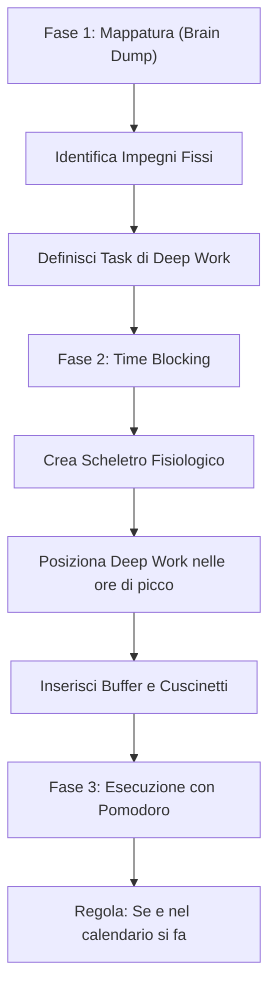

[[Home MOC|Home]] / [[Personal Growth & Health]] / [[Come Organizzare le Giornate|Come Organizzare le Giornate - Guida Pratica al Time Blocking]]

# Come Organizzare le Giornate: Guida Pratica alla Gestione del Tempo e al Time Blocking

- **Video URL**: https://youtu.be/zMxxEDaO0QM
- **Canale**: [[Andrea Muzii]]

---

## Sintesi Rapida

Gestire efficacemente il tempo non significa semplicemente stipare più impegni possibili nelle ventiquattro ore, ma definire con assoluta chiarezza le proprie <mark style="background:rgba(255, 193, 69, 0.32)"><b>priorità essenziali</b></mark> per proteggerle dalle distrazioni quotidiane. Attraverso un metodo strutturato in tre fasi — **mappatura delle attività**, <mark style="background:rgba(181, 113, 255, 0.36)"><b>Time Blocking</b></mark> ed **espropriazione della procrastinazione** tramite l'esecuzione disciplinata con la tecnica del Pomodoro — è possibile eliminare l'ansia da prestazione e sviluppare una profonda consapevolezza sul reale utilizzo del proprio tempo.

---

## La Filosofia della Gestione del Tempo: Fare di Più Facendo di Meno

La trappola principale della vita moderna risiede nell'illusione che una buona gestione temporale serva a svolgere un numero sempre maggiore di compiti. In realtà, il vero obiettivo di un sistema di pianificazione strategica è <mark style="background:rgba(255, 193, 69, 0.32)"><b>fare di meno per fare meglio</b></mark>, garantendo che il tempo a disposizione sia dedicato a ciò che produce il massimo impatto a lungo termine ed evitando che compiti marginali o improvvisati rubino risorse preziose.

Un approccio strutturato al proprio tempo offre una **direzione intenzionale** all'esistenza, eliminando quella sensazione di ansia latente legata alle giornate che sfuggono di mano senza lasciare traccia di risultati concreti.

>[!tip] Gradualità nell'Adozione del Metodo
>Per chi non ha mai organizzato la propria giornata in modo sistematico, provare a pianificare un'intera settimana può risultare travolgente e controproducente. Il segreto consiste nel partire dalla **pianificazione della singola giornata successiva** (ad esempio dedicando dieci minuti ogni sera alla preparazione dell'indomani). Una volta consolidata la routine e aumentata la consapevolezza personale, il medesimo framework potrà essere esteso su scala settimanale.

---

## Step 1: Brain Dump e Mappatura delle Attività

Il primo passo pratico consiste nello svuotare la mente trasferendo su carta o su un blocco note digitale l'elenco di tutte le attività da svolgere il giorno seguente. In questa fase iniziale non occorre preoccuparsi della precisione temporale o dell'ordine cronologico: l'obiettivo è definire il <mark style="background:rgba(181, 113, 255, 0.36)"><b>perimetro operativo</b></mark> della giornata.

La compilazione dell'elenco deve seguire una gerarchia rigorosa:

1. **Impegni Fissi e Non Negoziabili**: Si inizia inserendo gli appuntamenti che hanno un orario vincolato ed esterno, come riunioni, chiamate di lavoro o visite mediche (ad esempio, una **call prefissata alle 16:00**). Per questi elementi è obbligatorio specificare subito l'orario di svolgimento.
2. **Attività di Deep Work**: Subito dopo gli impegni fissi si posiziona l'attività a più alto valore aggiunto per la propria professione o studio. Si tratta dei blocchi di <mark style="background:rgba(255, 193, 69, 0.32)"><b>lavoro profondo</b></mark> (scrittura strategica, studio intenso, sviluppo di progetti complessi), in cui la concentrazione deve rimanere ininterrotta e priva di frammentazioni.
3. **Attività di Mantenimento e Salute**: Vanno incluse le sessioni di allenamento fisico o cura personale, fondamentali per sostenere l'energia e le prestazioni cognitive.
4. **Task Operativi e Comunicazioni**: Infine, si stimano i compiti secondari ma necessari, come la gestione delle email, la risposta ai messaggi o la realizzazione di brevi task gestionali.

---

## Step 2: Time Blocking e Architettura della Giornata

Dopo aver delineato la lista delle priorità, si passa alla fase centrale del metodo: il <mark style="background:rgba(181, 113, 255, 0.36)"><b>Time Blocking</b></mark>. Questa tecnica prevede l'assegnazione di uno specifico blocco di tempo nel calendario ad ogni singola attività identificata, trasformando una vaga lista di cose da fare in un programma visivo e concreto.

Per realizzare un time blocking efficace si possono utilizzare varie applicazioni (Google Calendar, Notion, Timetable o fogli di calcolo), seguendo un processo in quattro passaggi:

### 1. Costruzione dello Scheletro Fisiologico
Si definiscono anzitutto i vincoli biologici della giornata: l'orario di risveglio, la routine mattutina, la pausa pranzo e l'orario della cena. Questo crea la struttura portante entro cui collocare tutte le altre attività.

### 2. Inserimento degli Impegni Fissi e del Deep Work
Si posizionano per primi gli appuntamenti inderogabili. Subito dopo si colloca la sessione di <mark style="background:rgba(255, 193, 69, 0.32)"><b>Deep Work</b></mark> nelle prime ore utili della giornata (ad esempio dalle 09:30 alle 12:15), sfruttando il picco di chiarezza e freschezza mentale.

### 3. Inserimento di Sport, Operatività e Cuscinetti Temporali
Si aggiungono le sessioni dedicate allo sport e alla gestione delle comunicazioni. È vitale inserire dei <mark style="background:rgba(181, 113, 255, 0.36)"><b>cuscinetti di tempo libero</b></mark> (buffer di 15-30 minuti) tra un blocco e l'altro. Tali pause cuscinetto servono ad assorbire eventuali ritardi accidentali senza far crollare l'intera pianificazione.

### 4. Revisione e Bilanciamento
La visualizzazione sul calendario mostra immediatamente se le aspettative iniziali erano irrealistiche. Se la giornata appare eccessivamente satura, si riducono le durate o si spostano attività; se vi sono finestre libere prima di cena, si possono pianificare attività burocratiche o momenti di svago consapevole.

>[!important] La Connessione con gli Obiettivi a Lungo Termine
>La pianificazione quotidiana tramite Time Blocking rappresenta soltanto l'aspetto tattico della gestione del tempo. Perché sia davvero efficace, deve essere collegata a monte con la **gestione degli obiettivi** personali e della concentrazione (framework analizzati in opere come _Laser Focus_). Senza una direzione strategica chiara, il time blocking rischia di diventare una mera ottimizzazione dell'inefficienza.

---

## Step 3: Esecuzione e Disciplina del Calendario

Pianificare una giornata perfetta ha valore zero senza un'esecuzione rigorosa. La fase finale richiede di tradurre la griglia del calendario in azione concreta.

Per mantenere il focus durante le singole sessioni operative, uno strumento chiave è il **timer fisico** abbinato alla <mark style="background:rgba(181, 113, 255, 0.36)"><b>Tecnica del Pomodoro</b></mark>. Dividere un blocco di Deep Work da 2 ore e mezza in intervalli (ad esempio 50 minuti di lavoro concentrato e 10 di riposo, oppure 25 minuti di lavoro e 5 di pausa) garantisce che il cervello mantenga livelli elevati di lucidità senza raggiungere l'esaurimento.

### I Principi Cardine dell'Esecuzione

- **"Se è nel calendario si fa"**: Una volta validata la struttura del giorno, il calendario dev'essere trattato come un contratto non negoziabile con se stessi. Questo azzera i dubbi decisionali istantanei che causano la procrastinazione.
- **"Se NON è nel calendario non si fa"**: Imparare a rifiutare distrazioni e richieste improvvisate che non sono state preventivamente vagliate e inserite nella pianificazione.
- **Sviluppo della Consapevolezza Temporale**: All'inizio capiterà frequentemente di sottostimare i tempi necessari per completare un compito. Monitorare l'effettivo rispetto dei blocchi permette di affinare progressivamente la capacità di stima, migliorando nel tempo la propria <mark style="background:rgba(255, 193, 69, 0.32)"><b>consapevolezza operativa</b></mark>.

---

## Concetti Chiave

- **[[Time Blocking]]**: Metodo di gestione del tempo che consiste nel suddividere la giornata in rigidi blocchi temporali dedicati a specifiche attività, eliminando la dispersione e l'incertezza decisionale.
- **[[Deep Work]]**: Sessioni di lavoro o studio profondo, ininterrotto e ad altissima concentrazione, focalizzate sui compiti a maggior valore aggiunto.
- **[[Tecnica del Pomodoro]]**: Strategia di gestione dell'attenzione che alterna cicli di lavoro focalizzato ad intervalli di riposo programmato, spesso gestiti tramite un timer fisico per preservare la freschezza mentale.
- **[[Cuscinetti di Tempo]]**: Intervalli di rispetto (buffer di 15-30 minuti) posizionati tra un blocco operativo e l'altro per gestire imprevisti ed evitare che i ritardi contagino l'intera giornata.

---

## Collegamenti

- **Macro Area**: [[Personal Growth & Health]]
- **Note Correlate**: [[Guida al Dopamine Detox]], [[Laser Focus]], [[Home]]
