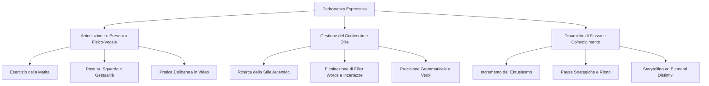

[[Home MOC|Home]] / [[Personal Growth & Health]] / [[Come e Perche Parlare Bene|Come e Perché Parlare Bene - Guida All'Oratoria e alla Comunicazione Efficace]]

# Come e Perché Parlare Bene: Guida all'Oratoria e alla Comunicazione Efficace

- **Video URL**: https://youtu.be/9qKD_1j1BLg
- **Canale**: [[Andrea Muzii]]

---

## Sintesi Rapida

Sapere comunicare con chiarezza ed efficacia rappresenta una delle competenze più trasversali e determinanti per il successo personale, professionale e sociale. L'espressione verbale non è soltanto un veicolo di informazioni verso l'esterno, ma si configura come la struttura stessa del pensiero: <mark style="background:rgba(255, 193, 69, 0.32)"><font color="#cc8800"><b>parlare bene significa pensare bene</b></font></mark>. Attraverso un percorso integrato che comprende tecniche di dizione, pulizia del vocabolario, gestione delle emozioni e presenza scenica, è possibile trasformare la propria comunicazione in uno strumento autorevole e magnetico.

---

## Il Potere della Parola e il Legame tra Parlare e Pensare

La capacità di esprimersi con efficacia ed eleganza costituisce un vero e proprio **superpotere trasversale**, capace di incidere profondamente su ogni dimensione della vita quotidiana. In ambito lavorativo, permette di presentare le proprie idee con impatto, accrescendo il valore percepito delle proprie competenze e dei propri progetti. Sul piano sociale, una comunicazione fluida e sicura esercita un'attrazione naturale, rendendo l'interlocutore carismatico e autorevole.

Tuttavia, il beneficio più profondo risiede nella sfera personale e metacognitiva. Il linguaggio non è un mero involucro esterno del pensiero, ma la sua impalcatura architetturale. Quando si compie lo sforzo di organizzare le parole con precisione, si costringe la mente a riordinare i concetti, eliminare le ambiguità e chiarire le relazioni logiche tra le idee. Per questa ragione, affinare l'espressione verbale equivale a potenziare la propria nitidezza di pensiero.

>[!important] L'Equazione Fondamentale
>La comunicazione esterna è lo specchio dell'organizzazione mentale interna. Affinare la dizione e la struttura del discorso non serve solo a farsi capire dagli altri, ma a chiarire a se stessi la sostanza delle proprie idee.

---

## Esercizi di Articolazione e Riscaldamento Vocale

Uno dei principali ostacoli alla chiarezza comunicativa è la pigrizia muscolare dell'apparato fonatorio. Troppo spesso si dà per scontato che un concetto chiaro nella propria mente risulti egualmente nitido alle orecchie di chi ascolta. In realtà, il pubblico deve decodificare suoni e ritmi in tempo reale, ed ogni imprecisione nella pronuncia aumenta il carico cognitivo dell'ascoltatore.

Per superare questa barriera, è fondamentale praticare il riscaldamento articolatorio, tra cui risalta l'eccellente <mark style="background:rgba(181, 113, 255, 0.36)"><font color="#9a54c1"><b>esercizio della matita</b></font></mark>. Posizionando una penna o una matita orizzontalmente tra i denti e parlando per uno o due minuti sforzandosi di articolare chiaramente ogni sillaba, si costringono i muscoli facciali e linguali a compiere un lavoro dinamico superiore alla norma.

```
       [ Esercizio della Matita ]
                  │
                  ▼
[ Resistenza Muscolare tra i Denti ]
                  │
                  ▼
[ Rimozione e Rilascio del Limite ]
                  │
                  ▼
 [ Espressione Chiara ed Articolata ]
```

Quando la matita viene rimossa, l'articolazione appare immediatamente più fluida, aperta e scandita. Tuttavia, l'esercizio meccanico deve essere accompagnato da uno **sforzo attivo e consapevole**: occorre muovere la bocca più di quanto si sia abituati a fare nella conversazione informale, garantendo che ogni sillaba arrivi a destinazione con la massima intelligibilità.

---

## Definire e Valorizzare il Proprio Stile Comunicativo

Nell'ambito dell'oratoria esiste il falso mito secondo cui l'unico modello vincente sia quello basato su un ritmo lento, solenne e pausato. Sebbene la lentezza possa conferire gravità ed eleganza, non rappresenta una regola universale adatta a qualsiasi personalità.

La vera efficacia comunicativa scaturisce dall'individuazione e dal perfezionamento del proprio <mark style="background:rgba(255, 193, 69, 0.32)"><font color="#cc8800"><b>stile comunicativo personale</b></font></mark>. Esistono grandi oratori caratterizzati da un ritmo posato e riflessivo, ed altri che fanno della rapidità e del dinamismo il proprio punto di forza.

>[!warning] Il Pericolo dell'Emulazione Acritica
>Tentare di scimmiottare lo stile comunicativo di un'altra persona — specialmente quando è antitetico alla propria indole — produce un effetto artificiale e distonico. Il pubblico percepisce immediatamente l'assenza di autenticità.

Chi possiede un parlantino rapido e concitato non deve necessariamente snaturarsi per omologarsi a un modello ideale: può invece incanalare la velocità naturale per trasmettere energia, dinamismo ed entusiasmo, mantenendo come vincolo ineludibile unicamente la chiarezza dell'articolazione.

---

## L'Entusiasmo come Canale Primario di Espressione

Il pilastro emotivo di qualsiasi discorso risiede nell'energia che l'oratore riesce ad infondere nelle proprie parole. Gli esseri umani sono strutturati per risuonare con le emozioni altrui grazie al meccanismo dell'empatia e all'attivazione dei <mark style="background:rgba(181, 113, 255, 0.36)"><font color="#9a54c1"><b>neuroni specchio</b></font></mark>.

Se chi parla si limita a pronunciare informazioni in modo neutrale o dimesso, la platea assorbirà quel medesimo stato di inerzia. Al contrario, per generare un vero <mark style="background:rgba(255, 193, 69, 0.32)"><font color="#cc8800"><b>contagio emotivo</b></font></mark>, è necessario amplificare intenzionalmente il proprio livello di coinvolgimento.

| Livello Percepito | Stato dell'Oratore | Impatto sull'Ascoltatore |
| --- | --- | --- |
| **Basso (1-4)** | Disinteresse, monotonia | Noia, distrazione immediata |
| **Medio (5-6)** | Correttezza formale | Ascolto passivo, memorizzazione scarsa |
| **Elevato (7-8)** | Entusiasmo attivo e passione | Coinvolgimento, empatia, alta ritenzione |

Alzare volutamente l'asticella dell'entusiasmo (portando ad esempio un livello percepito da 7 a 8 su una scala ideale) permette di superare la dispersione naturale dell'attenzione e di trasferire la passione per l'argomento direttamente nella mente di chi ascolta.

---

## Pulizia del Linguaggio: Eliminare i Vizi Comunicativi

Un'esposizione di alto livello richiede un rigoroso lavoro di potatura dei vizi verbali che depauperano il valore del discorso. È possibile individuare tre principali categorie di elementi negativi da eradicare:

1. **Uso di termini generici e banali**: Parole abusate come "cosa", "fatto" o "roba" impoveriscono la sostanza del discorso. Risulta fondamentale arricchire il proprio vocabolario attraverso la lettura costante e sostituire i termini generici con sostantivi precisi e contestualizzati (es. "tecnica", "pilastro", "argomentazione", "prospettiva").
2. **Eliminazione delle <mark style="background:rgba(181, 113, 255, 0.36)"><font color="#9a54c1"><b>filler words</b></font></mark>**: I riempitivi verbali (come "cioè", "tipo", "praticamente", o le formule anglofone "like" e "you know") vengono inseriti inconsciamente per prendere tempo, ma creano un rumore di fondo che distrae e penalizza l'autorevolezza.
3. **Erradicazione dei mugugni e delle formule di incertezza**: Suoni parassiti come "ehm", "ah", "mm" tradiscono insicurezza e mancanza di controllo. Analogamente, l'uso compulsivo di verbi al condizionale o di avverbi dubitativi ("forse", "credo", "sembrerebbe") indebolisce la forza delle affermazioni.

---

## L'Impegno Cognitivo nel Public Speaking

Parlare bene non è un atto spontaneo o rilassato, ma il frutto di un <mark style="background:rgba(255, 193, 69, 0.32)"><font color="#cc8800"><b>impegno cognitivo attivo</b></font></mark> e gravoso. Durante un intervento efficace, il cervello dell'oratore lavora a pieno regime per selezionare le parole, monitorare il ritmo, gestire il corpo e mantenere alto il livello energetico.

>[!tip] Autenticità vs Sforzo
>Mentre l'indifferenza verso il giudizio altrui rappresenta un tratto carismatico e attraente, il disinteresse per l'argomento trattato è letale. L'ascoltatore deve percepire chiaramente che l'oratore si sta spendendo con energia e rigore per comunicare qualcosa di significativo.

È del tutto naturale avvertire un forte affaticamento al termine di un discorso pubblico o di una presentazione importante: la stanchezza è la conferma tangibile che si è profuso uno sforzo consapevole per curare ogni dettaglio espressivo.

---

## Mappa delle Tecniche di Comunicazione Efficace



---

## Dinamiche di Flusso: Pause, Ritmo e Velocità

La gestione del tempo all'interno del discorso determina la tensione drammatica e il livello di attenzione del pubblico. L'errore più comune consiste nel procedere a velocità costante in modo monotono.

Per dominare il flusso espressivo occorre padroneggiare le <mark style="background:rgba(181, 113, 255, 0.36)"><font color="#9a54c1"><b>pause strategiche</b></font></mark>. Interrompere il flusso verbale subito prima di un concetto chiave genera un'aspettativa immediata nell'interlocutore, accendendo la curiosità e sottolineando il valore dell'affermazione successiva.

Inoltre, la velocità deve essere modulata intenzionalmente:
- **Accelerazioni calibrate**: Utili per trasmettere concitazione, passione, slancio narrativo o urgenza.
- **Rallentamenti e scansioni**: Indispensabili per fissare passaggi complessi, definizioni o momenti di sintesi.

In contesti valutativi come gli esami orali o le presentazioni aziendali, la variazione ritmica unita alla passione trasposta nel linguaggio del corpo elevano nettamente il giudizio percepito dal valutatore.

---

## Linguaggio del Corpo: Gestione dello Sguardo e delle Braccia

La comunicazione non verbale supporta e integra l'emissione vocale. I due vettori corporei principali sono rappresentati dagli occhi e dalle mani.

### Gestione dello Sguardo
Lo sguardo deve rimanere prevalentemente fisso e diretto verso l'interlocutore o la platea, trasmettendo sicurezza e connessione. Tuttavia, per evitare un effetto artificiale o minaccioso, è naturale deviare gli occhi verso l'alto durante la formulazione di un pensiero complesso, segnalando visivamente che si sta svolgendo un'elaborazione cognitiva estemporanea. Da evitare assolutamente sono invece i movimenti oculari rapidi e scattosi, che segnalano ansia o insicurezza.

### Gestione della Gestualità
- **Braccia**: Devono compiere movimenti ampi, fluidi e armoniosi, aprendosi verso il pubblico per accompagnare il significato del discorso.
- **Mani e Dita**: Vanno evitati i micro-movimenti nervosi delle dita o gli scatti delle mani, che comunicano tensione e distraggono l'ascoltatore.

---

## Padronanza Grammaticale e Scelta dei Tempi Verbali

La precisione sintattica eleva istantaneamente il registro dell'oratore. L'uso approssimativo dei tempi verbali è un indicatore di trascuratezza che riduce la qualità formale dell'esposizione.

Tra le accortezze grammaticali di maggior impatto spiccano:
- **L'impiego del <mark style="background:rgba(181, 113, 255, 0.36)"><font color="#9a54c1"><b>passato remoto</b></font></mark>**: Per narrare eventi collocati nel passato (specialmente se antecedenti a uno o due anni), è opportuno preferire il passato remoto all'imperfetto o al passato prossimo. Questo semplice accorgimento conferisce uno spessore colto e autorevole al racconto.
- **Corretto uso del congiuntivo**: Preservare le subordinate congiuntive evita l'appiattimento del discorso e dimostra piena padronanza della lingua italiana.
- **Riduzione delle forme ipotetiche debilitanti**: Ridurre l'uso ingiustificato del condizionale quando si espongono tesi che richiedono assertività.

---

## Pratica Deliberata, Storytelling e Originalità

La comunicazione efficace non è un dono innato, ma una competenza pratica che si affina esclusivamente attraverso la <mark style="background:rgba(255, 193, 69, 0.32)"><font color="#cc8800"><b>pratica deliberata</b></font></mark> e continuativa.

Per ottenere miglioramenti concreti, lo strumento più efficace è la **registrazione video**. Quando parliamo, la nostra percezione interna è distorta; riascoltarsi in video offre un riscontro oggettivo e spietato, consentendo di individuare mugugni trascurati, esitazioni, gesti parassiti e difetti di articolazione.

>[!quote] Il Valore della Narrazione
>Le idee astratte convincono la ragione, ma sono le storie a conquistare il cuore. Integrare strutture narrative e aneddoti all'interno del discorso rende il messaggio memorabile e facilita l'aggancio emotivo.

Infine, ogni grande oratore arricchisce la propria comunicazione con un elemento di **originalità personale** — che si tratti di un uso distintivo di oggetti visivi, di un lessico caratterizzante o di una struttura espositiva peculiare —, evitando piatte omologazioni e lasciando un'impronta duratura nella memoria del pubblico.

---
## Concetti Chiave

- **[[Metacognizione Comunicativa]]**: La relazione bidirezionale tra espressione verbale e struttura del pensiero, per cui l'affinamento del linguaggio migliora la chiarezza cognitiva interna.
- **[[Stile Comunicativo Individuale]]**: L'insieme delle caratteristiche espressive naturali (ritmo, tono, velocità) che vanno valorizzate e declinate senza forzature o emulazioni sterili.
- **[[Contagio Emotivo]]**: La capacità di trasferire il proprio stato di entusiasmo e coinvolgimento al pubblico sfruttando il meccanismo dell'empatia e dei neuroni specchio.
- **[[Pratica Deliberata e Video-Analisi]]**: Il processo metodico di miglioramento basato sul riscaldamento vocale, sull'eliminazione dei vizi verbali e sull'auto-osservazione tramite registrazione video.

---
## Collegamenti

- **Macro Area**: [[Personal Growth & Health]]
- **Note Correlate**: [[Learning to Learn ITA]], [[David Goggins - Analisi]], [[Contrastare la Brevita]]
