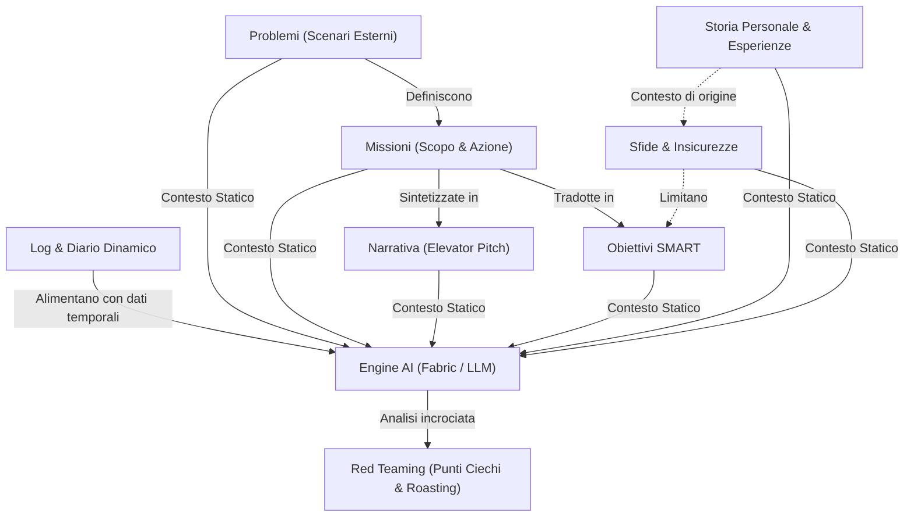

[[Home MOC|Home]] / [[Personal Growth & Health]] / [[Il File Telos|Il File Telos - Hacking Personale e Red Teaming Emozionale Tramite AI]]

# Il File Telos: Hacking Personale e Red Teaming Emozionale tramite AI

- **Video URL**: https://youtu.be/3BXE0e3QZ4U
- **Canale**: [[NetworkChuck]]

---

## Sintesi Rapida

Il <mark style="background:rgba(255, 193, 69, 0.32)"><b>File Telos</b></mark> è un framework di strutturazione della conoscenza personale racchiuso in un singolo documento Markdown, concepito per delineare con nitidezza la propria identità, la propria missione e le proprie sfide in un'epoca segnata dall'incertezza tecnologica. Integrando questo schema di contesto statico e dinamico con modelli di intelligenza artificiale, è possibile effettuare un vero e proprio <mark style="background:rgba(255, 193, 69, 0.32)"><b>Red Teaming personale</b></mark>, facendo emergere schemi di procrastinazione, incongruenze comportamentali e <mark style="background:rgba(181, 113, 255, 0.36)"><b>punti ciechi</b></mark> altrimenti inaccessibili all'autoanalisi tradizionale.

---

## L'Ansia da Intelligenza Artificiale e la Ridefinizione dell'Identità

L'avvento e la rapida diffusione delle tecnologie di intelligenza artificiale generano un senso diffuso di <mark style="background:rgba(181, 113, 255, 0.36)"><b>ansia da intelligenza artificiale</b></mark>, alimentando dubbi e preoccupazioni sulla tenuta del mercato del lavoro e sulla stabilità delle carriere tradizionali. Per oltre due secoli, la professione svolta ha rappresentato il pilastro primario dell'identità individuale: la risposta alla classica domanda *"di cosa ti occupi?"* ha costituito la principale etichetta sociale e personale.

L'automazione progressiva dei compiti operativi impone tuttavia un drastico cambio di paradigma. Per distinguersi e mantenere una rilevanza autentica non è più sufficiente adagiarsi sulle mansioni assegnate da un'organizzazione, ma diventa indispensabile sviluppare una profonda <mark style="background:rgba(255, 193, 69, 0.32)"><b>consapevolezza di sé</b></mark>. Essere in grado di articolare con chiarezza chi si è, quali valori si sostengono e quali problemi del mondo si intende risolvere rappresenta l'investimento più efficace per rendere il proprio percorso a prova di futuro. 

---

## Il Framework Telos: Struttura dei Quattro Pilastri Fondamentali

La parola *telos* deriva dalla lingua greca e indica lo scopo o la finalità intrinseca verso cui tende un'entità. Il <mark style="background:rgba(255, 193, 69, 0.32)"><b>File Telos</b></mark>, sviluppato originariamente da <mark style="background:rgba(181, 113, 255, 0.36)"><b>Daniel Miessler</b></mark>, si configura come un'infrastruttura testuale concepita per catturare l'essenza dell'esperienza umana in uno schema leggibile sia dalle persone che dagli algoritmi.

>[!info] Definizione di Telos
>In ambito filosofico e operativo, il *Telos* descrive la ragione fondamentale dell'esistenza: il *"perché"* primario che motiva le azioni quotidiane e orienta le scelte di lungo periodo.

L'ossatura fondamentale del documento si fonda su quattro sezioni operative connesse da una precisa gerarchia logica:

1. **Problemi**: Rappresentano le inefficienze, le ingiustizie o le criticità osservate nel mondo esterno che si desidera attivamente contribuire a risolvere (ad esempio, requisiti d'esperienza sproporzionati per ruoli entry-level, rischi di sicurezza per i minori in rete o la proliferazione di truffe informatiche). Anche una frustrazione strettamente individuale (come le difficoltà nell'avviare una carriera) può essere rielaborata come problema sistemico quando condivisa da una comunità.
2. **Missioni**: Identificano l'insieme delle azioni strategiche pensate per rispondere ai problemi individuati. La connessione tra il problema e la missione viene formalizzata mediante una frase chiave strutturata:
   >[!tip] La Formula della Missione Unificante
   >*"Ritengo che uno dei problemi più rilevanti nel mondo sia [Problema], ed è per questo motivo che la mia missione è [Azione]."*
3. **Narrative**: Consistono nella formalizzazione del proprio discorso identitario, noto come <mark style="background:rgba(181, 113, 255, 0.36)"><b>elevator pitch</b></mark>. È fondamentale saper sintetizzare la propria ragione d'essere in formulazioni adatte a contesti differenti, estendendosi da enunciati concisi di 8 o 15 secondi fino a presentazioni più articolate di 30 secondi per occasioni di networking o colloqui.
4. **Obiettivi**: Costituiscono la traduzione operativa delle missioni in traguardi concreti. Devono soddisfare i criteri <mark style="background:rgba(181, 113, 255, 0.36)"><b>SMART</b></mark> (Specifici, Misurabili, Raggiungibili, Rilevanti e Temporizzati), garantendo scadenze precise e metriche di verifica chiare.

Il flusso relazionale tra i pilastri e il processo di analisi tramite AI è schematizzato nel seguente diagramma:

---

## L'Estensione del Contesto: Storia, Sfide, Insicurezze e Strategie

Oltre ai quattro pilastri di base, il <mark style="background:rgba(255, 193, 69, 0.32)"><b>File Telos</b></mark> si estende verso sezioni di profonda introspezione per garantire al modello di contesto una visione olistica del soggetto:

- **Storia (History)**: Il racconto dettagliato degli eventi biografici e dei punti di svolta del passato. Ripercorrere la propria traiettoria personale permette di individuare le origini di determinate abitudini, paure o inclinazioni.
- **Sfide (Challenges)**: L'esplicitazione pragmatica degli ostacoli oggettivi (materiali, economici o logistici) che rallentano l'avanzamento verso i propri obiettivi.
- **Insicurezze (Insecurities)**: L'ammissione trasparente delle proprie vulnerabilità emotive o fisiche (come l'ansia da prestazione nei discorsi pubblici o i complessi legati all'aspetto fisico). La formalizzazione scritta di tali fragilità ne depotenzia l'impatto bloccante e consente di elaborare strategie di superamento.
- **Strategie e Progetti**: L'elenco delle routine tattiche e delle iniziative concrete messe in atto per aggirare le sfide e conquistare gli obiettivi previsti.

---

## Il Diario di Bordo Dinamico: Logging e Tracciamento delle Oscillazioni

Un punto di forza determinante dell'architettura Telos è l'inclusione di una sezione di **Journal** e **Logging** collocata in fondo al documento. A differenza delle schede di pianificazione statiche, il file viene trattato come un registro vivo e in continua evoluzione.

Ogni nota giornaliera deve includere una marca temporale (**timestamp**) precisa. I dati inseriti possono variare da brevi annotazioni telegrafiche sugli stati d'animo della giornata fino a considerazioni più estese su distrazioni, fallimenti o successi operativi. La registrazione costante consente all'intelligenza artificiale di individuare le oscillazioni emotive e i cicli comportamentali nel corso delle settimane.

>[!warning] Gestione della Finestra di Contesto
>Man mano che la sezione di logging cresce con l'aggiunta di annotazioni quotidiane, la dimensione del file può aumentare notevolmente. Per evitare di saturare la finestra di contesto dei modelli di intelligenza artificiale, è opportuno archiviare i log storici in file mensili o annuali separati, mantenendo nel file principale soltanto una sintesi periodica per punti elenco.

---

## Hacking Personale e Red Teaming tramite Intelligenza Artificiale

La combinazione tra la completezza del <mark style="background:rgba(255, 193, 69, 0.32)"><b>File Telos</b></mark> e la capacità di sintesi dei modelli linguistici rende possibile la pratica del <mark style="background:rgba(255, 193, 69, 0.32)"><b>Red Teaming personale</b></mark>. Mutuata dal settore della cybersecurity, questa tecnica consiste nel sottoporre la propria vita a un attacco simulato e imparziale per rilevare le vulnerabilità prima che si trasformino in fallimenti reali.

Utilizzando strumenti a riga di comando come <mark style="background:rgba(181, 113, 255, 0.36)"><b>Fabric</b></mark> o prompt dedicati negli LLM, è possibile alimentare l'algoritmo con l'intero file di contesto. L'intelligenza artificiale è in grado di mettere in luce:

- **Falsa produttività**: Schemi di procrastinazione mascherati da un'intensa attività organizzativa priva di impatto reale.
- **Incoerenza tra teoria e prassi**: Discrepanze tra le missioni professate e il tempo effettivamente allocato nelle registrazioni del diario.
- **Vulnerabilità metodologiche**: La propensione ad abbandonare i sistemi di lavoro non appena svanisce l'entusiasmo iniziale.

Questa analisi rigorosa trasforma il file in uno specchio obiettivo, capace sia di individuare i propri <mark style="background:rgba(181, 113, 255, 0.36)"><b>punti ciechi</b></mark> sia di fornire un incoraggiamento personalizzato basato sulla reale traiettoria dell'individuo.

---

## Concetti Chiave

- **[[File Telos]]**: Schema documentale in formato Markdown volto a centralizzare scopi, problemi, missioni, valori e log personali in un'unica fonte di verità.
- **[[Red Teaming]]**: Metodologia di analisi critica derivata dalla cybersecurity che impiega l'intelligenza artificiale per evidenziare incongruenze comportamentali e punti ciechi personali.
- **[[Daniel Miessler]]**: Esperto di sicurezza informatica e creatore di Fabric e del framework Telos per l'ottimizzazione del contesto personale.
- **[[Elevator Pitch]]**: Sintesi narrativa d'impatto (da 8 a 30 secondi) utilizzata per comunicare con efficacia la propria missione e la propria identità.

---

## Collegamenti

- **Macro Area**: [[Mentality]]
- **Note Correlate**: [[David Goggins - Analisi]], [[Obsidian Second Brain]], [[AI Second Brain System]]
