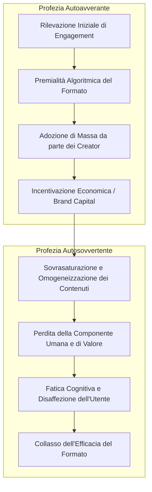
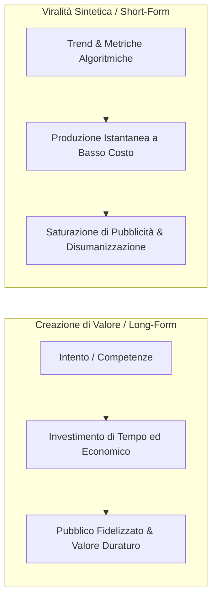

[[Home MOC|Home]] / [[Personal Growth & Health]] / [[Il Lato Oscuro di TikTok Che Ti Nascondono - con i TheShow]]

# Il Lato Oscuro di TikTok Che Ti Nascondono - con i TheShow

- **Video URL**: https://youtu.be/mkGGOxEPV-Q
- **Canale**: [[Gurulandia - Il Podcast]]

---

## Sintesi Esecutiva

L'evoluzione delle piattaforme digitali ha segnato il passaggio da modelli di distribuzione basati sull'intenzionalità dell'utente a sistemi algoritmici guidati dalla massimizzazione del <mark style="background:rgba(255, 193, 69, 0.32)"><b>tempo di permanenza</b></mark> (retention). Questo cambio di paradigma trova la sua massima espressione nei formati video brevi (come <mark style="background:rgba(181, 113, 255, 0.36)"><b>TikTok</b></mark>, <mark style="background:rgba(181, 113, 255, 0.36)"><b>Instagram Reels</b></mark> e <mark style="background:rgba(181, 113, 255, 0.36)"><b>YouTube Shorts</b></mark>), caratterizzati da un'interfaccia a scorrimento infinito che riduce l'attrito cognitivo e instaura dinamiche di dipendenza comportamentale assimilabili a micro-ricompense dopaminergiche intermittenti.

Parallelamente, le dinamiche di mercato e l'ottimizzazione algoritmica innescano cicli sistemici: dalla fase iniziale di <mark style="background:rgba(255, 193, 69, 0.32)"><b>profezia autoavverante</b></mark> (feedback loop positivo che premia e moltiplica un determinato formato) si transita verso una fase di <mark style="background:rgba(255, 193, 69, 0.32)"><b>profezia autosovvertente</b></mark> (saturazione e collasso del valore intrinseco del contenuto). La mercificazione dell'attenzione crea una frattura tra la fruizione passiva di contenuti frammentati e il consumo intenzionale di formati lunghi, determinando un'asimmetria cognitiva che conferisce un vantaggio competitivo duraturo a chi preserva la capacità di concentrazione profonda.

---

## Modelli Sistemici dell'Ecosistema Algoritmico

### Il Ciclo della Profezia Autoavverante e Autosovvertente

La diffusione di nuovi formati di contenuto (es. podcast, video verticali) all'interno delle piattaforme algoritmiche non segue un'evoluzione lineare, bensì una dinamica a ciclo chiuso governata da algoritmi predittivi e incentivi economici.

1. **Fase di Innesco e Autoavveramento**: L'algoritmo rileva un elevato tasso di engagement su un formato emergente e lo sovraindica nel feed degli utenti. I creatori di contenuti rispondono all'incentivo di visibilità convertendosi in massa a tale formato. L'aumento dell'offerta convalida l'ipotesi algoritmica, alimentando un loop di retroazione positiva:
   $$\text{Engagement} \uparrow \implies \text{Esposizione Algoritmica} \uparrow \implies \text{Produzione Contenuti} \uparrow \implies \text{Consumo Globale} \uparrow$$
2. **Fase di Saturazione e Autosovversione**: La standardizzazione industriale e la replicazione su larga scala eliminano la componente di unicità, autenticità e valore umano. Il mercato si satura di prodotti omogenei ottimizzati esclusivamente per le metriche algoritmiche, portando alla disaffezione dell'audience e al collasso dell'attenzione:
   $$\text{Omogeneizzazione} \implies \text{Saturazione dell'Attenzione} \implies \text{Svalutazione del Formato}$$

---

## Meccanica Cognitiva e Neurobiologica dei Contenuti Brevi

### Architettura del Feed Verticale e Scorrimento Infinito

La transizione dal formato orizzontale al formato verticale abbinato allo <mark style="background:rgba(255, 193, 69, 0.32)"><b>scorrimento infinito</b></mark> ha rimosso qualsiasi barriera di attivazione tra una decisione e l'altra. Il design di fruizione si basa su:

- **Assenza di Attrito Decisionale**: L'utente non seleziona attivamente cosa guardare (come avveniva nella ricerca per keyword o nella selezione di miniature su piattaforme tradizionali), ma subisce una somministrazione continua e passiva mediata interamente dal modello di raccomandazione.
- **Rinforzo Variabile Intermittente**: Il feed opera esattamente come una slot machine. L'alternanza imprevedibile tra contenuti ad alto impatto emotivo e contenuti a basso valore crea una dipendenza da <mark style="background:rgba(181, 113, 255, 0.36)"><b>micro-scariche dopaminergiche</b></mark>, spingendo l'individuo a prolungare la sessione ben oltre l'intenzione iniziale (la distorsione temporale per cui brevi finestre di relax si trasformano in ore di fruizione involontaria).

### Erosione della Soglia di Attenzione e Asimmetria Cognitiva

L'esposizione prolungata a stimoli iper-compressi di 15-60 secondi produce alterazioni nell'allocazione dell'attenzione sostenuta:

1. **Compromissione dell'Attenzione Profonda**: L'abitudine al consumo frammentato riduce la tolleranza alla complessità e alla latenza della gratificazione. L'utente perde progressivamente la capacità neurale di impegnarsi in attività prolungate (lettura di saggi, visione di lezioni o conferenze, lavoro analitico profondo).
2. **Il Vantaggio Competitivo del Contenuto Lungo**: In un contesto socio-culturale caratterizzato dalla deflazione dell'attenzione, gli individui capaci di fruire di formati estesi (<mark style="background:rgba(181, 113, 255, 0.36)"><b>long-form content</b></mark>, libri, saggi, documentari approfonditi) sviluppano un marcato <mark style="background:rgba(255, 193, 69, 0.32)"><b>vantaggio cognitivo e competitivo</b></mark>, mantenendo strutture di pensiero articolate rispetto alla massa esposta al consumo passivo.

---

## Economia Politica della Viralità: YouTube vs. TikTok

La divergenza tra le piattaforme storiche di video-sharing e i moderni aggregatori di video verticali risiede negli incentivi economici strutturali e nelle barriere all'ingresso.

| Dimensione | Formato Long-Form (Es. YouTube Tradizionale / Podcast) | Formato Short-Form (Es. TikTok / Shorts) |
| :--- | :--- | :--- |
| **Driver della Creazione** | Intenzionalità espressiva, competenza, narrazione strutturata | Ingegneria della viralità, metriche di ritenzione a breve termine |
| **Barriere all'Ingresso** | Elevate (tempo di produzione, sceneggiatura, editing, investimento economico) | Bassissime (basta uno smartphone e l'adozione di un trend sonoro/visivo) |
| **Relazione Creatore-Pubblico** | Basata su autorevolezza, identificazione e <mark style="background:rgba(181, 113, 255, 0.36)"><b>connessione umana non scriptabile</b></mark> | Effimera, basata sul gancio visivo (<mark style="background:rgba(181, 113, 255, 0.36)"><b>hook</b></mark>) e sulla saturazione sensoriale |
| **Obiettivo dell'Utente** | Ricerca attiva di informazione, approfondimento o intrattenimento mirato | Evasione passiva, riempimento automatico dei tempi morti |
| **Monetizzazione dei Brand** | Sponsorizzazioni integrate ad alta fiducia, posizionamento valoriale | Investimenti a pioggia a basso costo per massimizzare le impression |

### La Mercificazione dell'Individuo

L'iper-efficacia economica dei formati brevi risiede nella loro capacità di convertire l'utente da soggetto cosciente a puro consumatore reattivo. Poiché le barriere di creazione sono quasi nulle, il mercato dei contenuti viene invaso da format stereotipati concepiti unicamente per compiacere l'algoritmo e intercettare i budget pubblicitari aziendali.

---

## Implicazioni Epistemologiche ed Evoluzione Tecnologica

Sebbene ogni avanzamento tecnologico nel campo dei media (dalla televisione a YouTube) abbia storicamente generato ondate di allarmismo per la potenziale riduzione delle facoltà intellettive delle masse, i moderni contenuti brevi presentano una differenza qualitativa:

1. **Intrusività Ambientale**: Lo smartphone e il micro-contenuto occupano la totalità degli interstizi quotidiani (dalle pause lavorative ai momenti sociali e rituali), eliminando la noia creativa e lo spazio per l'elaborazione introspettiva.
2. **Incompatibilità tra Algoritmo e Profondità Umana**: L'autenticità relazionale, la vulnerabilità e lo scambio non strutturato non sono replicabili né scalabili tramite prompt algoritmici. I tentativi di ottimizzare ogni frazione di secondo distruggono la spontaneità comunicativa, trasformando l'intrattenimento in un flusso industriale omogeneo.
