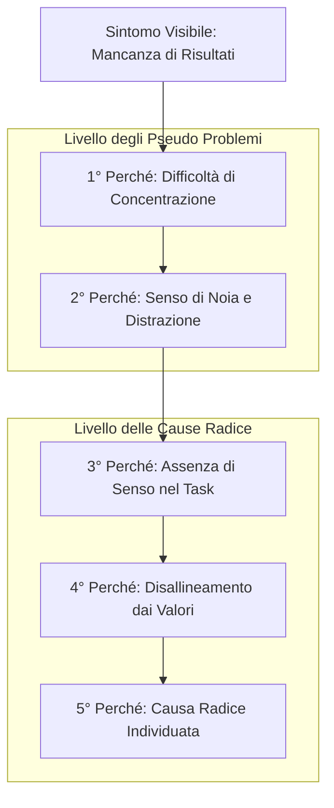

[[Home MOC|Home]] / [[Personal Growth & Health]] / [[Pseudo Problemi e la Tecnica dei 5 Perche|Pseudo Problemi e la Tecnica dei 5 Perché]]

# Pseudo Problemi e la Tecnica dei 5 Perché: Identificare e Risolvere le Cause Radice

- **Video URL**: https://youtu.be/isAcbfMsHZs
- **Canale**: [[Andrea Muzii]]

---

## Sintesi Rapida

Di fronte a difficoltà operative o cali di produttività, si tende spesso ad aggredire il problema superficiale con tecniche immediate, senza considerare che il sintomo manifesto potrebbe essere solo una conseguenza indiretta. La distinzione tra un <mark style="background:rgba(255, 193, 69, 0.32)"><b>pseudo problema</b></mark> e la vera **causa radice** è fondamentale per evitare di sprecare energie in soluzioni inefficaci. Attraverso l'applicazione sistematica della <mark style="background:rgba(181, 113, 255, 0.36)"><b>tecnica dei 5 perché</b></mark>, è possibile scavare oltre la superficie comportamentale, distinguendo i semplici fattori scatenanti dai reali disallineamenti di valori e motivazioni personali.

---

## La Natura degli Pseudo Problemi: Conseguenze vs Cause Radice

Quando si manifesta un ostacolo quotidiano — come l'uso eccessivo dello smartphone o l'incapacità di mantenere la concentrazione — l'impulso naturale è quello di applicare immediatamente un "hackeraggio" di produttività o una regola restrittiva. Tuttavia, focalizzarsi esclusivamente sul comportamento visibile rischia di trasformare l'intervento in una lotta senza fine contro un <mark style="background:rgba(255, 193, 69, 0.32)"><b>pseudo problema</b></mark>.

Un'analogia efficace per comprendere questo fenomeno è quella del **pavimento allagato**: se ci si limita ad asciugare continuamente l'acqua che scorre a terra, si sta trattando uno pseudo problema. L'acqua sul pavimento è solo una manifestazione visibile; il reale fattore critico risiede nel **tubo rotto** sottostante. Fino a quando il guasto principale non viene individuato e riparato, qualsiasi sforzo di pulizia sarà destinato a ripetersi all'infinito.

Nel contesto della crescita personale e del lavoro intellettuale, la difficoltà di concentrazione spesso non deriva da una carenza di disciplina, bensì da un profondo <mark style="background:rgba(181, 113, 255, 0.36)"><b>disallineamento di valori</b></mark> tra i desideri autentici dell'individuo e le attività svolte.

>[!warning] La Trappola delle Soluzioni Superficiali
>Applicare una tecnica di produttività o di gestione del tempo a un problema di attenzione, senza indagarne la genesi, equivale ad asciugare il pavimento ignorando la perdita idrica. Se non si crede nell'utilità di ciò che si sta facendo, l'attenzione tenderà inevitabilmente a frammentarsi.

---

## La Tecnica dei 5 Perché: Scavare fino alla Radice

Per superare la trappola degli pseudo problemi è indispensabile adottare uno strumento d'analisi profonda. La <mark style="background:rgba(181, 113, 255, 0.36)"><b>tecnica dei 5 perché</b></mark> — ideata originariamente da Sakichi Toyota in ambito industriale — si rivela straordinariamente potente anche per l'analisi personale e l'auto-miglioramento.

Il metodo consiste nel prendere un problema iniziale e porsi consecutivamente per **cinque volte** la domanda *"Perché?"*, permettendo a ogni risposta di diventare il punto di partenza per l'indagine successiva.

### L'Architettura dell'Indagine

1. **Le prime due risposte (Livello degli Pseudo Problemi)**: Solitamente mettono in luce soltanto sintomi visibili, noia superficiale o mancanza momentanea di concentrazione.
2. **Dal terzo al quinto perché (Livello delle Cause Radice)**: L'analisi penetra nelle motivazioni profonde, facendo emergere l'assenza di scopo, la sfiducia nel percorso intrapreso o resistenze emotive sotterranee.

### Scenario A: Disallineamento Motivazionale

Nel primo scenario d'analisi, la ricerca parte dall'incapacità di generare i risultati desiderati.

- **Problema**: *"Non riesco a produrre i risultati che vorrei."*
  - **1° Perché**: *"Perché ho continue difficoltà a concentrarmi."*
  - **2° Perché**: *"Perché quando mi metto al lavoro provo forte noia e poca motivazione."*
  - **3° Perché**: *"Perché non vedo un valore reale o un senso in quello che sto facendo."*
  - **4° Perché**: *"Perché l'attività attuale non riflette ciò che desidero veramente realizzare."*

In questo caso, la mancanza di attenzione non è il vero ostacolo, ma la diretta conseguenza di una scelta operativa distante dalle priorità dell'individuo.

### Scenario B: Evitamento Emotivo

Il medesimo sintomo di partenza può rivelare una causa radice del tutto differente se analizzato in un altro contesto personale.

- **Problema**: *"Non riesco ad ottenere i risultati prefissati."*
  - **1° Perché**: *"Perché la mia mente continua a vagare verso altro."*
  - **2° Perché**: *"Perché cerco costantemente distrazioni come videogiochi o uscite serali."*
  - **3° Perché**: *"Perché trovo faticoso o sgradevole rimanere da solo con i miei pensieri."*
  - **4° Perché**: *"Perché sto evitando un disagio emotivo o un conflitto interno non risolto."*

In questo secondo percorso, la distrazione digitale si scopre essere un meccanismo di difesa psicologico volto a fuggire dall'introspezione.

---

## La Complessità Emotiva e l'Inversione di Causa ed Effetto

Sebbene la formulazione dei cinque perché possa sembrare un algoritmo lineare, l'applicazione pratica alla psiche umana presenta una spiccata complessità. Gli esseri umani tendono frequentemente a **invertire causa ed effetto**:

- **Falsa percezione**: *"Sono demotivato perché trascorro troppe ore al telefono."*
- **Realtà causale**: *"Trascorro troppe ore al telefono perché sono privo di motivazione e chiarezza d'obiettivi."*

A causa dei meccanismi di autodifesa e della confusione emotiva, fare questa chiarezza in autonomia risulta spesso arduo. Per questo motivo, nei percorsi di potenziamento delle prestazioni cognitive e della concentrazione (come nei programmi di lavoro sugli obiettivi), si parte sempre dalla definizione dettagliata delle **motivazioni primarie** e dei propri valori guida.

>[!tip] Chiarezza degli Obiettivi
>Prima di intervenire sugli strumenti operativi o sulle routine di lavoro, occorre stabilire con precisione i propri obiettivi strategici. Quando la direzione è solida e desiderata, le distrazioni perdono gran parte della loro forza d'attrazione.

---

## Concetti Chiave

- **[[Pseudo Problema]]**: Ostacolo superficiale o sintomo visibile che viene scambiato per la causa principale di un fallimento, portando all'applicazione di soluzioni inefficaci.
- **[[Tecnica dei 5 Perche]]**: Metodo di indagine ricorsivo ideato in ambito industriale che consiste nel chiedersi ripetutamente il motivo di un fenomeno fino a raggiungere la causa radice.
- **[[Causa Radice]]**: Il fattore fondamentale e profondo che genera una catena di conseguenze; la sua risoluzione elimina definitivamente i problemi superficiali.
- **[[Disallineamento dei Valori]]**: Condizione in cui le azioni quotidiane o i task lavorativi non corrispondono ai principi e ai desideri autentici dell'individuo, producendo noia e cali di attenzione.

---

## Collegamenti

- **Macro Area**: [[Personal Growth & Health]]
- **Note Correlate**: [[Come Organizzare le Giornate]], [[Laser Focus]], [[Guida al Dopamine Detox]], [[Home]]
