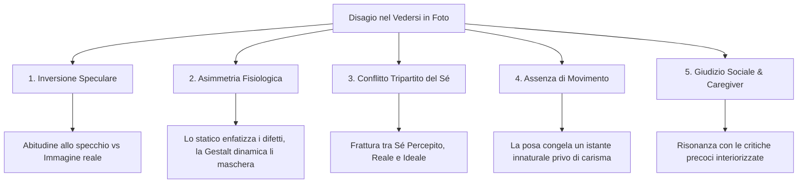

[[Home MOC|Home]] / [[Personal Growth & Health]] / [[Se Non Ti Piaci in Foto Ci Sono Questi 5 Motivi Psicologici]]

# Se Non Ti Piaci in Foto Ci Sono Questi 5 Motivi Psicologici

- **Video URL**: https://youtu.be/LfAInC9MyqM?si=eqHKDhZufe_1uwuO
- **Canale**: [[Michele Mezzanotte]]

---

## Sintesi Rapida

Il rifiuto o il disagio che proviamo nell'osservare la nostra immagine in fotografia non è un mero capriccio estetico, ma il risultato di <mark style="background:rgba(255, 193, 69, 0.32)"><b>cinque meccanismi psicologici e percettivi</b></mark> complessi. Il fenomeno nasce dalla discrepanza tra l'immagine riflessa a cui siamo assuefatti e quella reale, dall'assenza del dinamismo espressivo che maschera le naturali asimmetrie del volto, dalla frattura tra <mark style="background:rgba(181, 113, 255, 0.36)"><b>Sé percepito, Sé reale e Sé ideale</b></mark>, e dalla riattivazione inconscia del giudizio sociale interiorizzato durante l'infanzia attraverso lo sguardo dei caregiver.

---

## Architettura Concettuale

---

## I 5 Motivi Psicologici del Disagio Fotografico

### 1. L'Inversione Speculare (Familiarità Percettiva)
La percezione quotidiana del nostro volto avviene quasi esclusivamente attraverso lo <mark style="background:rgba(181, 113, 255, 0.36)"><b>specchio</b></mark>, che restituisce un'immagine specularmente invertita:
- Poiché nessun volto umano è perfettamente simmetrico, l'immagine fotografica (che mostra il nostro viso come lo vedono gli altri) viene registrata dal cervello come "aliena", insolita o sgradevole per via del principio di familiarità percettiva (*Mere-Exposure Effect*).
- Questo fenomeno è del tutto analogo a quanto accade quando <mark style="background:rgba(181, 113, 255, 0.36)"><b>riascoltiamo la nostra voce registrata</b></mark>: abituati alla conduzione ossea interna, la voce udita dall'esterno sembra appartenere a un estraneo, innescando una forte discrepanza cognitiva.

### 2. L'Asimmetria Fisiologica e l'Armonia Gestaltica
Ogni volto possiede asimmetrie naturali dovute a fattori genetici, posturali o traumi infantili:
- **Nella dinamica relazionale:** Quando comunichiamo dal vivo o ci muoviamo, i principi della <mark style="background:rgba(255, 193, 69, 0.32)"><b>psicologia della Gestalt</b></mark> fanno sì che la mente dell'osservatore integri il movimento in una percezione globale armoniosa, annullando la percezione dei singoli disallineamenti.
- **Nella fotografia statica:** L'immagine fissa interrompe il flusso dinamico; l'occhio dell'osservatore (e il nostro in primis) viene indotto a compiere una scansione analitica punto per punto, facendo emergere ed esasperando ogni minima asimmetria.

### 3. Il Conflitto Psicoanalitico del Sé: Percepito, Reale e Ideale
A livello profondo interiore si scontrano tre rappresentazioni identitarie distinte:
1. <mark style="background:rgba(181, 113, 255, 0.36)"><b>Sé Percepito (Interiore):</b></mark> La mappa mentale e soggettiva che abbiamo di noi stessi costruita in assenza di supporti visivi. 
 >[!quote] Il Caso Clinico di Giorgio Antonucci
 >Negli ospedali psichiatrici del passato, per motivi di sicurezza, non vi erano specchi. I pazienti potevano vivere decenni senza vedere il proprio volto, misurando lo scorrere del tempo e la propria identità corporea esclusivamente osservando l'invecchiamento delle proprie mani.
2. <mark style="background:rgba(181, 113, 255, 0.36)"><b>Sé Reale:</b></mark> La nostra conformazione fisica oggettiva nel mondo tridimensionale.
3. <mark style="background:rgba(181, 113, 255, 0.36)"><b>Sé Ideale:</b></mark> Il modello estetico a cui aspiriamo inconsciamente, plasmato da desideri e canoni socioculturali.
La fotografia rompe l'equilibrio immaginario del *Sé percepito* e si scontra con il *Sé ideale*, rendendo visibile la distanza tra aspettativa interiore e dato di realtà.

### 4. L'Assenza di Movimento e la Falsità della Posa
La nostra identità estetica e il nostro carisma risiedono primariamente nella <mark style="background:rgba(255, 193, 69, 0.32)"><b>prossemica e mimica espressiva</b></mark>:
- Le foto posate creano spesso disagio perché forzano posture rigide e statiche che non esistono nella vita reale.
- L'osservazione altrui coglie la naturalezza dei micromovimenti; isolare un singolo millisecondo cattura un fotogramma innaturale che toglie spontaneità e profondità alla persona.

### 5. Il Giudizio Sociale Interiorizzato e lo Sguardo dei Caregiver
L'atto di guardare una propria foto non è mai neutro, ma mediato da un "osservatore fantasma":
- Quando guardiamo noi stessi, ci chiediamo automaticamente: *"Come appaio agli altri?"*.
- Tale filtro interpretativo è radicato nelle relazioni primarie con i <mark style="background:rgba(255, 193, 69, 0.32)"><b>caregiver</b></mark> (genitori, insegnanti, allenatori). Se l'ambiente infantile è stato ipercritico, focalizzato sull'aspetto esteriore o ha rimandato costantemente correzioni e difetti, la foto diventa un trigger che risveglia la paura ancestrale dell'inadeguatezza e del rifiuto sociale.

---

## Trasformazione Generazionale: Dall'Identità Immaginata all'Identità Digitale

Il rapporto con la propria immagine sta attraversando una mutazione antropologica senza precedenti:
- **Generazioni Analogiche:** Cresciute con pochissime foto fisiche; l'autoconsapevolezza corporea era costruita in larga misura sull'immaginazione e sul racconto indiretto.
- **Generazioni Digital Native:** Esposte fin dalla prima infanzia a una mole sterminata di video e foto istantanee. I bambini oggi imparano a conoscersi e riconoscersi precocemente attraverso lo specchio digitale, trasformando la percezione di sé da un costrutto immaginario a una realtà documentata in tempo reale.

---

## Takeaway Pratici

>[!tip] Come Rimodulare il Rapporto con le Foto
>- **Consapevolezza dell'Effetto Esposizione:** Ricordare che l'inversione speculare è un bias percettivo: gli altri ci vedono da sempre nell'orientamento della foto e non notano l'effetto "strano" che disturba noi.
>- **Preferire la Spontaneità:** Privilegiare scatti catturati in movimento e durante interazioni autentiche rispetto alle pose forzate e statiche.
>- **Riconoscere l'Occhio Critico:** Quando sorge un giudizio svalutante, identificare se è una valutazione obiettiva o la voce interiorizzata di vecchi condizionamenti e caregiver passati.

---

## Collegamenti

- [[Personal Growth & Health|Personal Growth & Health MOC]]
- [[Youtube|Youtube MOC]]
- [[Home|Home]]
