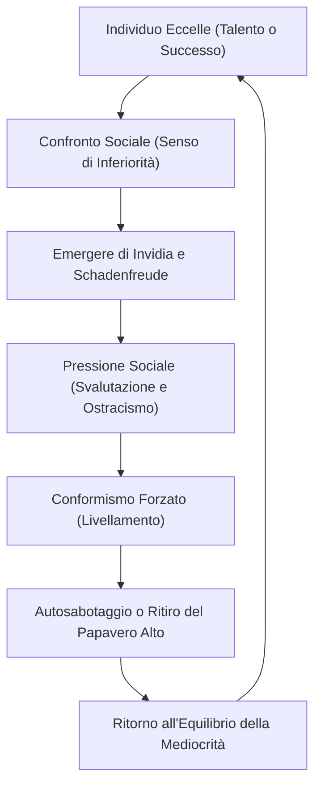

[[Home MOC|Home]] / [[Personal Growth & Health MOC|Personal Growth & Health]] / [[Sindrome del Papavero Alto]]

# Sindrome del Papavero Alto

La <mark style="background:rgba(255, 193, 69, 0.32)"><b>sindrome del papavero alto</b></mark> (nota internazionalmente come <mark style="background:rgba(181, 113, 255, 0.36)"><b>Tall Poppy Syndrome</b></mark>) è un fenomeno sociale e psicologico in cui le persone che si distinguono per capacità, successo, ricchezza o popolarità vengono sistematicamente criticate, sminuite o ostacolate dal gruppo di pari. Questo comportamento risponde a un desiderio, conscio o inconscio, di riportare l'individuo eccezionale a un livello di mediocrità condivisa, preservando la coesione del gruppo o placando il senso di inadeguatezza altrui.

---

## Origini Storiche e Mitologiche

Il concetto affonda le sue radici nell'antichità classica, descritto in aneddoti che illustrano la spietata gestione del potere e del dissenso sociale.

Il primo a parlarne fu <mark style="background:rgba(181, 113, 255, 0.36)"><b>Erodoto</b></mark> nelle sue _Storie_, narrando di un messaggero inviato da Trasibulo a <mark style="background:rgba(181, 113, 255, 0.36)"><b>Periandro</b></mark>, tiranno di Corinto. Periandro, per mostrare come mantenere il controllo sulla città, camminò in un campo di grano tagliando sistematicamente le spighe più alte ed eccezionali.

Successivamente, lo storico romano <mark style="background:rgba(181, 113, 255, 0.36)"><b>Tito Livio</b></mark> riadattò l'aneddoto nella sua opera _Ab Urbe Condita_, sostituendo il grano con i papaveri. Nel racconto, Sesto Tarquinio, figlio del re di Roma <mark style="background:rgba(181, 113, 255, 0.36)"><b>Tarquinio il Superbo</b></mark>, inviò un messaggero al padre per chiedergli come governare la città sottomessa di Gabi. Il re, senza proferire parola, si recò nel suo giardino e abbatté con un bastone le teste dei papaveri che spiccavano sopra gli altri, indicando la necessità di eliminare i cittadini più influenti per prevenire rivolte.

>[!quote] Tito Livio, _Ab Urbe Condita_
> Tarquinio, quasi immerso in pensieri profondi, passò al giardino della casa; là, passeggiando in silenzio, si dice che abbia abbattuto le teste dei papaveri più alti con una bacchetta. Il messaggero, stanco di attendere una risposta a voce, tornò a Gabi riferendo ciò che aveva visto.

---

## La Dinamica Psicologica e Sociale

La sindrome si fonda su una complessa rete di meccanismi di difesa individuali e dinamiche di gruppo. La spinta principale risiede nell'<mark style="background:rgba(255, 193, 69, 0.32)"><b>invidia sociale</b></mark>, un'emozione dolorosa derivante dal confronto con chi possiede qualità o successi desiderati.

Secondo la **teoria del confronto sociale** sviluppata da <mark style="background:rgba(181, 113, 255, 0.36)"><b>Leon Festinger</b></mark>, gli esseri umani valutano il proprio valore confrontandosi con gli altri. Quando questo confronto genera un senso di inferiorità, l'individuo ha due opzioni:
1. Migliorare la propria condizione (strategia costruttiva).
2. Ridurre il valore dell'altro per ristabilire l'uguaglianza percepita (strategia distruttiva).

La sindrome del papavero alto predilige la seconda via, spesso accompagnata dalla <mark style="background:rgba(181, 113, 255, 0.36)"><b>schadenfreude</b></mark> — il piacere maligno provato di fronte al fallimento di chi un tempo eccelleva. 

Un altro pilastro è il <mark style="background:rgba(255, 193, 69, 0.32)"><b>conformismo sociale</b></mark>. Il gruppo tende a percepire l'eccellenza come una minaccia all'equilibrio e alla coesione interna. Chi spicca troppo mette implicitamente in luce le lacune degli altri, rompendo il tacito accordo di mediocrità che garantisce la sicurezza psicologica collettiva.

---

## Differenze Culturali e Varianti Internazionali

Sebbene sia una dinamica umana universale, la sindrome si manifesta con intensità diverse a seconda dei valori culturali dominanti:

- **Paesi anglosassoni (Australia, Nuova Zelanda, Regno Unito)**: Qui la *Tall Poppy Syndrome* è parte del vocabolario comune. C'è una forte enfasi sull'egualitarismo e sulla modestia; l'auto-promozione o l'ostentazione del successo vengono duramente punite socialmente.
- **Scandinavia e la <mark style="background:rgba(255, 193, 69, 0.32)"><b>legge di Jante</b></mark>**: Codificata nello _Janteloven_ dallo scrittore Aksel Sandemose, descrive norme sociali che scoraggiano l'individualismo e il successo personale. Il principio cardine è: *"Non credere di essere migliore di noi"*.
- **Giappone**: Il celebre proverbio *"Il chiodo che sporge va preso a martellate"* illustra perfettamente come la conformità culturale e l'armonia di gruppo prevalgano sul successo del singolo.
- **Italia ed Europa Meridionale**: Spesso mascherata da critica intellettuale o moralismo, l'invidia sociale si manifesta attraverso il sospetto sistematico nei confronti di chi ottiene successo rapidamente, attribuendolo a raccomandazioni, fortuna o scorciatoie etiche anziché al merito.

---

## Conseguenze per il Singolo e la Collettività

Le ripercussioni di questa dinamica di livellamento si avvertono a livello individuale e collettivo.

### Impatto sull'Individuo

Chi viene identificato come "papavero alto" subisce una pressione costante che può minare il benessere psicologico:
- **Tendenza all'<mark style="background:rgba(181, 113, 255, 0.36)"><b>auto-sabotaggio</b></mark>**: Per evitare l'ostracismo, l'individuo potrebbe ridurre volontariamente le proprie prestazioni o nascondere i propri traguardi (*tall poppy hiding*).
- **Insorgenza della <mark style="background:rgba(181, 113, 255, 0.36)"><b>sindrome dell'impostore</b></mark>**: Il dubbio costante seminato dalle critiche altrui può portare a credere di non meritare i propri successi.
- **Isolamento sociale**: La diffidenza del gruppo crea una barriera emotiva difficile da superare, lasciando la persona in una condizione di solitudine lavorativa ed emotiva.

### Impatto sulla Collettività

>[!warning] Il Costo della Mediocrità
> Quando un'organizzazione o una società tollera e incoraggia la demolizione dei suoi membri migliori, il risultato a lungo termine è la paralisi dell'innovazione. Si crea una cultura in cui l'errore è punito meno dell'eccellenza, incentivando l'immobilismo.

- **Fuga di cervelli**: I talenti migliori migrano verso culture e contesti dove il merito viene celebrato anziché punito.
- **Cultura della sfiducia**: L'energia collettiva si sposta dalla collaborazione al controllo reciproco, riducendo l'efficienza generale.

---

## Strategie per Gestire e Superare la Sindrome

Sia i singoli individui sia i leader delle organizzazioni possono attuare strategie per contrastare gli effetti tossici del livellamento sociale.

### Per il Singolo

1. **Riconoscere la natura del problema**: Comprendere che le critiche distruttive spesso dicono più sulle insicurezze di chi le esprime che sul valore reale del proprio lavoro.
2. **Costruire una rete di supporto esterna**: Circondarsi di pari che condividano una mentalità orientata alla crescita e non alla competizione distruttiva.
3. **Praticare l'umiltà strategica**: Condividere i meriti, valorizzare il contributo del gruppo e comunicare i propri successi senza arroganza riduce l'attrito sociale.

### Per i Leader e le Organizzazioni

- **Premiare il merito in modo trasparente**: Se i criteri di avanzamento sono chiari e oggettivi, si riduce lo spazio per il sospetto di favoritismi.
- **Incentivare la collaborazione**: Strutturare i premi sulla base delle performance del team piuttosto che su quelle puramente individuali, stimolando il mutuo aiuto.
- **Promuovere una mentalità di crescita**: Diffondere l'idea che il successo di un singolo sia una risorsa e uno stimolo per l'intero grupo, e non una minaccia a somma zero.

---
## Collegamenti
- [[Echo Chamber]]
- [[Cancel Culture]]
