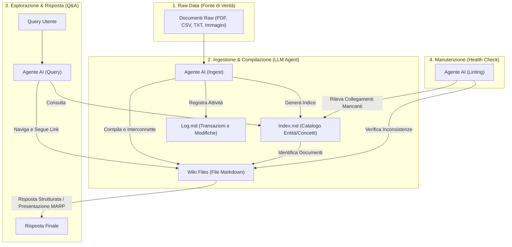

[[Home MOC|Home]] / [[Tech & AI]] / [[Costruire Knowledge Base per AI con LLM Wiki]]

# Costruire Knowledge Base per AI con LLM Wiki

- **Video URL**: https://youtu.be/LLxBcc_bMS8
- **Canale**: [[Simone Rizzo]]

---

## Sintesi Rapida

Il rapido avanzamento dei modelli di linguaggio ha evidenziato la necessità di sistemi di archiviazione della conoscenza sempre più avanzati. <mark style="background:rgba(255, 193, 69, 0.32)"><b>LLM Wiki</b></mark> rappresenta l'ultima evoluzione in questo campo, superando i limiti strutturali e di contesto dei tradizionali sistemi <mark style="background:rgba(255, 193, 69, 0.32)"><b>RAG</b></mark> ed evolvendo il concetto di <mark style="background:rgba(255, 193, 69, 0.32)"><b>Agentic File Search</b></mark>. Compilando la conoscenza in una struttura di file <mark style="background:rgba(181, 113, 255, 0.36)"><b>markdown</b></mark> persistenti, interconnessi e auto-manutenuti da agenti intelligenti, questo approccio crea una base di conoscenza trasparente, evolutiva e direttamente comprensibile sia dall'uomo che dall'intelligenza artificiale.

---

## Capitolo 1: La Necessità di una Memoria Esterna per i Modelli di Linguaggio

![[LLxBcc_bMS8_0_introduction_to.jpg]]

I Large Language Model (LLM) sono per loro natura sistemi **stateless**, privi cioè di una memoria interna persistente delle interazioni passate o delle informazioni esterne non incluse nel loro addestramento iniziale. Per illustrare questo concetto, si può immaginare un LLM come un soggetto affetto da una forma di amnesia totale a breve termine: ogni qualvolta gli viene posta una nuova domanda, il modello azzera la propria memoria operativa. Per consentire al modello di mantenere un contesto coerente e di attingere a informazioni aggiornate, è indispensabile fornirgli un supporto di memoria esterno su cui "leggere e scrivere" durante l'elaborazione delle risposte.

![[LLxBcc_bMS8_1_why_llms_need_e.jpg]]

La modalità con cui viene strutturato e gestito questo archivio di memoria definisce l'efficacia e le capacità operative dell'agente AI. Nel corso dell'evoluzione tecnologica recente, si sono succedute tre diverse generazioni di architetture dedicate all'organizzazione e al recupero dei documenti.

---

## Capitolo 2: L'Evoluzione dello Storage Esterno: Da RAG ad Agentic File Search

Nel percorso evolutivo dei sistemi di memorizzazione per intelligenze artificiali, si distinguono due tappe fondamentali prima dell'avvento dei sistemi Wiki:

### Prima Generazione: Il Sistema RAG (Retrieval-Augmented Generation)
Nato intorno al 2022, il framework <mark style="background:rgba(255, 193, 69, 0.32)"><b>RAG</b></mark> si fonda su un processo lineare di indicizzazione e ricerca semantica:
1. **Ingestione**: I documenti grezzi (come PDF, file di testo o trascrizioni) vengono suddivisi in porzioni ridotte chiamate <mark style="background:rgba(181, 113, 255, 0.36)"><b>chunk</b></mark>.
2. **Vettorializzazione**: Ogni frammento viene elaborato da un <mark style="background:rgba(181, 113, 255, 0.36)"><b>embedding model</b></mark>, che traduce il testo in un vettore numerico (una coordinata in uno spazio multidimensionale che ne rappresenta il significato semantico).
3. **Archiviazione**: I vettori vengono salvati all'interno di un <mark style="background:rgba(181, 113, 255, 0.36)"><b>database vettoriale</b></mark>.
4. **Retrieval**: Quando l'utente inserisce una <mark style="background:rgba(181, 113, 255, 0.36)"><b>query</b></mark>, anch'essa viene trasformata in vettore per identificare, tramite similarità matematica, i frammenti di testo più rilevanti.
5. **Augmentation**: I frammenti recuperati vengono inviati all'LLM insieme alla query originale per generare la risposta finale.

![[LLxBcc_bMS8_2_gen_1__what_is_.jpg]]

Nonostante il successo di soluzioni basate su questo modello, il RAG presenta limiti significativi:
- I singoli frammenti (<mark style="background:rgba(181, 113, 255, 0.36)"><b>chunk</b></mark>) tendono a perdere il contesto generale del documento di provenienza.
- I collegamenti logici incrociati (<mark style="background:rgba(181, 113, 255, 0.36)"><b>cross-reference</b></mark>) tra i documenti risultano invisibili.
- La similarità semantica non coincide necessariamente con la rilevanza logica rispetto al problema.
- Il sistema non accumula conoscenza nel tempo; ogni richiesta è isolata e indipendente.

### Seconda Generazione: Agentic File Search
Con la diffusione degli agenti di programmazione avanzati, si è affermato l'approccio <mark style="background:rgba(255, 193, 69, 0.32)"><b>Agentic File Search</b></mark>, che sostituisce i database vettoriali con l'esplorazione diretta del <mark style="background:rgba(181, 113, 255, 0.36)"><b>file system</b></mark> locale dell'utente.

![[LLxBcc_bMS8_3_gen_2__agentic_.jpg]]

La conoscenza viene strutturata in cartelle e file markdown standard. L'agente AI utilizza strumenti specifici (tool di scansione directory, filtri glob, visualizzatori e lettori di file) per esplorare le directory esattamente come farebbe un essere umano. Invece di basarsi su indici numerici precalcolati, l'agente può:
- Analizzare le gerarchie delle cartelle per dedurre relazioni di contesto.
- Effettuare letture selettive di intestazioni o sommari prima di caricare l'intero contenuto in memoria, riducendo l'uso di <mark style="background:rgba(181, 113, 255, 0.36)"><b>token</b></mark>.
- Seguire riferimenti testuali incrociati navigando da un file all'altro in tempo reale.

![[LLxBcc_bMS8_4_limitations_of_.jpg]]

Tuttavia, anche questo modello presenta un consumo di risorse elevato in termini di token a ogni esecuzione, e possiede una capacità limitata di consolidare e capitalizzare le informazioni elaborate nel tempo.

---

## Capitolo 3: La Terza Generazione: La Conoscenza Compilata di LLM Wiki

La terza generazione, rappresentata da <mark style="background:rgba(255, 193, 69, 0.32)"><b>LLM Wiki</b></mark>, supera la logica della ricerca al volo compilando e consolidando attivamente la conoscenza in una wiki strutturata e interconnessa che evolve costantemente.

![[LLxBcc_bMS8_5_gen_3__llm_wiki.jpg]]

In questa architettura, i documenti grezzi inseriti dall'utente non vengono semplicemente spezzettati o scansionati all'occorrenza, ma vengono letti e strutturati da un agente intelligente per generare una rete logica di file in formato markdown. Il principio cardine di questa metodologia risiede nel fatto che gli esseri umani tendono ad abbandonare la manutenzione delle wiki aziendali o personali a causa dell'onere burocratico di aggiornamento dei link e dei concetti. Un modello di linguaggio, al contrario, non risente della ripetitività di tali operazioni ed è in grado di modificare, collegare e aggiornare decine di file simultaneamente senza tralasciare alcuna corrispondenza.

### Struttura Tecnica dei File
L'architettura di un sistema LLM Wiki si articola in una gerarchia di directory ben definita:
- **Directory `raw/`**: contiene le fonti originarie e i dati "sporchi" inseriti dall'utente (PDF, report, articoli web salvati, dataset, fogli di calcolo e immagini).
- **Directory `wiki/`**: ospita i file markdown elaborati e suddivisi in categorie logiche:
  - `concepts/`: definizioni e approfondimenti di concetti specifici.
  - `entities/`: schede di persone, organizzazioni, tecnologie o normative.
  - `sources/`: riassunti strutturati e metadati di ciascun documento presente nella cartella raw.
  - `synthesis/`: note di sintesi che aggregano più fonti su tematiche trasversali.
- **`index.md`**: funge da catalogo centrale e indice principale di tutte le informazioni presenti, organizzate per domini e categorie.
- **`log.md`**: un registro cronologico che traccia ogni operazione compiuta dall'agente (es. inserimento di una nuova fonte, aggiornamento di un concetto, refactoring dei link).

![[LLxBcc_bMS8_6_the_technical_s.jpg]]

### I Tre Livelli dell'Architettura
Il sistema poggia su tre strati funzionali distinti:
1. **Layer dei Dati Grezzi (Raw)**: La base di verità e l'origine di tutte le informazioni.
2. **Layer della Wiki (Markdown)**: La base di conoscenza elaborata e strutturata, con backlink espliciti che collegano le varie note.
3. **Layer dello Schema (`cloud.md`)**: Il file di configurazione contenente i prompt di sistema e le regole che definiscono il comportamento dell'agente AI nella gestione della wiki.

![[LLxBcc_bMS8_10_the_three_level.jpg]]

---

## Capitolo 4: Obsidian come Interfaccia per il Second Brain

Per consentire la visualizzazione e la navigazione di questa base di conoscenza a livello visivo ed umano, lo strumento d'elezione è <mark style="background:rgba(255, 193, 69, 0.32)"><b>Obsidian</b></mark>.

![[LLxBcc_bMS8_7_obsidian__the_k.jpg]]

Obsidian è un'applicazione desktop e mobile che opera direttamente su file markdown locali, senza richiedere database centralizzati o connessioni cloud obbligatorie. Nel contesto di un LLM Wiki, Obsidian svolge il ruolo di **frontend** o IDE (Integrated Development Environment) visivo:
- Permette di esplorare graficamente le interconnessioni tra i file markdown tramite la **Graph View** (vista a grafo).
- Rende immediatamente navigabili i <mark style="background:rgba(181, 113, 255, 0.36)"><b>backlinks</b></mark> (i collegamenti bidirezionali inseriti dall'agente AI tramite la sintassi a doppia parentesi quadra `[[Nome Nota]]`).
- Consente all'utente umano di verificare la correttezza del ragionamento operato dall'AI sui documenti e di interagire direttamente con le note prodotte.

> [!note] Trasparenza del Grafo
> L'uso di Obsidian è puramente opzionale per il funzionamento dell'agente AI. Tuttavia, la visualizzazione a grafo favorisce l'emergere di cluster concettuali spontanei, evidenziando le tematiche più citate e facilitando la comprensione della struttura informativa.

---

## Capitolo 5: Il Ciclo di Vita della Wiki: Ingestione, Interrogazione e Manutenzione

La gestione del sistema LLM Wiki si sviluppa attraverso tre macro-attività cicliche:

### 1. Ingestione dei Dati (Ingest)
Quando nuovi documenti vengono inseriti nella cartella `raw/`, l'agente esegue una scansione e avvia la fase di acquisizione. L'AI analizza ogni file, ne estrae i concetti rilevanti e crea le relative schede all'interno delle cartelle di competenza (`concepts/`, `entities/`, `sources/`), aggiornando contestualmente l'indice generale (`index.md`) e registrando l'evento nel file `log.md`.

### 2. Interrogazione (Query)
Al momento della ricezione di una domanda complessa, l'agente AI non effettua una ricerca semantica grezza su tutti i chunk. Al contrario, consulta l'indice centrale `index.md` per localizzare i nodi di partenza della conoscenza. Da lì, l'agente naviga la rete di wikilink leggendo in sequenza le schede collegate e raccogliendo tutte le relazioni necessarie.

![[LLxBcc_bMS8_8_how_ai_explores.jpg]]

Il risultato finale può essere salvato direttamente all'interno della directory `synthesis/` come una nuova nota di sintesi, arricchita da link interni che consentono all'utente di approfondire i singoli concetti correlati.

### 3. Manutenzione e Controllo di Qualità (Linting)
La fase di <mark style="background:rgba(255, 193, 69, 0.32)"><b>linting</b></mark> consiste in un controllo periodico dello stato di salute della wiki da parte dell'agente.

![[LLxBcc_bMS8_9_marp_format_and.jpg]]
![[LLxBcc_bMS8_18_automatic_wiki_.jpg]]

Durante questa fase, l'LLM analizza la wiki alla ricerca di:
- **Pagine orfane**: note prive di collegamenti in ingresso.
- **Collegamenti interrotti**: wikilink che puntano a pagine non ancora esistenti.
- **Inconsistenze informative**: dati obsoleti o in contraddizione con fonti più recenti.
- **Concetti candidati**: parole chiave ricorrenti nel testo che beneficerebbero della creazione di una nota dedicata.

---

## Capitolo 6: Presentazioni Slide con il Formato MARP

Un'applicazione avanzata dell'output strutturato è la generazione automatica di presentazioni tramite il formato <mark style="background:rgba(255, 193, 69, 0.32)"><b>MARP</b></mark> (Markdown Presentation Ecosystem).

![[LLxBcc_bMS8_17_generating_auto.jpg]]

MARP permette di convertire un file markdown strutturato in slide animate e PDF professionali attraverso una sintassi dichiarativa semplice. Integrando l'agente AI con schemi di compilazione MARP e installando il relativo plugin all'interno di Obsidian, l'utente può richiedere l'elaborazione di sintesi complesse (ad esempio, l'analisi di fattibilità per un bando aziendale) direttamente sotto forma di file di presentazione pronti per la condivisione e l'esportazione.

---

## Capitolo 7: Guida Pratica all'Implementazione e Casi di Studio

### Step 1: Configurazione dell'Ambiente e Obsidian
1. Scaricare e installare l'applicazione desktop di **Obsidian**.
2. Creare un nuovo vault locale specificando una cartella dedicata del proprio computer.
3. Installare l'estensione del browser **Obsidian Web Clipper** per convertire gli articoli web in file markdown e indirizzarli automaticamente all'interno della cartella `raw/`.

![[LLxBcc_bMS8_11_tutorial__insta.jpg]]

### Step 2: Configurazione dell'Agente AI
Avviare il proprio agente AI all'interno della directory principale del vault e caricare il prompt di schema (`cloud.md`). Tale prompt istruisce l'agente a rispettare la struttura delle cartelle e a gestire in modo autonomo le fasi di ingestione, interrogazione e manutenzione.

![[LLxBcc_bMS8_12_ai_agent_config.jpg]]

> [!tip] Esempio di Prompt di Avvio
> "Implementa le regole di LLM Wiki per la gestione di questo secondo cervello. Configura il file di schema cloud.md, inizializza index.md e log.md, definisci le cartelle e preparati a eseguire la prima fase di Ingest."

### Step 3: Ingestione e Casi d'Uso Pratici
Per verificare il funzionamento del sistema, si possono caricare risorse tematiche nella cartella `raw/`.

#### Caso d'Uso 1: Wiki di Ricerca sull'Alimentazione
Utilizzando il Web Clipper, si possono acquisire articoli online relativi alle diete ed alla nutrizione.

![[LLxBcc_bMS8_13_practical_examp.jpg]]
![[LLxBcc_bMS8_14_creating_real_t.jpg]]

Avviando la fase di ingestione (`ingest`), l'agente elabora i contenuti generando note sui nutrienti e sugli obiettivi, collegate fra loro. Un'interrogazione mirata (es. "Qual è la migliore dieta per le performance cognitive?") estrarrà i dati esclusivamente dai documenti locali, archiviando una sintesi strutturata arricchita da link navigabili a concetti specifici come gli acidi grassi omega-3.

![[LLxBcc_bMS8_15_querying__query.jpg]]

#### Caso d'Uso 2: Indicizzazione di Bandi Pubblici
Un altro esempio pratico riguarda l'analisi di documenti complessi, come bandi di concorso e circolari informative in formato PDF.

![[LLxBcc_bMS8_16_case_study__ins.jpg]]

Inserendo i PDF nella directory `raw/` e lanciando l'ingest, l'agente estrae i criteri di ammissibilità, i requisiti legali e le scadenze, strutturandoli in schede sintetiche. L'utente può quindi porre quesiti sul bando più idoneo per la propria startup e ricevere un report di fattibilità personalizzato.

---

## Capitolo 8: Analisi Comparativa: RAG, Agentic e LLM Wiki

Le tre tecnologie analizzate non si escludono a vicenda, ma possono coesistere all'interno di un'architettura ibrida strutturata a seconda dei volumi di dati trattati.

![[LLxBcc_bMS8_19_final_compariso.jpg]]

| Caratteristica | RAG (Gen 1) | Agentic Search (Gen 2) | LLM Wiki (Gen 3) |
| :--- | :--- | :--- | :--- |
| **Meccanismo di Accesso** | Ricerca di Similarità (Embedding) | Navigazione con Tool (Scan, Read, Grep) | Lettura Diretta ed Esplorazione Indici/Grafo |
| **Unità di Contesto** | Frammenti di testo limitati (Chunk) | File intero | Pagine strutturate interconnesse |
| **Relazioni (Cross-Reference)**| Invisibili o assenti | Risolte a runtime tramite agenti | Materializzate a livello di file system (Link) |
| **Accumulo Conoscenza** | Nessuno (stateless) | Debole (append su file) | Centrale (Index, Log e Note consolidate) |
| **Efficienza Token** | Bassa (spesso rumore nei chunk) | Media (dipende dalla scansione dei file) | Molto alta (la conoscenza è già pre-compilata) |

Nei sistemi su grandissima scala, il **RAG** può essere impiegato come filtro iniziale per scremare milioni di documenti; l'**Agentic File Search** consente di esplorare nel dettaglio i singoli documenti candidati; infine, **LLM Wiki** consolida in modo permanente i risultati di queste analisi all'interno del second brain locale dell'utente.

---

## Concetti Chiave

- **[[LLM Wiki]]**: Metodologia di gestione della conoscenza che compila e organizza i file raw in markdown interconnessi tramite un agente AI.
- **[[RAG]]**: Framework di generazione aumentata da recupero semantico basato su database vettoriali ed embedding.
- **[[Agentic File Search]]**: Approccio basato su agenti intelligenti dotati di strumenti per esplorare direttamente il file system locale.
- **[[MARP]]**: Strumento di conversione di markdown in slide di presentazione strutturate.
- **[[Obsidian]]**: Applicazione di produttività personale usata come interfaccia visiva del grafo di note locali.

---

## Collegamenti

- **Macro Area**: [[Technology MOC]]
- **Note Correlate**: [[Antigravity AI CLI Personal Agent]], [[Obsidian Second Brain MOC]]
