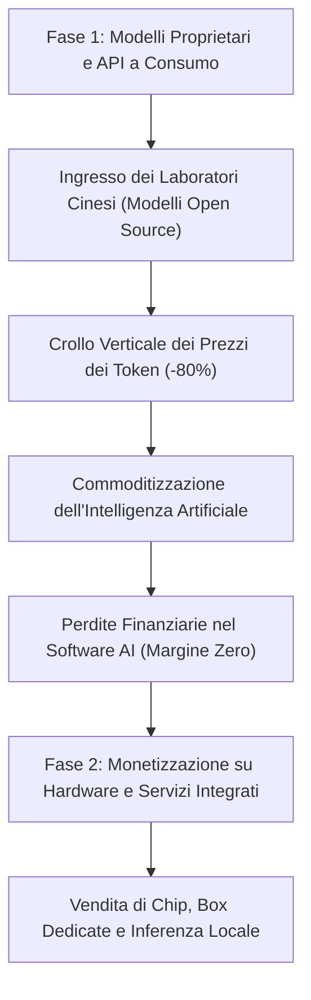
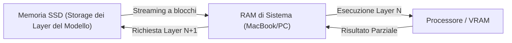

[[Home MOC|Home]] / [[Tech & AI]] / [[La Commoditizzazione Dell'Intelligenza Artificiale e la Guerra Dell'Hardware]]

# La Commoditizzazione dell'Intelligenza Artificiale e la Guerra dell'Hardware

- **Video URL**: https://youtu.be/3Elkmmon2vE
- **Canale**: [[Simone Rizzo]]

---

## Sintesi Rapida

L'industria dell'intelligenza artificiale sta affrontando una trasformazione radicale: mentre l'intelligenza dei modelli linguistici si avvia verso una rapida <mark style="background:rgba(255, 193, 69, 0.32)"><b>commoditizzazione dell'intelligenza</b></mark>, il focus dell'intera industria si sposta inevitabilmente sulla <mark style="background:rgba(255, 193, 69, 0.32)"><b>guerra dell'hardware</b></mark>. Il crollo verticale del costo delle API, guidato dal rilascio continuo di modelli open-source ad alte prestazioni da parte di laboratori cinesi, sta costringendo i colossi americani della tecnologia a ripensare i propri modelli di business. In questo scenario, la monetizzazione si sposta dalla vendita di token a consumo all'offerta di hardware integrato, cloud proprietario e architetture per l'inferenza locale, ridisegnando gli equilibri geopolitici e minacciando di far scoppiare la bolla degli investimenti software.

---

## La Guerra delle API e l'Offensiva Open-Source Cinese

Il panorama globale dei modelli di intelligenza artificiale di frontiera sta subendo una svalutazione sistematica del suo asset principale: il token. I laboratori di ricerca cinesi rilasciano nuovi modelli con licenza <mark style="background:rgba(255, 193, 69, 0.32)"><b>open-weight</b></mark> su base quasi settimanale. Queste soluzioni raggiungono o superano le prestazioni dei più noti modelli americani a una frazione del costo d'uso, spesso ridotto a un terzo o a un decimo rispetto ai concorrenti d'oltreoceano.

L'intento strategico di questa ondata tecnologica è scardinare il modello di business basato sulla vendita dell'accesso API a consumo, tipico delle big tech statunitensi. Come conseguenza diretta di questa pressione competitiva, si è assistito a un deprezzamento drastico del mercato: ad esempio, <mark style="background:rgba(181, 113, 255, 0.36)"><b>OpenAI</b></mark> ha ridotto dell'80% i costi delle API per il suo modello di punta <mark style="background:rgba(181, 113, 255, 0.36)"><b>GPT-5.6 Luna</b></mark> (indicato anche come GPT-Luna o GPT-5.6). Tuttavia, la risposta dei laboratori cinesi non si è fatta attendere: subito dopo l'annuncio americano, <mark style="background:rgba(181, 113, 255, 0.36)"><b>DeepSeek</b></mark> ha rilasciato la versione definitiva di <mark style="background:rgba(181, 113, 255, 0.36)"><b>DeepSeek-V4-Flash</b></mark>, un modello da 284 miliardi di parametri che batte concorrenti del calibro di _GLM-5.2_ e rivaleggia da vicino con _Opus 4.8_, ma a un costo di soli 8 centesimi di dollaro per milione di token in output rispetto al dollaro e venti richiesto per _Luna_.

---

## La Corsa all'Inferenza Locale e la Crisi dei Componenti Consumer

A livello infrastrutturale, la domanda massiccia di capacità computazionale per l'addestramento e l'inferenza nei data center sta creando un effetto imbuto sull'hardware di consumo. I produttori di memorie semiconduttrici stanno convertendo le proprie linee di produzione per soddisfare le richieste dei server dedicati all'intelligenza artificiale, trascurando la produzione di memorie RAM per personal computer e smartphone. Questa scarsità ha causato un incremento significativo dei prezzi dei dispositivi consumer, tra cui MacBook, portatili e telefoni.

Per mitigare l'impatto di questi rincari sui clienti finali, aziende come <mark style="background:rgba(181, 113, 255, 0.36)"><b>Apple</b></mark> stanno spingendo su formule finanziarie alternative come il noleggio a lungo termine (es. _Apple Upgrade_), prevedendo uno scenario in cui i computer ad alte prestazioni per l'elaborazione locale dell'AI costeranno diverse migliaia di euro.

Nel frattempo, la necessità di eseguire localmente i modelli da trilioni di parametri ha spinto produttori come <mark style="background:rgba(181, 113, 255, 0.36)"><b>Nvidia</b></mark> a commercializzare sistemi dedicati per l'utenza professionale, come la _DJX Station_ per Windows, dotata di oltre 700 GB di memoria RAM. Parallelamente, si rincorrono indiscrezioni su futuri computer Apple con chip <mark style="background:rgba(181, 113, 255, 0.36)"><b>M7 Ultra</b></mark> equipaggiati con un massimo di 1.5 Terabyte di memoria unificata, progettati specificamente per gestire modelli complessi in locale senza alcuna quantizzazione distruttiva dei parametri. 

Sul fronte geopolitico, la Cina sta accelerando la transizione verso l'indipendenza tecnologica. Per proteggersi da eventuali sanzioni o blocchi commerciali, i laboratori cinesi stanno sviluppando macchine proprietarie per la litografia dei chip, memorie nazionali e GPU dedicate, consentendo l'addestramento e l'esecuzione di modelli di frontiera all'interno di data center interamente liberi da componenti occidentali.

---

## Ottimizzazione Software: SSD Streaming e il Ruolo Fondamentale dell'Harness

L'esecuzione locale di modelli di dimensioni colossali su macchine consumer con capacità di memoria limitata rappresenta una delle sfide ingegneristiche più complesse. Per superare questa limitazione fisica senza dover acquistare costosi server di memoria, la comunità open-source ha sviluppato motori di inferenza innovativi basati su codice in linguaggio C, come _Colibri_, _IRLM_ o il progetto _[[Ds4]]_ del programmatore italiano [[Salvatore Sanfilippo]].

La tecnologia chiave alla base di questi motori è lo <mark style="background:rgba(255, 193, 69, 0.32)"><b>SSD streaming</b></mark>. Invece di caricare l'intera mole di parametri del modello all'interno della RAM, il software effettua uno streaming continuo e sequenziale dei singoli layer del modello direttamente dall'unità a stato solido (SSD) verso la RAM e la GPU solo nel momento esatto in cui sono richiesti per il calcolo. Anche se questa metodologia comporta una riduzione della velocità di elaborazione rispetto a un caricamento totale in RAM, essa rende possibile l'esecuzione di modelli da trilioni di parametri su hardware commerciale di fascia media.

Oltre alla gestione della memoria fisica, l'attenzione degli ingegneri del software si è concentrata sull'**harness** (il sistema di orchestrazione esterno che avvolge il modello). I benchmark eseguiti sul dataset di valutazione logica <mark style="background:rgba(181, 113, 255, 0.36)"><b>ARC-AGI</b></mark> (noto per misurare le reali capacità di ragionamento astratto) evidenziano come lo stesso identico modello di base (ad esempio _GPT-5.6 Soul_) possa incrementare drasticamente le proprie prestazioni – passando da un punteggio del 13% a oltre il 38% – semplicemente ottimizzando il codice di supporto circostante per implementare tecniche avanzate di compattazione e ragionamento persistente (retained reasoning).

---

## Dal Prompt Engineering al Loop Engineering: Agenti Autonomi a Lungo Termine

Con il rilascio di modelli sempre più complessi, come il MoE <mark style="background:rgba(181, 113, 255, 0.36)"><b>Qwen-3.8-Max</b></mark> di <mark style="background:rgba(181, 113, 255, 0.36)"><b>Alibaba</b></mark> da 2.4 trilioni di parametri (di cui 95 miliardi attivi per token), si sta verificando un cambio di paradigma nell'interazione uomo-macchina. Questo modello introduce la possibilità di eseguire compiti complessi in totale autonomia continuativa per un periodo di **16 giorni**, superando la scala temporale delle ore o dei singoli giorni a cui eravamo abituati.

Questo incremento della persistenza operativa ha decretato il tramonto del classico prompt engineering in favore del <mark style="background:rgba(255, 193, 69, 0.32)"><b>Loop Engineering</b></mark>. L'utente non si limita più a fornire istruzioni puntuali e a supervisionare l'output ad ogni passaggio (babysitting dell'agente), ma definisce obiettivi complessi e condizioni di terminazione rigorose (sfruttando framework agentici avanzati come il comando `/goal`). L'agente genera autonomamente i propri prompt intermedi, corregge gli errori in modo ricorsivo e prosegue il lavoro autonomamente fino al raggiungimento dello scopo finale. 

Un esempio emblematico di questa applicazione si ritrova nella ricerca scientifica: fornendo un paper accademico a un agente autonomo, questo è in grado di riprodurne l'esperimento, scrivere ed eseguire il codice di convalida e proporre ottimizzazioni incrementali senza alcun intervento umano.

---

## La Bolla dell'AI e i Nuovi Modelli di Business

L'enorme mole di capitali investiti nella creazione di data center e nell'addestramento di modelli di frontiera sta sollevando crescenti dubbi sulla sostenibilità economica del settore software. L'analisi finanziaria dell'industria rivela che quasi tutte le principali aziende focalizzate esclusivamente sulla fornitura di servizi AI via software (tra cui <mark style="background:rgba(181, 113, 255, 0.36)"><b>Anthropic</b></mark>, Mistral, Cohere e persino OpenAI) stanno registrando perdite miliardarie a causa dei costi operativi e del crollo del prezzo delle API. 

Al contrario, gli unici soggetti a generare profitti record in questa fase sono i produttori di infrastruttura e semiconduttori, guidati da <mark style="background:rgba(181, 113, 255, 0.36)"><b>Nvidia</b></mark> (con oltre 280 miliardi di dollari di profitto netto) e <mark style="background:rgba(181, 113, 255, 0.36)"><b>Micron</b></mark>. Questa asimmetria ha spinto un consorzio di 25 aziende tecnologiche americane (comprendente Nvidia, Microsoft, Dell, Replit, Perplexity, Meta, Palantir e Hugging Face) a firmare una lettera ufficiale indirizzata alla Casa Bianca per opporsi alle restrizioni all'esportazione verso la Cina e promuovere attivamente il rilascio di modelli open-source.

>[!info] Il Cambio di Strategia
>La consapevolezza che l'intelligenza pura dei modelli linguistici stia diventando una commodity a margine zero sta guidando le aziende verso una transizione strategica: regalare i modelli come open-source per spingere la vendita di hardware proprietario ottimizzato e servizi cloud proprietari ad alte prestazioni.

In prospettiva futura, il mercato vedrà la proliferazione di modelli aperti e l'emergere di soluzioni integrate "chiavi in mano", dove i fornitori venderanno computer dedicati e chip personalizzati ottimizzati al millesimo per far girare localmente e ad altissima efficienza i propri modelli nativi.

---
## Concetti Chiave

- **[[Commoditizzazione dei LLM]]**: Il processo per cui la capacità di ragionamento dei modelli linguistici di grandi dimensioni smette di essere un fattore differenziante di mercato, trasformandosi in un servizio di base a basso costo.
- **[[SSD Streaming]]**: Tecnica di ottimizzazione della memoria che consente di eseguire modelli AI di dimensioni superiori alla memoria di sistema caricando e scaricando i blocchi di parametri in tempo reale dall'SSD.
- **[[Loop Engineering]]**: La metodologia di sviluppo e gestione di agenti AI basata sulla creazione di cicli di feedback autonomi in cui la macchina genera, valuta e corregge le proprie istruzioni senza intervento umano fino al raggiungimento di un target definito.
- **[[Harness Optimization]]**: L'ottimizzazione del software che circonda ed esegue il modello AI, in grado di sbloccare incrementi di prestazioni logiche senza richiedere modifiche ai pesi o all'architettura interna del modello stesso.

---
## Collegamenti

- **Macro Area**: [[Tech & AI]]
- **Note Correlate**: [[Evoluzione Dell'Agente AI]], [[La Gente Chiede Tutto Alle AI Perche Non Ha Scelta]]
