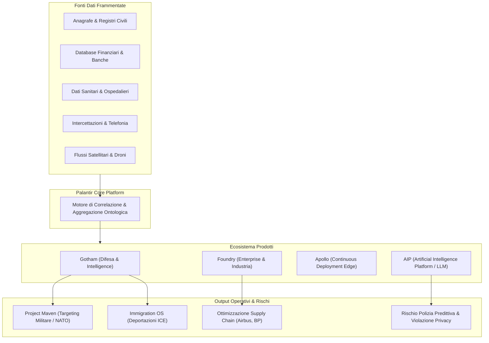

[[Home MOC|Home]] / [[Tech & AI]] / [[Palantir - Cosa Fa l'Azienda Che Aiuta i Governi e Perche e Preoccupante]]

# Palantir - Cosa Fa l'Azienda Che Aiuta i Governi e Perche e Preoccupante

- **Video URL**: https://youtu.be/HXFmhEYcnTw
- **Canale**: [[Geopop]]

---

## Sintesi Esecutiva

<mark style="background:rgba(255, 193, 69, 0.32)"><b>Palantir Technologies</b></mark> è una delle aziende software più potenti, strategiche e controverse al mondo. Fondata nel 2003 da <mark style="background:rgba(181, 113, 255, 0.36)"><b>Peter Thiel</b></mark> e guidata da <mark style="background:rgba(181, 113, 255, 0.36)"><b>Alex Karp</b></mark>, l'azienda è specializzata nell'integrazione e analisi predittiva di <mark style="background:rgba(255, 193, 69, 0.32)"><b>Big Data eterogenei</b></mark> per governi, agenzie di intelligence (<mark style="background:rgba(181, 113, 255, 0.36)"><b>CIA</b></mark>, <mark style="background:rgba(181, 113, 255, 0.36)"><b>NSA</b></mark>, <mark style="background:rgba(181, 113, 255, 0.36)"><b>FBI</b></mark>, <mark style="background:rgba(181, 113, 255, 0.36)"><b>DoD</b></mark>) e grandi multinazionali.

Il valore distintivo di Palantir non risiede nella raccolta diretta dei dati, bensì nella capacità di **connettere database frammentati e non comunicanti** (anagrafici, finanziari, sanitari, intercettazioni telefoniche, flussi satellitari e video da droni), consentendo alle autorità di ricostruire reti relazionali complesse e anticipare eventi o minacce.

Tuttavia, l'espansione dei suoi software solleva interrogativi cruciali su:
1. La delega di funzioni statali critiche e di intelligence a un soggetto privato a scopo di lucro;
2. La trasformazione dell'analisi preventiva in <mark style="background:rgba(255, 193, 69, 0.32)"><b>sorveglianza di massa e polizia predittiva</b></mark>;
3. L'esplicita ideologia bellica e anti-democratica formalizzata nel manifesto aziendale _The Technological Republic_.

---

## Ecosistema Tecnologico: I 4 Pilastri di Palantir

L'offerta di Palantir si articola su quattro piattaforme software modulari e integrate:

### 1. Gotham (Difesa & Intelligence Governativa)
- **Funzione Primaria:** Piattaforma progettata per l'analisi investigativa, la difesa e la sicurezza nazionale.
- **Meccanica:** Integra moli immense di dati operativi (celle telefoniche, movimenti veicolari, transazioni bancarie, tabulati) per tracciare bersagli, smantellare cellule terroristiche e identificare pattern criminali.
- **Moduli Specifici:** Include sotto-versioni come *Immigration OS* ed *ELITE*, fornite all'<mark style="background:rgba(181, 113, 255, 0.36)"><b>ICE</b></mark> per profilare e localizzare migranti irregolari, e *Project Maven* per l'analisi assistita da IA di video da droni per il Pentagono e la NATO.

### 2. Foundry (Settore Privato & Grandi Aziende)
- **Funzione Primaria:** Creazione di un "digital twin" aziendale integrando dati eterogenei dei processi produttivi e della logistica.
- **Casi d'Uso:** Ottimizzazione delle catene di fornitura, manutenzione predittiva, allocazione delle risorse ospedaliere e simulazioni industriali per clienti quali Airbus, Merck e BP.

### 3. Apollo (Automazione & Continuous Deployment Edge)
- **Funzione Primaria:** Sistema autonomo di orchestrazione e deployment continuo.
- **Meccanica:** Permette di installare, aggiornare e mantenere sicuri sia Gotham che Foundry in ambienti estremi, air-gapped o non connessi (satelliti in orbita, droni, sommergibili, reti militari ultra-classificate).

### 4. AIP — Artificial Intelligence Platform (2023)
- **Funzione Primaria:** Integrazione sicura di <mark style="background:rgba(181, 113, 255, 0.36)"><b>Large Language Models</b></mark> (LLM) e agenti generativi nelle reti decisionali operative.
- **Applicazione:** Consente agli operatori di interrogare in linguaggio naturale i sistemi d'arma, le simulazioni tattiche e i database aziendali con vincoli stringenti di autorizzazione e tracciamento.

---

## Origini, Modello di Business e Svolta Pandemica

| Periodo | Evento Chiave | Impatto Strategico |
|---|---|---|
| **1998-2003** | Algoritmo antifrode di <mark style="background:rgba(181, 113, 255, 0.36)"><b>PayPal</b></mark> | Peter Thiel e i suoi ingegneri intuiscono che la profilazione delle transazioni può essere applicata alla prevenzione del crimine e del terrorismo post-11 Settembre 2001. |
| **2004** | Seed capital di <mark style="background:rgba(181, 113, 255, 0.36)"><b>In-Q-Tel (CIA)</b></mark> | Investimento strategico di 2 milioni di dollari che apre le porte dei contratti di sicurezza federale USA. |
| **2020** | Pandemia di COVID-19 | Governi (USA, UK/NHS, Paesi Bassi, Colombia) affidano a Palantir il tracciamento dei contagi, la saturazione ospedaliera e la logistica vaccinale. |
| **2025-2026** | Boom dell'AI & Geopolitica | Fatturato salito da 742M$ (2019) a **4.5 miliardi di dollari** (+56% YoY), trainato dal programma AIP e dalle commesse militari globali (Ucraina, Israele/IDF). |

>[!info] Il Nome Palantír
>Il nome deriva dal _Signore degli Anelli_ di J.R.R. Tolkien: i **palantíri** sono le pietre veggenti indistruttibili usate per osservare eventi remoti e comunicare nello spazio-tempo. Nella mitologia tolkeniana le pietre finiscono per corrompere chi le usa se cadono nelle mani sbagliate; l'azienda ha adottato il nome con la presunzione di saper gestire tale sorveglianza "dalla parte dei giusti", chiamando internamente i dipendenti _Hobbit_ e la propria missione _"salvare la Contea"_.

---

## Criticità Etiche, Polizia Predittiva e Rischi Costituzionali

>[!warning] Il Paradosso del "Non Ho Nulla da Nascondere"
>La raccolta e correlazione totale dei dati porta all'instaurazione di meccanismi di **polizia predittiva**, dove non si persegue solo il reato consumato, ma si valuta preventivamente la probabilità statistica che un cittadino possa commettere un'infrazione, esponendo ogni individuo a bias sistemici e allucinazioni algoritmiche.

### 1. Bias Algoritmici e Falsa Neutralità
L'opinione pubblica e le autorità tendono ad attribuire ai risultati degli algoritmi un'illusoria oggettività. Se i dati storici di addestramento contengono pregiudizi socio-economici o razziali, il sistema amplifica le discriminazioni, automatizzando ingiustizie su scala industriale.

### 2. Single Point of Failure & Rischi di Cybersicurezza
Accentrare le banche dati di intelligence, difesa, anagrafe e sanità mondiale all'interno dell'infrastruttura di un unico fornitore crea un bersaglio critico: una violazione informatica di Palantir comprometterebbe la sicurezza nazionale globale.

### 3. Divergenza Giuridica: USA vs Unione Europea
- **Unione Europea & Italia:** 
 - La privacy è un **diritto umano fondamentale inalienabile** (tutelato in Italia dall'Art. 15 della Costituzione).
 - Nel 2023, la Corte Costituzionale Federale Tedesca ha dichiarato **incostituzionale** l'uso di Gotham da parte delle polizie di Assia e Amburgo.
 - L'<mark style="background:rgba(255, 193, 69, 0.32)"><b>EU AI Act</b></mark> (in piena applicazione dal 2026) vieta categoricamente i sistemi di polizia predittiva basati su IA che profilano i singoli cittadini per stimare il rischio di reato.
- **Stati Uniti:**
 - Assenza di una legge federale omnicomprensiva sulla privacy dei dati personali; approccio frammentato e subordinato a ragioni di sicurezza nazionale e supremazia tecnologica.

---

## L'Ideologia di Fondo: "The Technological Republic"

L'identità di Palantir trascende quella di una comune software house della Silicon Valley: si configura come un **attore ideologico e geopolitico militante**.

>[!quote] Alex Karp (CEO) & Peter Thiel
>- *"La democrazia non funziona, dobbiamo sostituirla con la tecnologia."*
>- *"La soluzione migliore alle guerre è che l'Occidente abbia le armi più forti, precise e letali in assoluto."*
>- *"Non credo nell'idea di vincere o perdere, credo nella dominazione."*

Nel saggio/manifesto _The Technological Republic_ (2025), Alex Karp teorizza che:
1. La Silicon Valley ha il dovere morale vincolante di armare e difendere militarmente gli Stati Uniti e l'Occidente;
2. Le istituzioni democratiche tradizionali e il pluralismo sono insufficienti per garantire la sopravvivenza della civiltà occidentale;
3. Solo l'<mark style="background:rgba(255, 193, 69, 0.32)"><b>Hard Power tecnologico</b></mark> e la superiorità letale guidata dall'IA possono imporre l'ordine e prevenire il collasso sistemico.

---

## Concetti Chiave & Takeaway

- **Core Capability:** Non raccoglie nuovi dati proprietari, ma fonde database governativi e industriali isolati creando un'ontologia relazionale unificata ad altissima risoluzione.
- **Quattro Prodotti:** Gotham (Governo/Difesa), Foundry (Industria/Sanità), Apollo (Deployment Edge/Classificato), AIP (Integrazione LLM operativi).
- **Rischio Sistemico:** La convergenza tra delega privata, polizia predittiva e retorica di guerra permanente mina le tutele democratiche e lo stato di diritto.
- **Scudo Europeo:** L'impianto normativo comunitario (GDPR, EU AI Act, Corti Costituzionali) costituisce attualmente il principale baluardo globale contro l'adozione indiscriminata di questi sistemi per il controllo sociale.

---

## Applicazioni & Note Operative

- **Connessione con l'Ingegneria del Software:** Caso studio paradigmatico di architettura distribuita, ontologie di dati per Big Data e deployment continuo in ambienti mission-critical (*Apollo*).
- **Riflessione su Etica dell'AI & Privacy:** Documentazione di riferimento per valutare i limiti della sorveglianza algoritmica, l'applicazione dell'EU AI Act e l'impatto dei sistemi autonomi nei teatri di conflitto moderno.

---
## Collegamenti
- [[Tech & AI]]
- [[La Commoditizzazione Dell'Intelligenza Artificiale e la Guerra Dell'Hardware]]
- [[Evoluzione Dell'Agente AI]]
