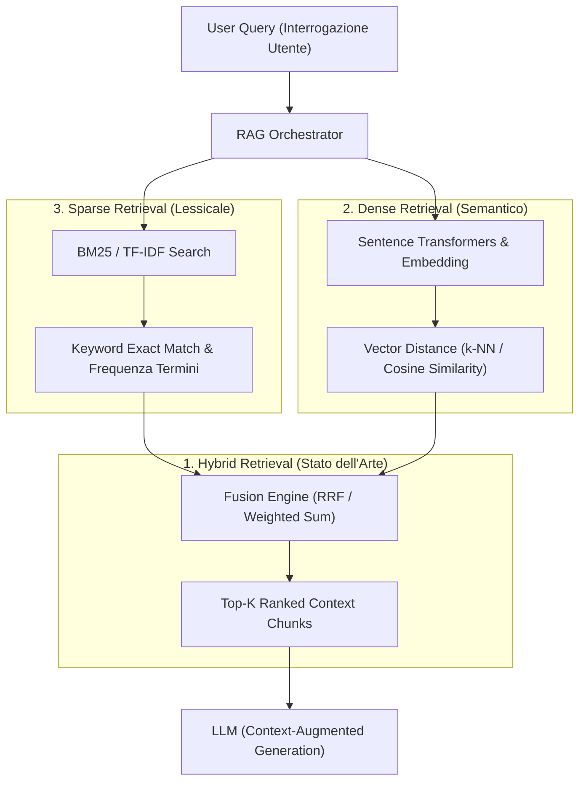

[[Home MOC|Home]] / [[Tech & AI]] / [[Top 3 RAG Retrieval Strategies - Sparse, Dense, & Hybrid Explained]]

# Top 3 RAG Retrieval Strategies — Sparse, Dense & Hybrid Explained

- **Video URL**: https://youtu.be/r0Dciuq0knU
- **Canale**: [[IBM Technology]]

---

## Sintesi Esecutiva

Nei sistemi <mark style="background:rgba(255, 193, 69, 0.32)"><b>Retrieval-Augmented Generation (RAG)</b></mark>, l'efficacia e l'accuratezza dell'LLM dipendono criticamente dalla qualità della fase di <mark style="background:rgba(181, 113, 255, 0.36)"><b>retrieval</b></mark>, ovvero dalla capacità di estrarre dalla knowledge base i chunk più rilevanti, completi e privi di rumore. 

Mentre la componente generativa è standardizzata, la strategia di recupero dati modella l'intero comportamento del sistema:
- **Sparse Retrieval (BM25)**: ricerca lessicale basata su keyword esatte, ultra-veloce ed economica, ideale per codici identificativi, log e clausole legali.
- **Dense Retrieval (Vector Search)**: ricerca semantica tramite modelli di embedding in spazi vettoriali multidimensionali, ottima per cogliere sinonimi e linguaggio naturale conversazionale.
- **Hybrid Retrieval (RRF / Weighted Fusion)**: lo stato dell'arte attuale, che combina in parallelo vettori e keyword integrando i risultati con algoritmi di fusione per massimizzare contemporaneamente **Precision** e **Recall**.

---

## Architettura Concettuale del Retrieval RAG

---

## Le 3 Strategie di Retrieval a Confronto

### 3. Sparse Retrieval (Ricerca Lessicale & BM25)
Rappresenta la modalità classica e fondamentale di Information Retrieval, con oltre cinquant'anni di storia e consolidamento ingegneristico:
- **Meccanismo:** Si basa su algoritmi statistici come **TF-IDF** e soprattutto <mark style="background:rgba(255, 193, 69, 0.32)"><b>BM25</b></mark> (*Best Matching 25*), che calcolano la rilevanza di un documento analizzando la frequenza dei termini della query rapportata alla rarità dei termini nell'intero corpus (*Inverse Document Frequency*).
- **Punti di Forza:**
 - Estremamente veloce, deterministico e altamente scalabile su moli gigantesche di dati.
 - **Zero costi computazionali per embedding:** non necessita di modelli neurali né di schede GPU dedicate per l'indicizzazione.
 - Superiore a qualsiasi modello di deep learning quando la ricerca richiede il match di **termini esatti, stringhe univoche, codici prodotto, registri di log di sistema o formule legali precise**.
- **Limiti:** Soffre del cosiddetto *Vocabulary Mismatch Problem*; non comprende sinonimi, parafrasi, relazioni concettuali né il contesto semantico (se la parola cercata non è identica, il chunk non viene recuperato).
- **Motori & Database:** Apache Lucene, Elasticsearch, Milvus (con modulo BM25 nativo).

---

### 2. Dense Retrieval (Ricerca Vettoriale Semantica)
Tecnologia emersa nell'ultimo decennio grazie all'avvento dei Transformers e del deep learning, diventata la spina dorsale semantica del modern computing:
- **Meccanismo:** Sia la query dell'utente che i chunk di testo vengono convertiti in vettori numerici densi (embedding ad alta dimensionalità, tipicamente da 384 a 1536 dimensioni) tramite modelli come *Sentence Transformers*:
 - Concetti con significato affine atterrano in posizioni geometricamente vicine all'interno dello spazio vettoriale.
 - Il recupero avviene calcolando la vicinanza angolare o geometrica (tramite <mark style="background:rgba(181, 113, 255, 0.36)"><b>Cosine Similarity</b></mark> o Dot Product) sfruttando algoritmi di ricerca approssimata *Approximate Nearest Neighbor (ANN)* o *k-Nearest Neighbors (k-NN)*.
- **Punti di Forza:**
 - Eccelle nell'interpretare il linguaggio naturale ambiguo, domande conversazionali, sinonimi complessi e formulazioni eterogenee.
 - Indispensabile per chatbot, assistenti vocali, customer support e ricerca concettuale su basi di conoscenza non strutturate.
- **Limiti:**
 - Spesso inefficace su query brevissime (1-2 parole isolate) o su sigle/codici tecnici rari che non erano presenti nel training set del modello di embedding (*out-of-vocabulary*).
 - Richiede pipeline di embedding asincrone e motori vettoriali dedicati con elevato consumo di RAM.
- **Motori & Librerie:** FAISS (Meta), JVector (libreria Java ad alte prestazioni per enterprise RAG), Milvus, Qdrant, Weaviate, Pinecone.

---

### 1. Hybrid Retrieval (La Scelta Definitiva / Stato dell'Arte)
Sviluppato negli ultimi 2-3 anni come standard de facto nei sistemi RAG di livello enterprise:
- **Meccanismo:** Esegue la query **in parallelo** su entrambi i binari (Vector Dense Search + Keyword Sparse Search) e combina le due liste di ranking tramite algoritmi di fusione avanzati:
 1. <mark style="background:rgba(255, 193, 69, 0.32)"><b>Reciprocal Rank Fusion (RRF)</b></mark>: Algoritmo basato sulla posizione ordinale dei risultati nelle due classifiche indipendenti:
 $$RRF\_Score(d) = \sum_{m \in M} \frac{1}{k + rank_m(d)}$$
 *(con costante di smoothing standard $k=60$). Non richiede normalizzazione dei punteggi grezzi.*
 2. **Weighted Score Fusion**: Somma ponderata dei punteggi normalizzati (es. $70\%$ peso semantico dense $+ 30\%$ peso lessicale sparse).
- **Punti di Forza:**
 - Elimina i punti deboli di entrambi i sistemi: il vettore intercetta l'intento e i concetti generali, mentre il motore BM25 garantisce che identificatori, nomi propri e clausole tecniche non vadano persi.
 - I benchmark mostrano sistematicamente una netta superiorità di accuratezza rispetto al solo dense retrieval, innalzando sia la **Precision** che la **Recall**.
- **Applicazioni Ideali:** Settori ad alto tasso di gergo tecnico specialistico, documentazione legale, farmacologia, medicina e repository di codice sorgente.

---

## Tabella Comparativa delle Strategie RAG

| Dimensione | 3. Sparse Retrieval | 2. Dense Retrieval | 1. Hybrid Retrieval |
| :--- | :--- | :--- | :--- |
| **Origine / Età** | ~50 anni (IR classico) | ~5-10 anni (Deep Learning) | ~2-3 anni (Modern RAG) |
| **Algoritmo Base** | BM25 / TF-IDF | Embedding Cosine / ANN k-NN | Dual-track + RRF / Weighted Sum |
| **Punto di Forza** | Match esatti, codice, scalabilità | Sinonimi, contesto, linguaggio naturale | Massima precisione + massima copertura |
| **Punto Debole** | Mancata comprensione semantica | Gergo raro, sigle, query minime | Complessità architetturale maggiore |
| **Overhead Risorse** | Molto basso (CPU/Disco) | Medio-Alto (Modelli di Embedding + VRAM) | Medio (Integrazione Dual-Index) |
| **Casi d'Uso Elettivi** | Codici, SKU, log, leggi | Chatbot, Q&A generale | **Enterprise RAG, Medical, Legal, Tech** |

---

## Raccomandazioni Architetturali per Sviluppatori & Data Scientist

>[!tip] Come Configurare la Pipeline RAG
>- **Default per la Produzione:** Adottare sempre l'approccio **Hybrid Retrieval** con algoritmo RRF. Database moderni come Elasticsearch, Milvus e Weaviate offrono il supporto integrato out-of-the-box.
>- **Ottimizzazione del Bilanciamento:** Se il dominio contiene molti codici e formule (es. documentazione API o ingegneria), aumentare il peso della componente BM25 ($40-50\%$).
>- **Pre-filtri sui Metadati:** Combinare il retrieval ibrido con filtri deterministici sui metadati YAML/JSON (`area`, `tags`, `date`) per ridurre drasticamente lo spazio di ricerca e azzerare il rumore informativo prima della fusione.

---

## Collegamenti

- [[Tech & AI|Tech & AI MOC]]
- [[Costruire Knowledge Base per AI con LLM Wiki|Costruire Knowledge Base per AI con LLM Wiki]]
- [[Context Windows in LLM - How They Work and Why They Can Slow Down|Context Windows in LLM]]
- [[Youtube|Youtube MOC]]
- [[Home|Home]]
