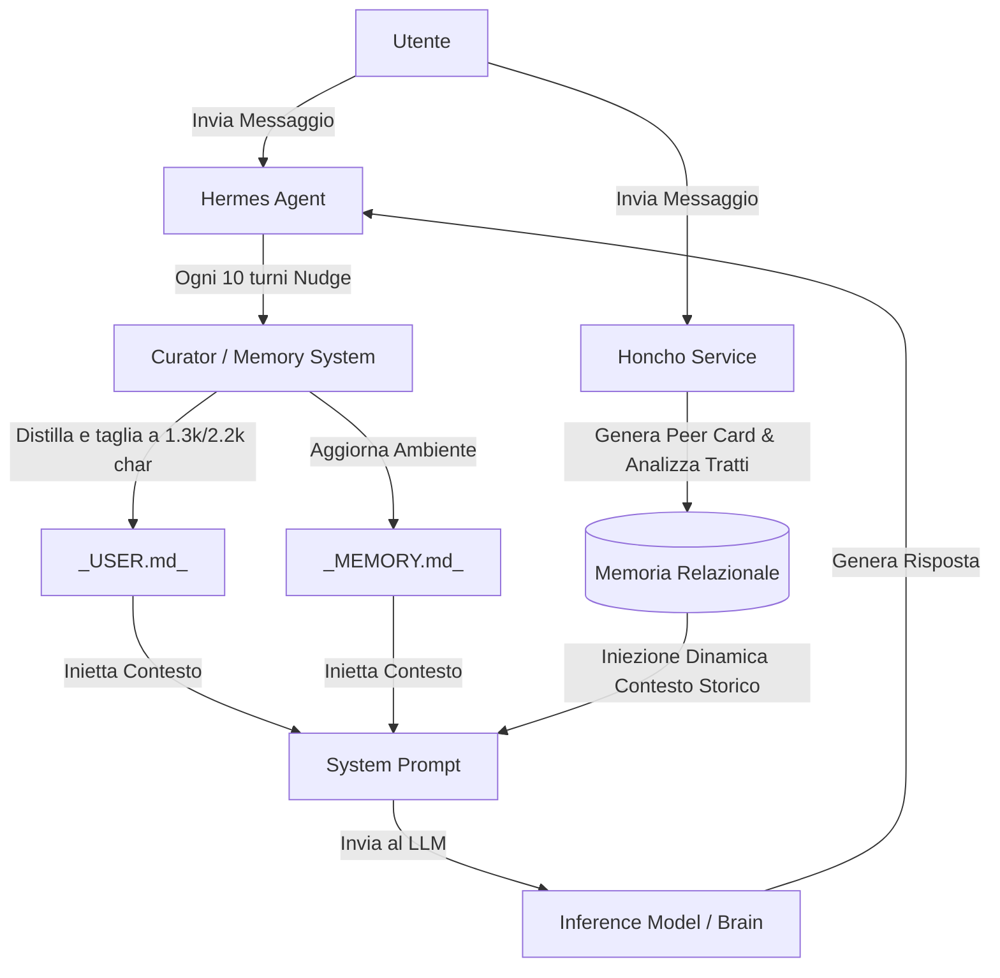

[[Home MOC|Home]] / [[Tech & AI MOC|Tech & AI]] / [[Hermes Agent]]

# Hermes Agent: L'Evoluzione dei Sistemi Agenti a Memoria Distillata e Auto-Miglioramento

- **Video URL**: https://youtu.be/QQEgIo4Juxg
- **Canale**: [[NetworkChuck]]
- **Data Ingestione**: 2026-07-18

---

## Sintesi Rapida

L'inefficacia degli agenti autonomi tradizionali, spesso soggetti a degradamento prestazionale e sovraccarico cognitivo, viene superata dall'architettura di <mark style="background:rgba(181, 113, 255, 0.36)"><b>Hermes Agent</b></mark>. Sviluppato da <mark style="background:rgba(181, 113, 255, 0.36)"><b>Nous Research</b></mark>, questo framework introduce un <mark style="background:rgba(255, 193, 69, 0.32)"><b>sistema di memoria distillata</b></mark> e un ciclo di <mark style="background:rgba(255, 193, 69, 0.32)"><b>auto-miglioramento</b></mark> continuo. L'obiettivo primario è fornire un'interfaccia operativa solida e stabile, capace di evolvere e adattarsi dinamicamente alle reali esigenze dell'utente senza accumulare ridondanze o instabilità strutturali.

---

## Capitolo 1: L'Architettura Operativa e il Deployment Infrastrutturale

L'infrastruttura di un agente intelligente richiede persistenza e flessibilità. L'installazione di questo framework può essere eseguita in ambienti cloud o server privati virtuali (VPS) basati su Ubuntu, garantendo un'operatività costante e sempre accessibile. Per garantire che l'agente rimanga attivo in background come demone di sistema, viene configurato un servizio tramite <mark style="background:rgba(181, 113, 255, 0.36)"><b>SystemD</b></mark>, delegando la gestione del processo direttamente al sistema operativo.

![[QQEgIo4Juxg_1_installing_herm.jpg]]

Dal punto di vista dell'inferenza, l'agente si comporta come un <mark style="background:rgba(255, 193, 69, 0.32)"><b>harness di feedback aptico</b></mark>: non è vincolato a un singolo modello linguistico di grandi dimensioni (LLM), ma agisce come un controller esterno. Questo permette di interfacciarsi sia con motori di frontiera commerciali (come le ultime versioni di GPT o Grok) sia con modelli open-source eseguiti localmente (come Qwen tramite LM Studio).

L'interazione con l'agente non è limitata al terminale locale, ma si estende a gateway di messaggistica popolari come Telegram. Attraverso la creazione di un bot dedicato e la rigida configurazione degli identificativi utente (ID), si crea un canale di comunicazione sicuro, privato e accessibile in mobilità, minimizzando la superficie di attacco esposta a terze parti.

---

## Capitolo 2: La Gestione della Memoria Distillata: USER, MEMORY e SOUL

Il vero elemento di differenziazione rispetto a sistemi precedenti, come <mark style="background:rgba(181, 113, 255, 0.36)"><b>OpenClaw</b></mark>, risiede nella filosofia di gestione dello stato e della memoria. Nei sistemi tradizionali, l'accumulo incontrollato di informazioni storiche all'interno della finestra di contesto porta inevitabilmente a un degrado delle risposte dell'agente (il cosiddetto "bloat"). 

![[QQEgIo4Juxg_2_choosing_your_a.jpg]]

L'agente organizza le sue informazioni chiave in tre componenti strutturali precise:
1. **_SOUL.md_**: Contiene la definizione fondamentale della personalità, delle direttive etiche, del tono di voce e dell'identità dell'agente.
2. **_USER.md_**: Raccoglie le informazioni apprese sull'utente (abitudini, preferenze operative, requisiti personali). Ha un limite fisico invalicabile di **1.375 caratteri**.
3. **_MEMORY.md_**: Memorizza i dati relativi all'ambiente tecnico in cui l'agente opera (dettagli di rete, configurazioni di sistema, strumenti disponibili). Ha un limite fisico invalicabile di **2.200 caratteri**.

>[!important] Distillazione contro la Saturazione
>I limiti di caratteri imposti a questi file costringono l'agente a operare una sintesi continua. Quando la memoria si satura, l'agente deve decidere attivamente quali informazioni eliminare e quali conservare, distillando solo i dettagli cruciali per l'interazione.

A differenza di altri framework che aggiornano la memoria solo al termine di una sessione o durante la compattazione manuale, questo agente avvia un processo di analisi in background con cadenza regolare (tipicamente ogni **10 turni di conversazione**). Questo "nudge" automatico valuta le ultime interazioni e aggiorna dinamicamente i file di configurazione senza interrompere il flusso operativo dell'utente.

---

## Capitolo 3: L'Integrazione di Honcho per la Memoria Relazionale a Lungo Termine

Per superare i limiti intrinseci della memoria locale distillata senza appesantire il contesto di sistema, l'agente può essere integrato con <mark style="background:rgba(181, 113, 255, 0.36)"><b>Honcho</b></mark>. Questo servizio agisce come una piattaforma di memoria a lungo termine di tipo relazionale, analizzando in background ogni singolo messaggio scambiato.

La piattaforma <mark style="background:rgba(181, 113, 255, 0.36)"><b>Honcho</b></mark> compila ed aggiorna continuamente una **peer card** dell'utente. Questa scheda non contiene semplici trascrizioni, ma delinea tratti psicologici, preferenze professionali e comportamenti ricorrenti (ad esempio, la tendenza a procrastinare compiti complessi a favore della scrittura di script). Quando l'utente interroga l'agente, <mark style="background:rgba(181, 113, 255, 0.36)"><b>Honcho</b></mark> estrae solo i frammenti di contesto storico semanticamente rilevanti per la richiesta attuale e li inietta nel prompt di sistema, garantendo una personalizzazione profonda e non invasiva.

---

## Capitolo 4: Il Loop di Auto-Miglioramento e il Ruolo del Curator

La caratteristica più avanzata del framework è la <mark style="background:rgba(255, 193, 69, 0.32)"><b>creazione autonoma di skill</b></mark>. Mentre la maggior parte delle piattaforme richiede l'installazione manuale di moduli precompilati da un catalogo statico, l'agente è in grado di codificare le proprie capacità operative man mano che interagisce con l'ambiente esterno.

Ad esempio, se l'utente richiede l'integrazione di un client VPN complesso come <mark style="background:rgba(181, 113, 255, 0.36)"><b>Twingate</b></mark> o la gestione di controller di rete come UniFi, l'agente affronta il problema passo dopo passo. Una volta individuata una sequenza di comandi o di codice che risolve il problema con successo, l'agente **cristallizza** quell'esperienza in uno script riutilizzabile (una nuova skill).

Per evitare che questa proliferazione di codice causi disordine e inefficienze nel lungo periodo, interviene il <mark style="background:rgba(181, 113, 255, 0.36)"><b>Curator</b></mark>.

>[!tip] Il Ciclo del Curator
>Il <mark style="background:rgba(181, 113, 255, 0.36)"><b>Curator</b></mark> è un sotto-agente di pulizia che monitora costantemente la libreria di skill create. Le ordina e le sposta dinamicamente attraverso tre stati:
>- **Attivo**: Skill utilizzate di frequente e ottimizzate.
>- **Stale**: Skill che mostrano segni di obsolescenza o che non vengono richiamate da molto tempo.
>- **Archiviato**: Skill rimosse dall'ambiente attivo per non sprecare risorse cognitive, ma conservate nello storico in caso di necessità future.

Questo ciclo assicura che l'agente rimanga performante a lungo termine, rendendolo sensibilmente più efficiente ed affidabile dopo mesi di utilizzo continuativo.

---

## Capitolo 5: Dal Controllo Aptico alle Applicazioni Pratiche

La solidità strutturale dell'agente si traduce nella capacità di interagire in modo sicuro ed efficiente con le API del mondo fisico e digitale. L'agente include moduli per la gestione di ecosistemi complessi:
- **Domotica**: Integrazione nativa con Home Assistant, che permette all'agente di leggere lo stato dei sensori e controllare attuatori fisici (luci, tapparelle, climatizzazione) interpretando il linguaggio naturale in comandi haptici precisi.
- **Infrastrutture IT**: Capacità di interfacciarsi con i sistemi di rete UniFi per inventariare i dispositivi connessi, gestire le autorizzazioni ed isolare potenziali anomalie.

![[QQEgIo4Juxg_9_live_demo__home.jpg]]

Per coordinare l'esecuzione di compiti complessi che richiedono più passaggi logici, l'agente utilizza una dashboard **Kanban** integrata. Questa interfaccia visiva permette di monitorare lo stato di avanzamento dei task, definire priorità e assegnare sotto-obiettivi ad agenti secondari. 

Inoltre, il sistema implementa un meccanismo di sicurezza **human-in-the-loop**: qualora l'agente incontri una limitazione di risorse, un errore bloccante o richieda un'autorizzazione per eseguire un comando critico sul computer dell'utente (attraverso le funzionalità di *computer use*), interrompe l'esecuzione e attende una convalida esplicita da parte dell'utente, scongiurando comportamenti imprevisti.

---

## Concetti Chiave

- **[[Memoria Distillata]]**: Approccio alla gestione del contesto che limita rigidamente la dimensione dei file di stato dell'agente, forzando una sintesi continua e prevenendo la saturazione delle finestre di contesto dei modelli linguistici.
- **[[Ciclo di Auto-Miglioramento]]**: Processo evolutivo per cui l'agente analizza i propri successi operativi ed errori, cristallizzando le soluzioni stabili in nuove skill pronte all'uso.
- **[[Harness Aptico]]**: Interfaccia software che traduce le decisioni cognitive di un modello di intelligenza artificiale in azioni fisiche o digitali strutturate sul sistema ospitante.

---

## Collegamenti

- **Macro Area**: [[Tech & AI MOC]]
- **Note Correlate**: [[Agenti AI Cosa Sono e Come Usarli 6 Tool Imperdibili]], [[Context Windows in LLM - How They Work and Why They Can Slow Down]]
