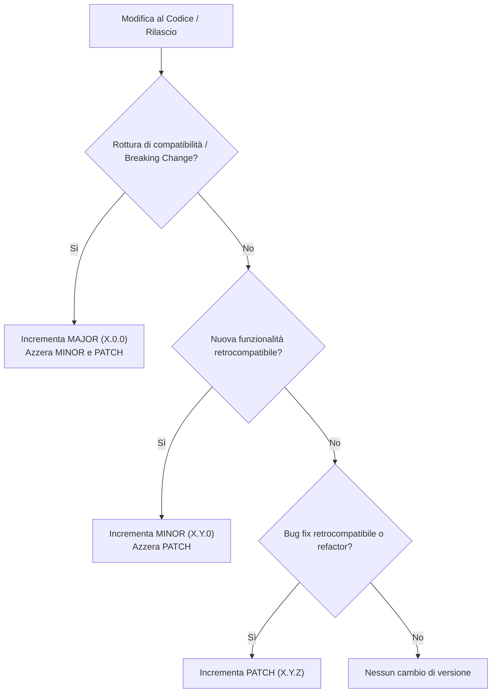

[[Home MOC|Home]] / [[Tech & AI]] / [[Semantic Versioning]]

# Semantic Versioning

## Sintesi Esecutiva

Il <mark style="background:rgba(255, 193, 69, 0.32)"><b>Semantic Versioning</b></mark> (SemVer 2.0.0), formalizzato da <mark style="background:rgba(181, 113, 255, 0.36)"><b>Tom Preston-Werner</b></mark>, è una specifica formale concepita per risolvere il problema dell'interdipendenza caotica tra librerie e package software, noto come *dependency hell*. Il modello definisce un contratto semantico universale basato sulla triade numerica formattata come `X.Y.Z` ($\text{MAJOR}.\text{MINOR}.\text{PATCH}$), in cui ogni variazione del valore numerico comunica in modo deterministico il livello di compatibilità e l'impatto funzionale delle modifiche introdotte nell'<mark style="background:rgba(255, 193, 69, 0.32)"><b>API pubblica</b></mark>.

---

## Fondamenti Teorici e Struttura di SemVer 2.0.0

L'architettura di SemVer si basa sul presupposto formale che ogni modulo software esponga una <mark style="background:rgba(255, 193, 69, 0.32)"><b>Public API</b></mark> rigorosamente documentata. Qualsiasi elemento non formalizzato all'interno dell'API pubblica deve essere considerato dettaglio implementativo privato, soggetto a potenziale mutazione senza preavviso.

### Anatomia della Versione

Una stringa di versione conforme a SemVer 2.0.0 rispetta la seguente grammatica formale:

$$\text{Versione} = \text{MAJOR}.\text{MINOR}.\text{PATCH}[-\text{PRERELEASE}][+\text{BUILDMETADATA}]$$

I requisiti dei tre segmenti primari non negativi sono:

1. <mark style="background:rgba(255, 193, 69, 0.32)"><b>MAJOR (X)</b></mark>: Viene incrementato esclusivamente quando vengono introdotte modifiche retro-incompatibili (*breaking changes*). Questo azzera forzatamente $\text{MINOR}$ e $\text{PATCH}$ a $0$.
2. <mark style="background:rgba(255, 193, 69, 0.32)"><b>MINOR (Y)</b></mark>: Viene incrementato quando si aggiungono nuove funzionalità preservando la completa retrocompatibilità, o qualora una funzionalità esistente venga contrassegnata come <mark style="background:rgba(181, 113, 255, 0.36)"><b>deprecata</b></mark>. Questo azzera forzatamente $\text{PATCH}$ a $0$.
3. <mark style="background:rgba(255, 193, 69, 0.32)"><b>PATCH (Z)</b></mark>: Viene incrementato quando vengono applicate correzioni di bug (*bug fixes*) o ottimizzazioni interne che non alterano l'interfaccia pubblica né rompono il comportamento atteso dai client.

### Valori e Regole di Precedenza

Tutti gli identificatori numerici devono essere interi non negativi espressi in notazione decimale senza zeri iniziali (es. `1.0.4` è valido, `1.0.04` non è valido). Una volta rilasciato e distribuito un pacchetto identificato da una combinazione univoca `X.Y.Z`, i contenuti di quella specifica versione diventano <mark style="background:rgba(255, 193, 69, 0.32)"><b>immutabili</b></mark>. Qualsiasi modifica successiva impone la pubblicazione di un nuovo identificatore.

---

## Identificatori Speciali ed Estensioni

### Fase Iniziale di Sviluppo (Versione Zero: `0.Y.Z`)

Nella fase in cui il software si trova nello stato $\text{MAJOR} = 0$, la versione è definita come fase di sviluppo iniziale:
- L'API pubblica è considerata <mark style="background:rgba(181, 113, 255, 0.36)"><b>instabile</b></mark>.
- Qualsiasi modifica (inclusi i cambi di rottura) può verificarsi arbitrariamente in qualsiasi momento incrementando $\text{MINOR}$ o $\text{PATCH}$.
- Il passaggio a `1.0.0` sancisce l'entrata in produzione e la stabilizzazione del contratto formale.

### Identificatori di Pre-Release

Una versione di pre-release indica che il pacchetto è instabile e potrebbe non soddisfare i requisiti di compatibilità garantiti dalla corrispondente versione finale.
- Vengono concatenati tramite un trattino (`-`) immediatamente successivo al numero di patch: ad esempio `1.0.0-alpha`, `1.0.0-alpha.1`, `1.0.0-beta.2`, `1.0.0-rc.1`.
- Sono composti da identificatori alfanumerici e trattini ASCII separati da punti `[0-9A-Za-z-]`.
- Una versione di pre-release possiede sempre una <mark style="background:rgba(255, 193, 69, 0.32)"><b>precedenza inferiore</b></mark> rispetto alla corrispondente versione normale:

$$1.0.0\text{-alpha} < 1.0.0\text{-alpha.1} < 1.0.0\text{-beta} < 1.0.0\text{-rc.1} < 1.0.0$$

### Metadati di Compilazione (Build Metadata)

I metadati di compilazione possono essere associati aggiungendo un segno più (`+`) seguito da identificatori alfanumerici e trattini:
- Esempi: `1.0.0-beta+exp.sha.5114f85`, `1.0.0+20130313144700`.
- I metadati di build vengono completamente ignorati durante il calcolo dell'ordine di precedenza:

$$1.0.0+build.1 \equiv 1.0.0+build.2 \equiv 1.0.0$$

---

## Calcolo dell'Ordinamento e Precedenza Formale

L'ordinamento tra due versioni $A$ e $B$ si determina scomponendo la stringa nei suoi elementi costitutivi e confrontandoli da sinistra verso destra:

1. **Segmenti Numerici**: Si confrontano sequenzialmente $\text{MAJOR}$, $\text{MINOR}$ e $\text{PATCH}$ come valori numerici interi (es. $2.1.0 > 1.9.9$).
2. **Presenza di Pre-release**: A parità di $\text{MAJOR}$, $\text{MINOR}$ e $\text{PATCH}$, una versione con stringa di pre-release è antecedente a quella priva di prefisso (es. $1.0.0\text{-rc.1} < 1.0.0$).
3. **Confronto tra Pre-release**:
   - Identificatori composti solo da cifre vengono confrontati numericamente.
   - Identificatori con lettere o trattini vengono confrontati lessicalmente in ordine ASCII.
   - I sotto-identificatori numerici hanno sempre precedenza inferiore rispetto a quelli non numerici.
   - Se una pre-release ha un insieme di identificatori che è un prefisso esatto di un'altra, la più corta precede la più lunga (es. `1.0.0-alpha` < `1.0.0-alpha.1`).

---

## Analisi Critica: Limiti e la Legge di Hyrum

Sebbene il Semantic Versioning fornisca una base deterministica per i package manager (<mark style="background:rgba(181, 113, 255, 0.36)"><b>npm</b></mark>, <mark style="background:rgba(181, 113, 255, 0.36)"><b>Cargo</b></mark>, <mark style="background:rgba(181, 113, 255, 0.36)"><b>Composer</b></mark>), nella pratica ingegneristica emergono frizioni sistematiche:

- <mark style="background:rgba(255, 193, 69, 0.32)"><b>Legge di Hyrum</b></mark>: Con un numero sufficiente di utenti di un'API, ogni comportamento osservabile del sistema (anche non documentato o bug accidentale) sarà considerato critico da qualcuno. Ne consegue che qualsiasi modifica a livello di patch può rompere downstream consumers non intenzionalmente.
- **Ambiguità nell'Intento**: Distinguere un *bug fix* da una modifica di comportamento intenzionale spesso dipende dalla prospettiva dell'integratore, portando a discrepanze nell'incremento tra $\text{PATCH}$ e $\text{MAJOR}$.
- **Affidamento Umano vs Automazione**: L'assegnazione manuale delle versioni è soggetta ad errore umano. Per questo motivo, nei moderni flussi di CI/CD, SemVer viene integrato con strumenti di <mark style="background:rgba(181, 113, 255, 0.36)"><b>Conventional Commits</b></mark> e pipeline di release automatizzate (es. *semantic-release*) per dedurre deterministicamente l'incremento di versione dai metadati dei commit.
