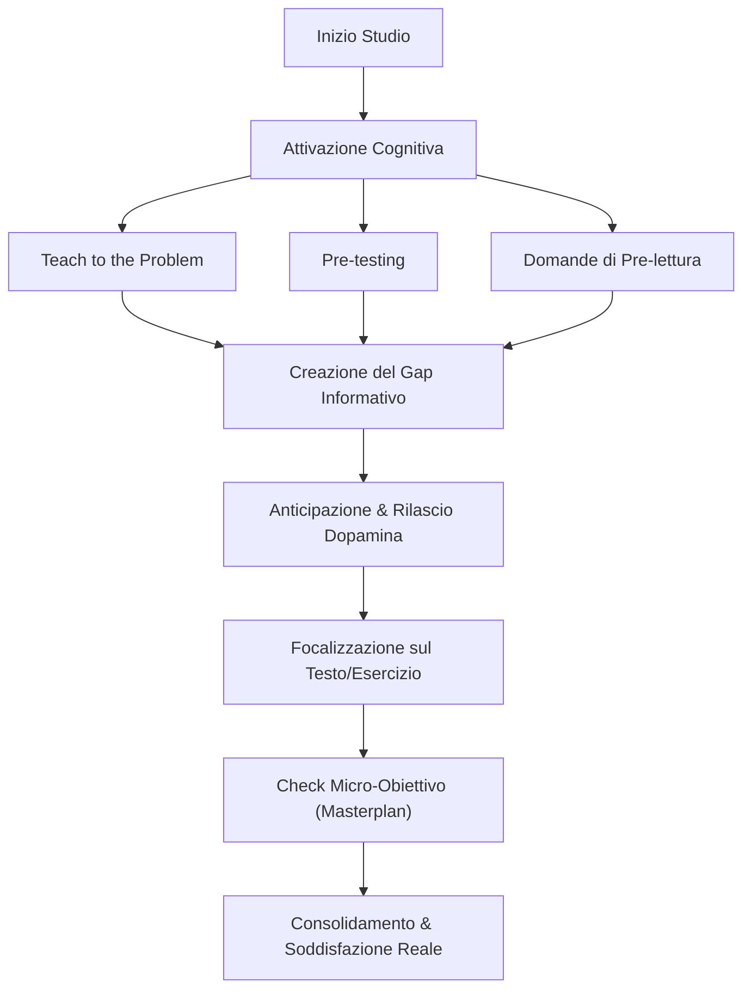

[[Home MOC|Home]] / [[03 - Inbox|Inbox]] / [[Dopamine Load - Geniale o Pura Fuffa Reaction]]

# 🎯 Dopamine Load - Geniale o Pura Fuffa Reaction

## 🎯 Sintesi Esecutiva

In questo video, <mark style="background:rgba(255, 193, 69, 0.32)"><b>Alessandro de Concini (ADC)</b></mark> analizza criticamente un contenuto virale sul cosiddetto **"Dopamine Load"**, una presunta routine per "hackerare" il cervello e rendere lo studio dipendente come lo scrolling sui social media. 

L'analisi smonta i presupposti ingenui e irrealistici del video virale — etichettato come tipico esempio di <mark style="background:rgba(181, 113, 255, 0.36)"><b>AI Slop</b></mark> (consigli superficiali, generati da AI e mal assemblati) — e chiarisce il funzionamento biologico della **dopamina**, proponendo metodologie autentiche basate sull'evidenza scientifica per stimolare la motivazione e la concentrazione durante lo studio.

---

## 🧠 Meccanismi Neuroscientifici: La Dopamina come Anticipazione

La dopamina non è il neurotrasmettitore del "piacere" o del godimento immediato, bensì il mediatore dell'<mark style="background:rgba(255, 193, 69, 0.32)"><b>anticipazione della ricompensa</b></mark> e della ricerca attiva (seeking behavior).

- **Lo spike dopaminico dei social e del gioco d'azzardo:** È innescato dalla variabilità e dall'incertezza del risultato (reward variabile immediato). L'attesa febbrile di una notifica o di una vincita tiene il cervello in costante tensione attentiva.
- **L'asimmetria con lo studio:** Lo studio è un'attività intrinsecamente lenta, cognitiva e a reward differito nel lungo termine. Il cervello non associa spontaneamente la fatica dello studio a un premio sub-secondo.
- **La baseline dopaminica:** In un ambiente iper-stimolato, la soglia basale di eccitazione è costantemente saturata, rendendo qualsiasi compito a basso stimolo percepito come intollerabile e noioso. Collegato ai principi descritti in [[Guida al Dopamine Detox]].

---

## 🔬 Analisi Critica del Protocollo "Dopamine Load"

Il video virale propone un protocollo suddiviso in 3 fasi, che ADC analizza evidenziandone i limiti logici e applicativi:

### 1. Fase di Deprivazione: La fallacia del "Basta non farlo"
- **La proposta virale:** Svegliarsi, non toccare il telefono per tutta la mattina e trascorrere 30 minuti in completo silenzio o camminando prima di studiare per abbassare la baseline dopaminica.
- **La critica:** Presuppone che la persona abbia già la capacità di autocontrollo che sta cercando di acquisire. Suggerire a chi è dipendente da dopamina rapida di stare 30 minuti nel nulla è come dire a un alcolista: *"Il segreto per non bere è semplicemente non bere"*. Se l'utente avesse già tale disciplina monastica, non avrebbe alcuna difficoltà a mettersi direttamente a studiare.

### 2. Fase di Priming: L'inefficacia della visualizzazione passiva
- **La proposta virale:** Dedicare 2 minuti a visualizzare se stessi mentre si studia con successo per "creare anticipazione".
- **La critica:** La visualizzazione non innesca il circuito dopaminico dello studio perché il cervello non percepisce la pura immagine mentale dell'impegno come una ricompensa immediata. L'anticipazione nello studio si crea tramite la curiosità epistemica e la sfida cognitiva, non con la fantasia passiva.

### 3. Fase di Amplificazione & Routine Quotidiana
- **La proposta virale:** Routine estrema senza telefono fino alle 18:30, premiandosi solo bevendo acqua fredda o facendo il letto.
- **La critica:** Bere acqua o rifare il letto non costituisce una ricompensa neurobiologicamente rilevante. Inoltre, protocolli così rigidi e punitivi falliscono alla prima interruzione della routine, generando frustrazione e abbandono.

---

## 🛠️ Strategie Reali ed Efficaci per Stimolare l'Apprendimento

In contrapposizione alle ricette miracolose, ADC evidenzia gli strumenti metodologici che creano una reale attivazione dopaminica prima e durante lo studio (approfonditi in [[Learning to Learn ITA]]):

### 1. Creare Tensione Cognitiva (Gap Informativo)
- **Teach to the Problem, not the Solution:** Affrontare prima il problema/quesito complesso senza guardare la soluzione. L'ingegno stimolato dal non riuscire a risolvere subito genera una fame attiva della risposta nel libro.
- **Pre-testing:** Nelle materie tecniche e quantitative, svolgere esercizi o test prima di leggere la teoria per identificare i punti critici.
- **Domande di Pre-lettura:** Porsi quesiti espliciti sul testo prima di leggerlo per orientare la ricerca attiva del significato.

### 2. Gestione del Ritmo e Micro-Reward
- **Tecnica Pomodoro:** Blocchi di studio concentrato intervallati da pause reali. Nelle pause è fondamentale non bombardarsi di stimoli ultra-dopaminici (es. reel, TikTok), ma rilassarsi con camminate, stretching o respirazione.
- **Notare i Micro-Obiettivi (Masterplan / Task List):** Tracciare le micro-attività completate e spuntare la checklist attiva un autentico senso di efficacia e gratificazione dopaminica. Riferimento a [[Come Organizzare le Giornate]].

---

## 🤖 Il Fenomeno "AI Slop" nella Divulgazione

Il video evidenzia un problema crescente nell'ecosistema dei contenuti educativi digitali:
1. **Contenuti superficiali generati da AI:** Script redatti da LLM senza comprensione del contesto umano e psicologico.
2. **Mescolanza di vero e fuffa:** Vengono uniti concetti scientifici corretti (la dopamina regola l'anticipazione, il Pomodoro funziona) con consigli impraticabili e surreali (morning routine di digiuno dopaminico estremo).
3. **Mancanza di pragmatismo:** Consigli che ignorano la realtà della psicologia comportamentale umana, creando false illusioni negli studenti.

---

## 🔗 Collegamenti & Note Correlate

- [[Home MOC|Home]]
- [[Guida al Dopamine Detox]]
- [[Come Organizzare le Giornate]]
- [[Learning to Learn ITA]]
